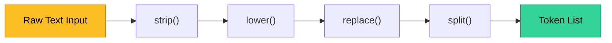
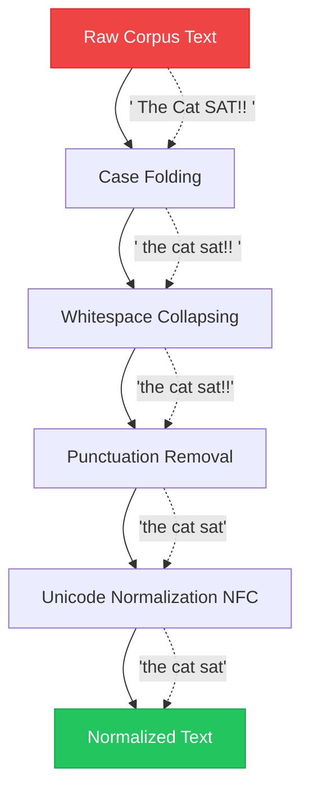

# Chapter 1 — Strings & Text Manipulation

> **Module 1 · Python for NLP** · Estimated Duration: 35 minutes

---

## 🎯 Learning Objectives

By the end of this chapter you will be able to:

1. Explain how Python represents strings internally (Unicode, UTF-8).
2. Apply core string methods (`split`, `join`, `replace`, `strip`, `lower`, `upper`, `find`, `count`) to NLP pre-processing tasks.
3. Use slicing and f-strings for efficient text extraction and formatting.
4. Normalise text for downstream NLP pipelines (case folding, whitespace collapsing, punctuation stripping).

---

## 📚 Core Concepts

### 1.1 — Python Strings as Unicode Sequences

In Python 3, every string is a sequence of **Unicode code points**. This is critical for NLP because real-world text includes accented characters, emojis, and multi-byte scripts.

```python
from loguru import logger  # Import the structured logging library for DEBUG-level execution tracing

logger.debug("Starting Chapter 01 — Strings & Text Manipulation")  # Log the chapter entry point

sample_text: str = "Natural Language Processing — Pro téchne"  # Declare a sample string with Unicode characters
logger.debug(f"Sample text: '{sample_text}'")  # Log the raw string to verify contents

text_length: int = len(sample_text)  # Compute the length (number of Unicode code points, not bytes)
logger.debug(f"String length (code points): {text_length}")  # Log the length for verification

encoded_bytes: bytes = sample_text.encode("utf-8")  # Encode to UTF-8 bytes to demonstrate byte-level representation
logger.debug(f"UTF-8 byte length: {len(encoded_bytes)}")  # Log byte count — may exceed code-point count for multi-byte chars
```

---

### 1.2 — Essential String Methods for NLP



```python
from loguru import logger  # Import loguru for structured debug logging

raw_input: str = "   Hello, World!  Welcome to NLP.   "  # Simulate noisy user input with leading/trailing whitespace
logger.debug(f"Raw input: '{raw_input}'")  # Log the original input before any transformation

stripped: str = raw_input.strip()  # Remove leading and trailing whitespace — essential first step in text normalization
logger.debug(f"After strip(): '{stripped}'")  # Log the stripped result

lowered: str = stripped.lower()  # Convert to lowercase for case-insensitive processing — standard NLP normalization
logger.debug(f"After lower(): '{lowered}'")  # Log the lowered result

no_punctuation: str = lowered.replace(",", "").replace("!", "").replace(".", "")  # Strip common punctuation marks
logger.debug(f"After punctuation removal: '{no_punctuation}'")  # Log cleaned string

tokens: list[str] = no_punctuation.split()  # Split on whitespace to produce a preliminary token list
logger.debug(f"Tokens: {tokens}")  # Log the resulting list of tokens

rejoined: str = " | ".join(tokens)  # Rejoin tokens with a custom delimiter — useful for display or downstream formatting
logger.debug(f"Rejoined with '|': '{rejoined}'")  # Log the formatted output
```

---

### 1.3 — String Slicing for Extraction

```python
from loguru import logger  # Import loguru for DEBUG tracing

document: str = "CLASSIFICATION: UNCLASSIFIED — Date: 2026-03-05"  # A structured string from which we need to extract fields
logger.debug(f"Full document string: '{document}'")  # Log the original string

classification: str = document[16:28]  # Slice to extract the classification value by known position
logger.debug(f"Extracted classification: '{classification}'")  # Log the extracted substring

date_field: str = document[-10:]  # Slice the last 10 characters to capture the ISO date
logger.debug(f"Extracted date: '{date_field}'")  # Log the date extraction result

reversed_doc: str = document[::-1]  # Reverse the string — occasionally useful for suffix analysis
logger.debug(f"Reversed: '{reversed_doc}'")  # Log the reversed string
```

---

### 1.4 — Text Normalization Pipeline



```python
import re  # Import regex module for whitespace collapsing — more powerful than simple replace
import unicodedata  # Import unicodedata for Unicode normalization (NFC/NFD forms)
from loguru import logger  # Import loguru for step-by-step execution logging

def normalise_text(text: str) -> str:
    """Apply a standard NLP text normalization pipeline."""
    logger.debug(f"[normalise] Input: '{text}'")  # Log the raw input before any processing

    text = text.lower()  # Step 1: Case folding — collapse all characters to lowercase
    logger.debug(f"[normalise] After lower(): '{text}'")  # Log after case folding

    text = text.strip()  # Step 2: Strip outer whitespace — removes leading/trailing blanks
    logger.debug(f"[normalise] After strip(): '{text}'")  # Log after stripping

    text = re.sub(r"\s+", " ", text)  # Step 3: Collapse internal whitespace runs to a single space
    logger.debug(f"[normalise] After whitespace collapse: '{text}'")  # Log after collapsing

    text = re.sub(r"[^\w\s]", "", text)  # Step 4: Remove all non-alphanumeric, non-space characters
    logger.debug(f"[normalise] After punctuation removal: '{text}'")  # Log after punctuation removal

    text = unicodedata.normalize("NFC", text)  # Step 5: Apply NFC normalization to unify composed characters
    logger.debug(f"[normalise] After NFC normalization: '{text}'")  # Log the final normalized output

    return text  # Return the clean, normalized string


# --- Execution ---
if __name__ == "__main__":
    sample: str = "   The Cat SAT on the MAT!!   "  # A messy input string for demonstration
    result: str = normalise_text(sample)  # Run the full normalization pipeline
    logger.debug(f"Final normalized result: '{result}'")  # Log the final output
```

---

## 🧪 Exercises

1. **Exercise 1.1** — Write a function that counts the number of vowels in a given string, logging each vowel found.
2. **Exercise 1.2** — Given a multi-line string, extract every line that contains the word "error" (case-insensitive) and return them as a list.
3. **Exercise 1.3** — Build a function that takes a sentence and returns a dictionary mapping each word to its character length.

---

## 🔑 Key Takeaways

- Python strings are **immutable Unicode sequences** — every method returns a new string.
- A consistent normalization pipeline (`strip → lower → collapse → remove punctuation → NFC`) is the foundation of any NLP workflow.
- **`loguru`** provides structured, readable logs that make debugging text pipelines trivial.

---

[← Module Index](MODULE.md) · [Next Chapter →](M01-C02-L01-advanced-regex-patterns.md)
