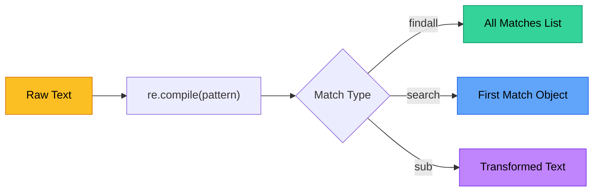
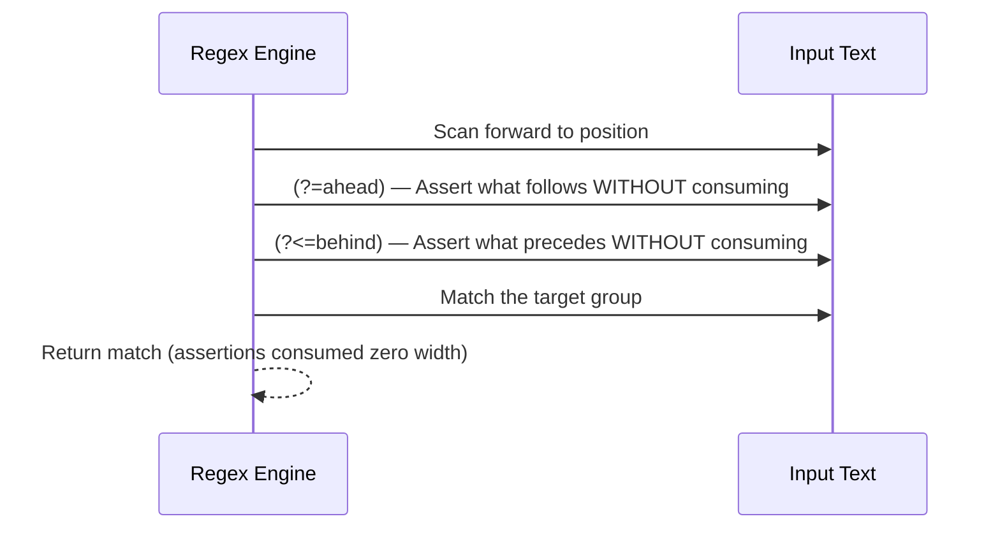

# Chapter 2 — Advanced Regex Patterns

> **Module 1 · Python for NLP** · Estimated Duration: 40 minutes

---

## 🎯 Learning Objectives

1. Construct complex regular expressions using groups, alternations, and quantifiers.
2. Apply lookahead and lookbehind assertions for context-dependent matching.
3. Use named capture groups to extract structured fields from unstructured text.
4. Benchmark regex performance for large-corpus NLP workloads.

---

## 📚 Core Concepts

### 2.1 — The Regex Engine in NLP Pipelines



```python
import re  # Import the regex module — the backbone of pattern-based text extraction in NLP
from loguru import logger  # Import loguru for DEBUG-level step-by-step execution tracing

logger.debug("Starting Chapter 02 — Advanced Regex Patterns")  # Log chapter entry

# --- Basic Pattern Compilation ---
email_pattern: re.Pattern = re.compile(
    r"[a-zA-Z0-9._%+-]+@[a-zA-Z0-9.-]+\.[a-zA-Z]{2,}"  # RFC-simplified email pattern
)  # Compile the pattern once for reuse — avoids recompilation overhead in loops
logger.debug(f"Compiled email pattern: {email_pattern.pattern}")  # Log the compiled pattern string

corpus: str = "Contact us at info@example.co.uk or support@nlp-lab.org for details."  # Sample text with emails
logger.debug(f"Corpus: '{corpus}'")  # Log the input corpus

emails: list[str] = email_pattern.findall(corpus)  # Extract all email addresses from the corpus
logger.debug(f"Extracted emails: {emails}")  # Log the list of matches
```

### 2.2 — Named Capture Groups

```python
import re  # Import regex for structured field extraction
from loguru import logger  # Import loguru for execution tracing

log_pattern: re.Pattern = re.compile(
    r"(?P<timestamp>\d{4}-\d{2}-\d{2}T\d{2}:\d{2}:\d{2})"  # Named group: ISO timestamp
    r"\s+\[(?P<level>\w+)\]"  # Named group: log level inside brackets
    r"\s+(?P<message>.+)"  # Named group: the rest of the line is the message
)  # Compile once — named groups make extracted fields self-documenting
logger.debug(f"Log pattern compiled with groups: {log_pattern.groupindex}")  # Log the group names

log_line: str = "2026-03-05T06:54:10 [ERROR] Failed to tokenise input document"  # Sample structured log line
logger.debug(f"Log line: '{log_line}'")  # Log the input

match: re.Match | None = log_pattern.search(log_line)  # Attempt to match the pattern against the log line
if match:  # Guard: only proceed if the pattern matched
    logger.debug(f"Timestamp: {match.group('timestamp')}")  # Extract and log the timestamp field
    logger.debug(f"Level:     {match.group('level')}")  # Extract and log the severity level
    logger.debug(f"Message:   {match.group('message')}")  # Extract and log the message body
else:
    logger.warning("No match found for log line")  # Warn if the pattern did not match
```

### 2.3 — Lookahead & Lookbehind Assertions



```python
import re  # Import regex for zero-width assertion demonstrations
from loguru import logger  # Import loguru for execution tracing

text: str = "Price: $42.99, Discount: $5.00, Total: $37.99"  # Financial text with dollar amounts
logger.debug(f"Input text: '{text}'")  # Log the raw input

# Lookbehind: match digits that are preceded by a dollar sign
amounts: list[str] = re.findall(r"(?<=\$)\d+\.\d{2}", text)  # Lookbehind assertion for '$' prefix
logger.debug(f"Dollar amounts (lookbehind): {amounts}")  # Log the extracted amounts

# Lookahead: match words that are followed by a colon
labels: list[str] = re.findall(r"\w+(?=:)", text)  # Lookahead assertion for ':' suffix
logger.debug(f"Labels before colons (lookahead): {labels}")  # Log the extracted labels
```

---

## 🧪 Exercises

1. **Exercise 2.1** — Write a regex that extracts all IPv4 addresses from a block of server logs.
2. **Exercise 2.2** — Use named groups to parse a date string in the format "05 March 2026" into day, month, and year.
3. **Exercise 2.3** — Build a `re.sub`-based function that redacts all email addresses in a document with `[REDACTED]`.

---

## 🔑 Key Takeaways

- **Compile once, match many** — `re.compile()` avoids redundant parsing overhead in loops.
- **Named groups** (`?P<name>`) make regex-extracted data self-documenting and less error-prone.
- **Lookahead / lookbehind** assertions enable context-sensitive matching without consuming characters.

---

[← Previous Chapter](M01-C01-L01-strings-text-manipulation.md) · [Module Index](MODULE.md) · [Next Chapter →](M01-C03-L01-file-io-multi-source-handling.md)
