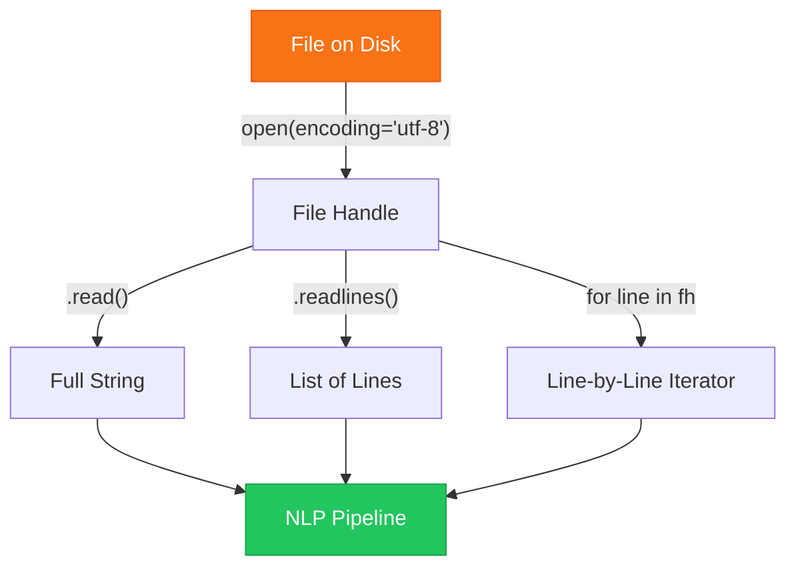
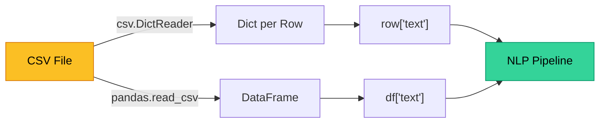

# Chapter 3 — File I/O & Multi-Source Handling

> **Module 1 · Python for NLP** · Estimated Duration: 35 minutes

---

## 🎯 Learning Objectives

1. Read and write text files with explicit encoding specification.
2. Process multiple files in batch using `pathlib.Path.glob()`.
3. Handle CSV files as structured text sources for NLP corpora.
4. Implement context managers for safe, leak-free file handling.

---

## 📚 Core Concepts

### 3.1 — Reading Text Files with Encoding Control



```python
from pathlib import Path  # Import pathlib for cross-platform, object-oriented file system access
from loguru import logger  # Import loguru for DEBUG-level execution tracing

logger.debug("Starting Chapter 03 — File I/O & Multi-Source Handling")  # Log the chapter entry point

file_path: Path = Path("data/sample_corpus.txt")  # Define the target file path as a Path object
logger.debug(f"Target file path: {file_path}")  # Log the path for verification

# --- Safe reading with context manager ---
with open(file_path, mode="r", encoding="utf-8") as fh:  # Open with explicit UTF-8 to avoid platform default issues
    content: str = fh.read()  # Read the entire file into a single string
    logger.debug(f"Read {len(content)} characters from '{file_path.name}'")  # Log the character count
    
logger.debug(f"First 100 chars: '{content[:100]}'")  # Log a preview of the content
```

### 3.2 — Batch Processing with Glob

```python
from pathlib import Path  # Import pathlib for glob-based file discovery
from loguru import logger  # Import loguru for execution tracing

data_dir: Path = Path("data/corpus")  # Define the directory containing multiple text files
logger.debug(f"Scanning directory: {data_dir}")  # Log the target directory

txt_files: list[Path] = sorted(data_dir.glob("*.txt"))  # Discover all .txt files, sorted alphabetically
logger.debug(f"Found {len(txt_files)} text files")  # Log the file count

for idx, file_path in enumerate(txt_files, start=1):  # Iterate with a 1-based index for human-readable logging
    logger.debug(f"Processing file {idx}/{len(txt_files)}: '{file_path.name}'")  # Log current file
    with open(file_path, mode="r", encoding="utf-8") as fh:  # Open each file with consistent encoding
        lines: list[str] = fh.readlines()  # Read all lines into a list
        logger.debug(f"  → {len(lines)} lines read")  # Log the line count per file
```

### 3.3 — CSV as Structured Text Source



```python
import csv  # Import the csv module for delimiter-separated file parsing
from pathlib import Path  # Import pathlib for file path construction
from loguru import logger  # Import loguru for DEBUG execution tracing

csv_path: Path = Path("data/reviews.csv")  # Define path to the CSV corpus file
logger.debug(f"Opening CSV: {csv_path}")  # Log the target CSV path

with open(csv_path, mode="r", encoding="utf-8", newline="") as fh:  # Open with newline="" per csv module docs
    reader = csv.DictReader(fh)  # Create a dict reader — each row becomes an OrderedDict keyed by header
    logger.debug(f"CSV headers: {reader.fieldnames}")  # Log the detected column headers
    
    for row_num, row in enumerate(reader, start=1):  # Iterate rows with a 1-based counter
        text: str = row.get("review_text", "")  # Safely extract the text column with a default
        logger.debug(f"Row {row_num}: {len(text)} chars — preview: '{text[:60]}…'")  # Log a preview per row
```

---

## 🧪 Exercises

1. **Exercise 3.1** — Write a script that reads all `.txt` files in a folder and concatenates them into a single output file.
2. **Exercise 3.2** — Parse a CSV file with columns `id`, `label`, `text` and log the distribution of labels.
3. **Exercise 3.3** — Implement a function that reads a file and returns a dictionary: `{"lines": int, "words": int, "chars": int}`.

---

## 🔑 Key Takeaways

- Always specify `encoding="utf-8"` — platform defaults vary and cause silent data corruption.
- `pathlib.Path.glob()` is the idiomatic way to discover files — avoid `os.listdir` in modern Python.
- **Context managers** (`with` statements) guarantee file handles are released even when exceptions occur.

---

[← Previous Chapter](M01-C02-L01-advanced-regex-patterns.md) · [Module Index](MODULE.md) · [Next Chapter →](M01-C04-L01-json-data-structures.md)
