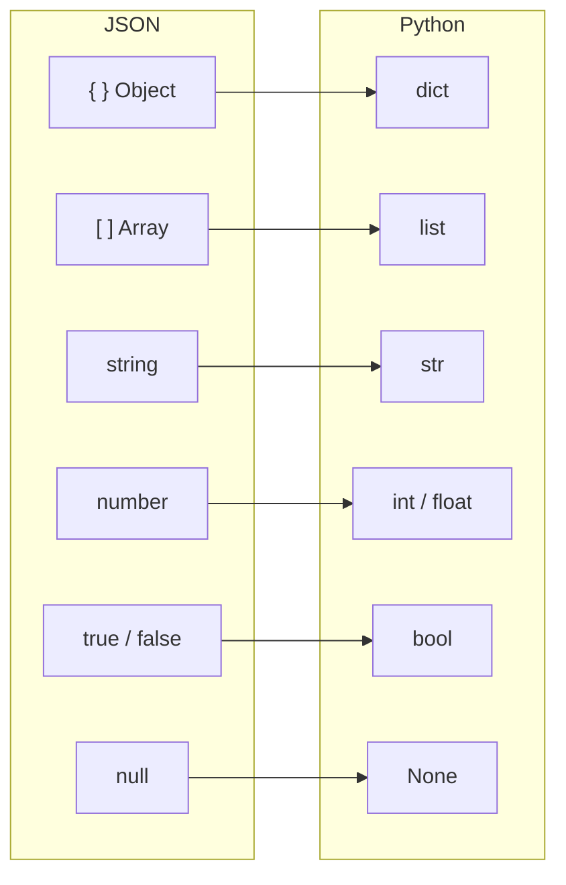
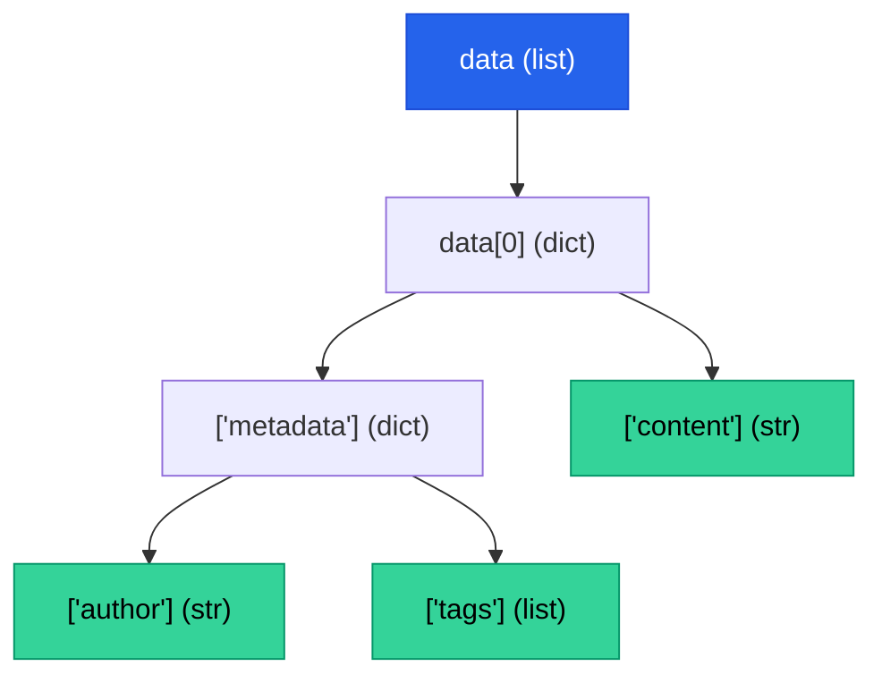

# Chapter 4 — JSON Data Structures

> **Module 1 · Python for NLP** · Estimated Duration: 35 minutes

---

## 🎯 Learning Objectives

1. Parse JSON files and API responses into Python dictionaries and lists.
2. Navigate deeply nested JSON structures to extract NLP-relevant fields.
3. Serialise processed data back to JSON with controlled formatting.
4. Validate JSON schemas programmatically for pipeline robustness.

---

## 📚 Core Concepts

### 4.1 — JSON ↔ Python Type Mapping



```python
import json  # Import the json module for serialization and deserialization of JSON data
from pathlib import Path  # Import pathlib for file system path handling
from loguru import logger  # Import loguru for DEBUG-level execution logging

logger.debug("Starting Chapter 04 — JSON Data Structures")  # Log the chapter entry point

# --- Loading JSON from a file ---
json_path: Path = Path("data/articles.json")  # Define the path to the JSON corpus file
logger.debug(f"Loading JSON from: {json_path}")  # Log the file path

with open(json_path, mode="r", encoding="utf-8") as fh:  # Open with UTF-8 encoding for safety
    data: list[dict] = json.load(fh)  # Deserialise the entire JSON file into a Python object
    logger.debug(f"Loaded {len(data)} records from JSON")  # Log the record count

# --- Inspecting the first record ---
first_record: dict = data[0]  # Access the first element for inspection
logger.debug(f"First record keys: {list(first_record.keys())}")  # Log the top-level keys
logger.debug(f"First record preview: {json.dumps(first_record, indent=2)[:200]}")  # Log a pretty-printed preview
```

### 4.2 — Navigating Nested Structures



```python
import json  # Import json for nested structure traversal demonstration
from loguru import logger  # Import loguru for step-by-step logging

# --- Simulated nested JSON data ---
article: dict = {
    "title": "Advances in Tokenization",
    "metadata": {
        "author": "Dr. A. Turing",
        "tags": ["NLP", "tokenization", "research"],
        "published": "2026-02-15"
    },
    "content": "This paper discusses modern approaches to sub-word tokenization..."
}  # A representative nested document structure
logger.debug(f"Article title: {article['title']}")  # Log the top-level title

author: str = article["metadata"]["author"]  # Traverse two levels deep to extract the author
logger.debug(f"Author: {author}")  # Log the extracted author

tags: list[str] = article.get("metadata", {}).get("tags", [])  # Safely traverse with .get() to avoid KeyError
logger.debug(f"Tags: {tags}")  # Log the list of tags

content_preview: str = article["content"][:80]  # Extract a content preview (first 80 characters)
logger.debug(f"Content preview: '{content_preview}…'")  # Log the preview
```

---

## 🧪 Exercises

1. **Exercise 4.1** — Load a JSON file containing a list of articles and extract all unique author names.
2. **Exercise 4.2** — Write a function that flattens a nested JSON object into a single-level dictionary with dot-separated keys.
3. **Exercise 4.3** — Serialise a Python dictionary to a JSON file with `indent=2` and `ensure_ascii=False`.

---

## 🔑 Key Takeaways

- `json.load()` reads from a file handle; `json.loads()` reads from a string — know the difference.
- Use `.get()` with defaults for safe nested traversal in production pipelines.
- Always set `ensure_ascii=False` when serialising multilingual NLP data to preserve Unicode characters.

---

[← Previous Chapter](M01-C03-L01-file-io-multi-source-handling.md) · [Module Index](MODULE.md) · [Next Chapter →](M01-C05-L01-robust-error-exception-handling.md)
