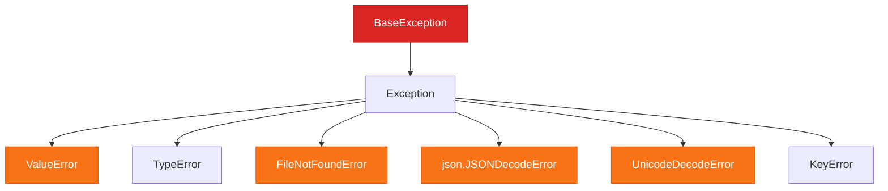
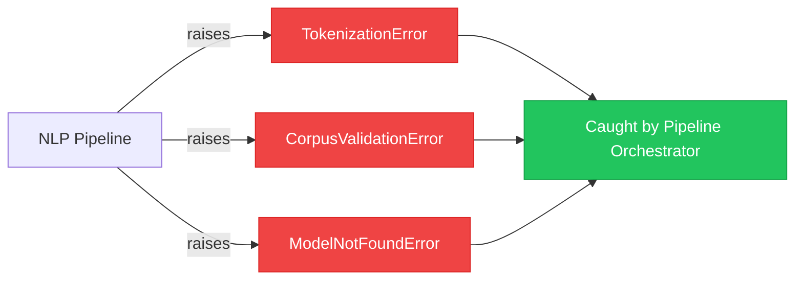

# Chapter 5 — Robust Error & Exception Handling

> **Module 1 · Python for NLP** · Estimated Duration: 35 minutes

---

## 🎯 Learning Objectives

1. Classify Python exceptions and understand the exception hierarchy.
2. Apply `try / except / else / finally` blocks in NLP pipeline stages.
3. Create custom exception classes for domain-specific error signalling.
4. Implement graceful degradation patterns that keep pipelines running.

---

## 📚 Core Concepts

### 5.1 — Exception Hierarchy for NLP



```python
import json  # Import json to demonstrate JSONDecodeError handling
from pathlib import Path  # Import pathlib for file path construction
from loguru import logger  # Import loguru for DEBUG-level tracing

logger.debug("Starting Chapter 05 — Robust Error & Exception Handling")  # Log the chapter entry

# --- Handling file and JSON errors gracefully ---
def load_corpus(file_path: Path) -> list[dict]:
    """Load a JSON corpus with comprehensive error handling."""
    logger.debug(f"Attempting to load corpus from: {file_path}")  # Log the target path
    
    try:  # Begin the guarded block for file and parse operations
        with open(file_path, mode="r", encoding="utf-8") as fh:  # Open with explicit encoding
            data: list[dict] = json.load(fh)  # Attempt to parse the JSON content
            logger.debug(f"Successfully loaded {len(data)} records")  # Log success
    except FileNotFoundError:  # Handle missing file — common in batch processing
        logger.error(f"File not found: {file_path}")  # Log the error with context
        data = []  # Return empty list as graceful fallback
    except json.JSONDecodeError as e:  # Handle malformed JSON — common with scraped data
        logger.error(f"JSON parse error in '{file_path.name}': {e}")  # Log with error detail
        data = []  # Return empty list rather than crashing
    except UnicodeDecodeError as e:  # Handle encoding mismatches
        logger.error(f"Encoding error in '{file_path.name}': {e}")  # Log the encoding issue
        data = []  # Graceful fallback
    else:  # Runs only if no exceptions were raised
        logger.debug("No errors encountered during loading")  # Confirm clean execution
    finally:  # Always runs — useful for cleanup logging
        logger.debug(f"load_corpus() completed for: {file_path}")  # Log completion regardless of outcome
    
    return data  # Return the data (or empty fallback)
```

### 5.2 — Custom Exceptions for NLP Domains



```python
from loguru import logger  # Import loguru for execution tracing

# --- Custom exception definitions ---
class NLPPipelineError(Exception):
    """Base exception for all NLP pipeline errors."""
    pass  # Serves as the root of our custom hierarchy

class TokenizationError(NLPPipelineError):
    """Raised when tokenization fails on a document."""
    pass  # Specific to tokenization-stage failures

class CorpusValidationError(NLPPipelineError):
    """Raised when corpus data fails validation checks."""
    pass  # Specific to data quality issues

# --- Using custom exceptions ---
def validate_document(doc: dict) -> None:
    """Validate a document dictionary before processing."""
    logger.debug(f"Validating document: {doc.get('id', 'UNKNOWN')}")  # Log the document being validated
    
    if "text" not in doc:  # Check for the required 'text' field
        raise CorpusValidationError(f"Document missing 'text' field: {doc}")  # Raise domain-specific error
    
    if len(doc["text"].strip()) == 0:  # Check for empty text content
        raise CorpusValidationError(f"Document has empty text: {doc.get('id')}")  # Raise with context

    logger.debug("Document validation passed")  # Log successful validation
```

---

## 🧪 Exercises

1. **Exercise 5.1** — Wrap a file-reading loop in error handling that logs failures and continues processing remaining files.
2. **Exercise 5.2** — Create a `ModelNotFoundError` exception class and raise it when a model path does not exist.
3. **Exercise 5.3** — Write a decorator that catches any exception, logs it, and returns a default value.

---

## 🔑 Key Takeaways

- **Catch specific exceptions** — never use bare `except:` in production NLP pipelines.
- **Custom exceptions** make error handling self-documenting and enable fine-grained recovery strategies.
- The `else` and `finally` clauses complete the four-part error handling pattern for robust pipelines.

---

[← Previous Chapter](M01-C04-L01-json-data-structures.md) · [Module Index](MODULE.md) · [Next Chapter →](M01-C06-L01-pandas-dataframes-nlp.md)
