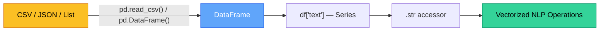
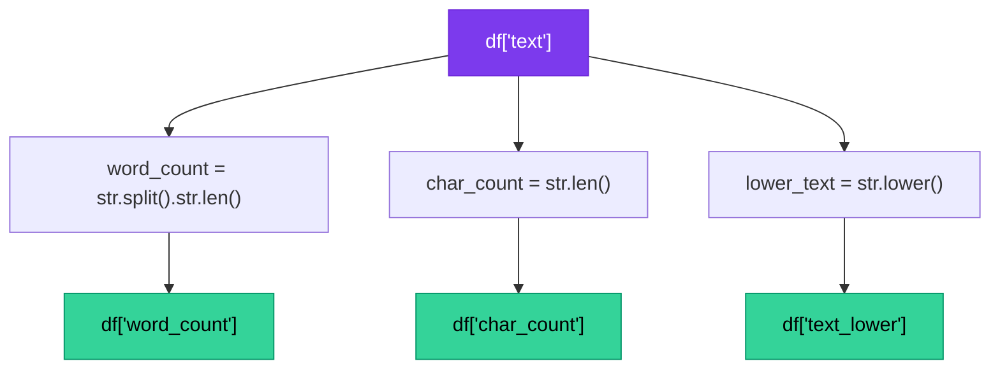

# Chapter 6 — Pandas DataFrames for NLP

> **Module 1 · Python for NLP** · Estimated Duration: 40 minutes

---

## 🎯 Learning Objectives

1. Create DataFrames from NLP corpora (CSV, JSON, lists of dictionaries).
2. Access and manipulate text columns using pandas indexing.
3. Apply vectorized string operations on text Series.
4. Compute basic text statistics (word count, character count) as new columns.

---

## 📚 Core Concepts

### 6.1 — From Corpus to DataFrame



```python
import pandas as pd  # Import pandas for tabular NLP data manipulation
from loguru import logger  # Import loguru for DEBUG execution tracing

logger.debug("Starting Chapter 06 — Pandas DataFrames for NLP")  # Log chapter entry

# --- Creating a DataFrame from a list of dictionaries ---
corpus: list[dict] = [
    {"id": 1, "label": "positive", "text": "This product is absolutely wonderful!"},
    {"id": 2, "label": "negative", "text": "Terrible experience. Would not recommend."},
    {"id": 3, "label": "positive", "text": "Excellent quality and fast delivery."},
    {"id": 4, "label": "negative", "text": "The item arrived broken and damaged."},
]  # Simulated NLP corpus as a list of document dictionaries
logger.debug(f"Corpus contains {len(corpus)} documents")  # Log corpus size

df: pd.DataFrame = pd.DataFrame(corpus)  # Convert list of dicts to a DataFrame — one row per document
logger.debug(f"DataFrame shape: {df.shape}")  # Log (rows, columns) dimensions
logger.debug(f"Columns: {list(df.columns)}")  # Log column names
logger.debug(f"Dtypes:\n{df.dtypes}")  # Log data types per column
```

### 6.2 — Text Column Operations



```python
import pandas as pd  # Import pandas for DataFrame operations
from loguru import logger  # Import loguru for execution tracing

# --- Assuming df is already loaded (see section 6.1) ---
df["word_count"] = df["text"].str.split().str.len()  # Count words per document using vectorized str.split()
logger.debug(f"Word counts:\n{df[['id', 'word_count']]}")  # Log the word count column

df["char_count"] = df["text"].str.len()  # Count characters per document — useful for length filtering
logger.debug(f"Character counts:\n{df[['id', 'char_count']]}")  # Log character counts

df["text_lower"] = df["text"].str.lower()  # Create a lowercase copy — preserves the original column
logger.debug(f"Lowered text sample: '{df['text_lower'].iloc[0]}'")  # Log a sample

# --- Label distribution ---
label_counts: pd.Series = df["label"].value_counts()  # Count occurrences of each label
logger.debug(f"Label distribution:\n{label_counts}")  # Log class balance information
```

---

## 🧪 Exercises

1. **Exercise 6.1** — Load a CSV file into a DataFrame and display the first 5 rows with `loguru`.
2. **Exercise 6.2** — Add a column `has_exclamation` that is `True` if the text contains `!`.
3. **Exercise 6.3** — Filter the DataFrame to only include documents with more than 5 words.

---

## 🔑 Key Takeaways

- pandas DataFrames are the natural container for tabular NLP corpora with metadata columns.
- The `.str` accessor unlocks **vectorized** string operations — avoid row-by-row loops.
- Adding computed columns (word count, char count) is the first step in **exploratory text analysis**.

---

[← Previous Chapter](M01-C05-L01-robust-error-exception-handling.md) · [Module Index](MODULE.md) · [Next Chapter →](M01-C07-L01-text-filtering-cleaning.md)
