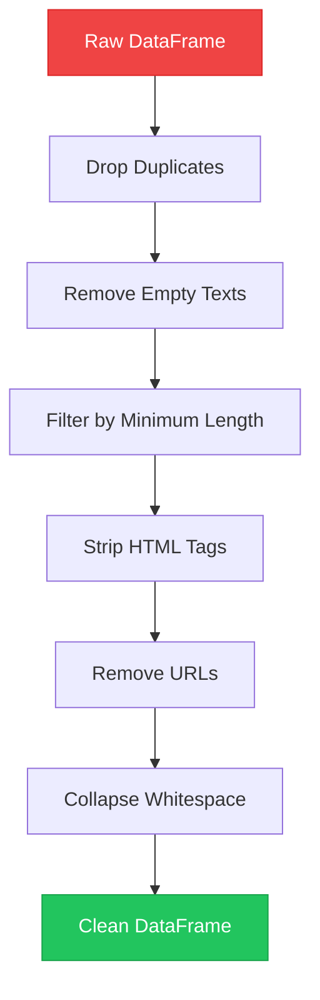
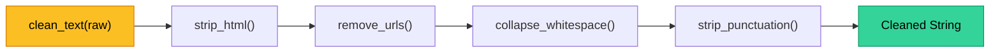

# Chapter 7 — Text Filtering & Cleaning

> **Module 1 · Python for NLP** · Estimated Duration: 35 minutes

---

## 🎯 Learning Objectives

1. Apply DataFrame filtering to remove noisy, empty, or duplicate documents.
2. Build reusable text cleaning functions that work with `pandas.Series.apply()`.
3. Handle common text artefacts: HTML tags, URLs, excess whitespace, special characters.
4. Chain cleaning operations into a reproducible cleaning pipeline.

---

## 📚 Core Concepts

### 7.1 — Filtering Pipeline Architecture



```python
import re  # Import regex for pattern-based text cleaning
import pandas as pd  # Import pandas for DataFrame operations
from loguru import logger  # Import loguru for DEBUG-level execution tracing

logger.debug("Starting Chapter 07 — Text Filtering & Cleaning")  # Log chapter entry

# --- Step 1: Drop duplicate rows ---
initial_count: int = len(df)  # Record row count before deduplication
df = df.drop_duplicates(subset=["text"], keep="first")  # Remove exact text duplicates, keeping the first occurrence
logger.debug(f"Dropped {initial_count - len(df)} duplicate rows → {len(df)} remaining")  # Log dedup stats

# --- Step 2: Remove empty or whitespace-only texts ---
mask_nonempty: pd.Series = df["text"].str.strip().str.len() > 0  # Boolean mask: True if text is non-empty
df = df[mask_nonempty].reset_index(drop=True)  # Apply mask and reset the integer index
logger.debug(f"After removing empty texts: {len(df)} rows")  # Log remaining count

# --- Step 3: Minimum word count filter ---
MIN_WORDS: int = 3  # Define the minimum acceptable word count threshold
df = df[df["text"].str.split().str.len() >= MIN_WORDS].reset_index(drop=True)  # Filter short texts
logger.debug(f"After min-word filter ({MIN_WORDS}): {len(df)} rows")  # Log filtered count
```

### 7.2 — Reusable Cleaning Functions



```python
import re  # Import regex for HTML and URL removal patterns
from loguru import logger  # Import loguru for execution tracing

def strip_html(text: str) -> str:
    """Remove HTML tags from text."""
    cleaned: str = re.sub(r"<[^>]+>", "", text)  # Replace any <tag> with empty string
    logger.debug(f"[strip_html] '{text[:40]}…' → '{cleaned[:40]}…'")  # Log before/after
    return cleaned

def remove_urls(text: str) -> str:
    """Remove HTTP(S) URLs from text."""
    cleaned: str = re.sub(r"https?://\S+", "", text)  # Match URLs starting with http(s)://
    logger.debug(f"[remove_urls] Cleaned URLs from text")  # Log the operation
    return cleaned

def collapse_whitespace(text: str) -> str:
    """Collapse multiple whitespace characters into a single space."""
    cleaned: str = re.sub(r"\s+", " ", text).strip()  # Replace whitespace runs and strip edges
    logger.debug(f"[collapse_ws] Result: '{cleaned[:60]}…'")  # Log the result
    return cleaned

def clean_text(text: str) -> str:
    """Apply the full cleaning pipeline to a single text string."""
    text = strip_html(text)  # Step 1: remove HTML artefacts
    text = remove_urls(text)  # Step 2: remove embedded URLs
    text = collapse_whitespace(text)  # Step 3: normalise whitespace
    return text  # Return the cleaned text

# --- Apply to DataFrame ---
df["text_clean"] = df["text"].apply(clean_text)  # Apply the pipeline to every row via .apply()
logger.debug(f"Cleaning complete. Sample: '{df['text_clean'].iloc[0]}'")  # Log a sample result
```

---

## 🧪 Exercises

1. **Exercise 7.1** — Write a function that removes all digits from a text string.
2. **Exercise 7.2** — Extend the cleaning pipeline to also remove email addresses.
3. **Exercise 7.3** — Build a report that shows how many characters were removed per document during cleaning.

---

## 🔑 Key Takeaways

- Always **deduplicate and filter** before expensive NLP processing — it saves compute and reduces noise.
- Composable, single-responsibility cleaning functions are easier to test and maintain.
- `pandas.Series.apply()` bridges the gap between scalar functions and vectorized DataFrame operations.

---

[← Previous Chapter](M01-C06-L01-pandas-dataframes-nlp.md) · [Module Index](MODULE.md) · [Next Chapter →](M01-C08-L01-descriptive-text-statistics.md)
