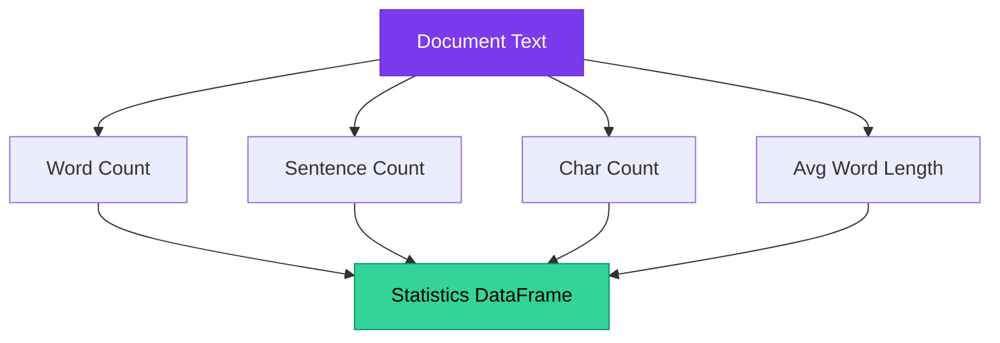

# Chapter 8 — Descriptive Text Statistics

> **Module 1 · Python for NLP** · Estimated Duration: 35 minutes

---

## 🎯 Learning Objectives

1. Compute document-level statistics: word count, sentence count, average word length.
2. Build corpus-level distribution summaries using pandas `describe()`.
3. Identify outliers in text length that may indicate data quality issues.
4. Visualise word count distributions conceptually for EDA.

---

## 📚 Core Concepts

### 8.1 — Document-Level Metrics



```python
import pandas as pd  # Import pandas for tabular statistics computation
from loguru import logger  # Import loguru for DEBUG-level tracing

logger.debug("Starting Chapter 08 — Descriptive Text Statistics")  # Log chapter entry

# --- Compute document-level statistics ---
df["word_count"] = df["text"].str.split().str.len()  # Count words by splitting on whitespace
logger.debug(f"Word count range: {df['word_count'].min()} – {df['word_count'].max()}")  # Log range

df["sentence_count"] = df["text"].str.count(r"[.!?]+")  # Count sentence-ending punctuation clusters
logger.debug(f"Sentence count range: {df['sentence_count'].min()} – {df['sentence_count'].max()}")  # Log range

df["char_count"] = df["text"].str.len()  # Count total characters including whitespace
logger.debug(f"Character count range: {df['char_count'].min()} – {df['char_count'].max()}")  # Log range

df["avg_word_len"] = df["text"].apply(
    lambda t: sum(len(w) for w in t.split()) / max(len(t.split()), 1)  # Avoid division by zero
)  # Compute mean word length per document
logger.debug(f"Average word length range: {df['avg_word_len'].min():.2f} – {df['avg_word_len'].max():.2f}")
```

### 8.2 — Corpus-Level Summary


```python
import pandas as pd  # Import pandas for statistical summaries
from loguru import logger  # Import loguru for execution logging

# --- Corpus-level descriptive statistics ---
stats_columns: list[str] = ["word_count", "sentence_count", "char_count", "avg_word_len"]
summary: pd.DataFrame = df[stats_columns].describe()  # Compute count, mean, std, min, quartiles, max
logger.debug(f"Corpus statistics:\n{summary}")  # Log the full summary table

# --- Outlier detection using IQR ---
q1: float = df["word_count"].quantile(0.25)  # First quartile
q3: float = df["word_count"].quantile(0.75)  # Third quartile
iqr: float = q3 - q1  # Inter-quartile range
lower_bound: float = q1 - 1.5 * iqr  # Lower fence for outliers
upper_bound: float = q3 + 1.5 * iqr  # Upper fence for outliers
logger.debug(f"Word count IQR: {iqr:.1f}, bounds: [{lower_bound:.1f}, {upper_bound:.1f}]")  # Log bounds

outliers: pd.DataFrame = df[
    (df["word_count"] < lower_bound) | (df["word_count"] > upper_bound)
]  # Filter documents outside the IQR fences
logger.debug(f"Detected {len(outliers)} word-count outliers")  # Log outlier count
```

---

## 🧪 Exercises

1. **Exercise 8.1** — Add a `unique_word_ratio` column (unique words / total words) and analyse its distribution.
2. **Exercise 8.2** — Compute the top 10 most common words across the entire corpus.
3. **Exercise 8.3** — Identify documents where `sentence_count` is zero and flag them as potentially malformed.

---

## 🔑 Key Takeaways

- **Document-level metrics** (word count, sentence count, average word length) are essential sanity checks before modelling.
- `df.describe()` provides a compact corpus-level summary — always inspect it before training.
- **IQR-based outlier detection** identifies abnormally short or long documents that may need special handling.

---

[← Previous Chapter](M01-C07-L01-text-filtering-cleaning.md) · [Module Index](MODULE.md) · [Next Chapter →](M01-C09-L01-vectorized-string-operations.md)
