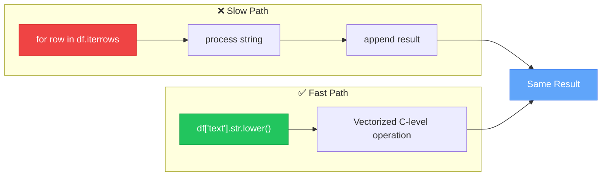
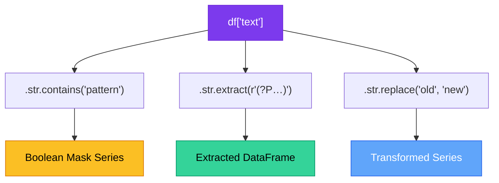

# Chapter 9 — Vectorized String Operations

> **Module 1 · Python for NLP** · Estimated Duration: 35 minutes

---

## 🎯 Learning Objectives

1. Distinguish between `apply()` and vectorized `.str` methods in terms of performance.
2. Chain multiple `.str` accessor calls for efficient text transformation.
3. Use `.str.contains()`, `.str.extract()`, and `.str.replace()` for pattern-based operations.
4. Apply conditional logic on text columns using `np.where()` and boolean masks.

---

## 📚 Core Concepts

### 9.1 — Vectorized vs. Loop-Based Processing



```python
import pandas as pd  # Import pandas for vectorized text operations
import numpy as np  # Import numpy for conditional logic (np.where)
from loguru import logger  # Import loguru for DEBUG execution tracing

logger.debug("Starting Chapter 09 — Vectorized String Operations")  # Log chapter entry

# --- Chained vectorized operations ---
df["text_processed"] = (
    df["text"]
    .str.lower()  # Step 1: case folding — vectorized, runs at C level
    .str.strip()  # Step 2: strip whitespace — vectorized
    .str.replace(r"[^\w\s]", "", regex=True)  # Step 3: remove punctuation — vectorized regex
)  # Chain produces a new Series without any Python-level loops
logger.debug(f"Processed sample: '{df['text_processed'].iloc[0]}'")  # Log a processed sample
```

### 9.2 — Pattern Matching & Extraction



```python
import pandas as pd  # Import pandas for vectorized pattern operations
import numpy as np  # Import numpy for np.where conditional logic
from loguru import logger  # Import loguru for step-by-step logging

# --- .str.contains() — boolean pattern matching ---
has_number: pd.Series = df["text"].str.contains(r"\d+", regex=True)  # True if text contains any digit
logger.debug(f"Documents with numbers: {has_number.sum()} / {len(df)}")  # Log the count

# --- .str.extract() — capture group extraction ---
year_extracted: pd.DataFrame = df["text"].str.extract(r"(?P<year>\b20\d{2}\b)")  # Extract 4-digit years
logger.debug(f"Extracted years:\n{year_extracted.dropna()}")  # Log non-null extracted years

# --- Conditional column with np.where ---
df["length_category"] = np.where(
    df["text"].str.len() > 100,  # Condition: text longer than 100 characters
    "long",  # Value if True
    "short"  # Value if False
)  # Create a categorical column based on text length
logger.debug(f"Length category distribution:\n{df['length_category'].value_counts()}")  # Log distribution
```

---

## 🧪 Exercises

1. **Exercise 9.1** — Use `.str.count()` to count the number of uppercase letters in each document.
2. **Exercise 9.2** — Extract all words that start with a capital letter using `.str.findall()`.
3. **Exercise 9.3** — Benchmark `.str.lower()` vs. `.apply(lambda x: x.lower())` on a 100,000-row DataFrame.

---

## 🔑 Key Takeaways

- **Vectorized `.str` methods** operate at C level and are orders of magnitude faster than Python loops.
- **Chain `.str` calls** for readable, efficient multi-step text transformations.
- Use `np.where()` to create conditional columns without slow row-by-row iteration.

---

[← Previous Chapter](M01-C08-L01-descriptive-text-statistics.md) · [Module Index](MODULE.md) · [Next Chapter →](M01-C10-L01-exploratory-analysis-eda.md)
