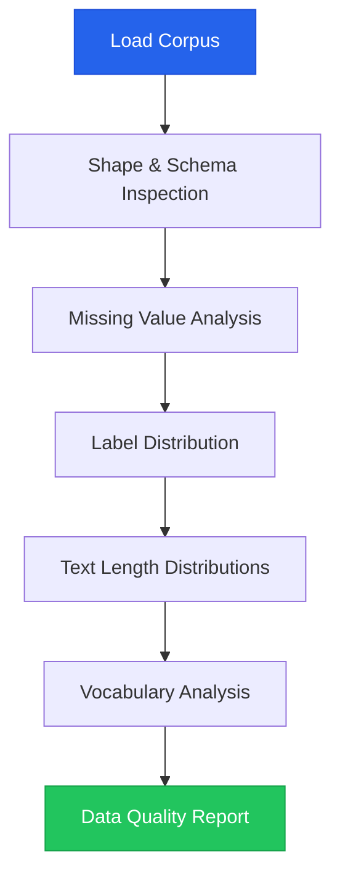
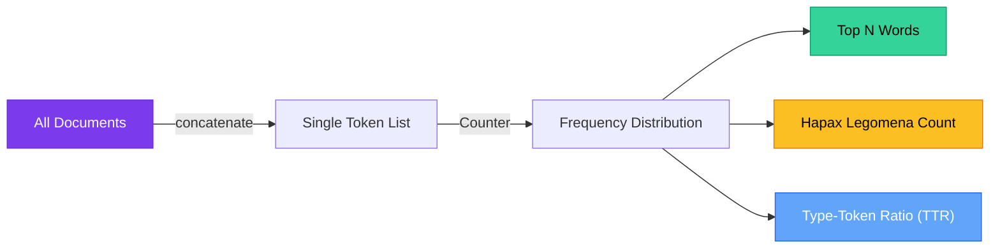

# Chapter 10 — Exploratory Data Analysis (EDA)

> **Module 1 · Python for NLP** · Estimated Duration: 40 minutes

---

## 🎯 Learning Objectives

1. Conduct a full exploratory analysis on an NLP corpus DataFrame.
2. Profile corpus composition: class balance, text length distributions, vocabulary richness.
3. Detect data quality issues through statistical and visual inspection.
4. Document EDA findings as reproducible analytical reports.

---

## 📚 Core Concepts

### 10.1 — EDA Workflow for NLP



```python
import pandas as pd  # Import pandas for corpus exploration
from collections import Counter  # Import Counter for vocabulary frequency analysis
from loguru import logger  # Import loguru for DEBUG-level execution tracing

logger.debug("Starting Chapter 10 — Exploratory Data Analysis (EDA)")  # Log chapter entry

# --- Step 1: Shape & Schema ---
logger.debug(f"DataFrame shape: {df.shape}")  # Log dimensions (rows, columns)
logger.debug(f"Column dtypes:\n{df.dtypes}")  # Log data types

# --- Step 2: Missing values ---
missing: pd.Series = df.isnull().sum()  # Count nulls per column
logger.debug(f"Missing values per column:\n{missing}")  # Log missing counts

# --- Step 3: Label distribution ---
if "label" in df.columns:
    label_dist: pd.Series = df["label"].value_counts(normalize=True)  # Normalized label frequencies
    logger.debug(f"Label distribution (%):\n{label_dist * 100}")  # Log as percentages
```

### 10.2 — Vocabulary Richness Analysis



```python
from collections import Counter  # Import Counter for word frequency counting
from loguru import logger  # Import loguru for structured logging

# --- Build corpus-wide vocabulary ---
all_tokens: list[str] = []  # Initialise empty token accumulator
for text in df["text"]:  # Iterate through all documents
    tokens: list[str] = text.lower().split()  # Simple whitespace tokenization with case folding
    all_tokens.extend(tokens)  # Accumulate tokens into the master list

total_tokens: int = len(all_tokens)  # Total number of tokens (with repetition)
logger.debug(f"Total tokens in corpus: {total_tokens}")  # Log total count

vocab: Counter = Counter(all_tokens)  # Build frequency distribution
unique_types: int = len(vocab)  # Number of unique word types
logger.debug(f"Unique types: {unique_types}")  # Log vocabulary size

ttr: float = unique_types / max(total_tokens, 1)  # Type-Token Ratio — measure of vocabulary richness
logger.debug(f"Type-Token Ratio (TTR): {ttr:.4f}")  # Log the TTR

# --- Top 10 most frequent words ---
top_10: list[tuple[str, int]] = vocab.most_common(10)  # Retrieve the 10 most frequent tokens
logger.debug(f"Top 10 words: {top_10}")  # Log the frequency leaders

# --- Hapax legomena (words appearing exactly once) ---
hapax: list[str] = [word for word, count in vocab.items() if count == 1]  # Filter single-occurrence words
logger.debug(f"Hapax legomena: {len(hapax)} words ({len(hapax)/unique_types*100:.1f}% of vocabulary)")
```

---

## 🧪 Exercises

1. **Exercise 10.1** — Generate a full EDA report for a sentiment analysis dataset (e.g., IMDb reviews).
2. **Exercise 10.2** — Compute the **Zipf's Law** exponent for your corpus and plot the rank-frequency distribution.
3. **Exercise 10.3** — Compare TTR between positive and negative labels — does one class use richer vocabulary?

---

## 🔑 Key Takeaways

- **Always run EDA before modelling** — class imbalance, missing values, and outliers derail models silently.
- **Type-Token Ratio (TTR)** quantifies vocabulary richness and can vary significantly across document classes.
- **Hapax legomena** (words appearing once) often dominate the vocabulary — they need special treatment in feature engineering.

---

## 🏁 Module 1 Complete

Congratulations! You have completed **Module 1 — Python for NLP**. You now have the Python foundations to build robust NLP data pipelines.

**Next:** [Module 2 — Classical NLP →](../Module-02_Classical-NLP/MODULE.md)

---

[← Previous Chapter](M01-C09-L01-vectorized-string-operations.md) · [Module Index](MODULE.md) · [Course Index](../README.md)
