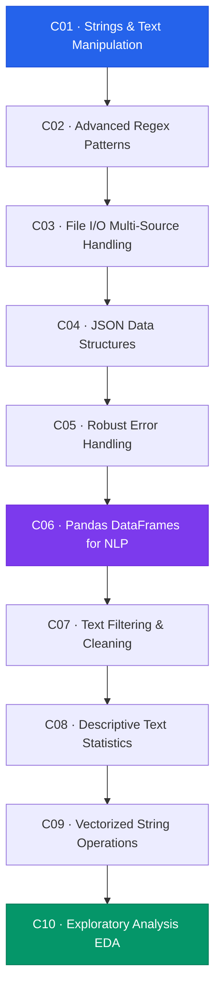

# Module 1 — Python for NLP

> **Duration:** 6 Hours · **Chapters:** 10 · **Level:** Foundation

---

## 🎯 Module Objective

Equip learners with the Python proficiency required to build, debug, and scale NLP data pipelines — from raw text ingestion to structured, analysis-ready DataFrames.

---

## 📖 Synopsis

This module covers the essential Python skills that serve as the bedrock for every NLP project:

- **String manipulation & Regex** — extracting, transforming, and validating textual data at scale.
- **File I/O & JSON** — reading from heterogeneous sources and handling semi-structured data.
- **Error handling** — building resilient pipelines that fail gracefully.
- **Pandas for NLP** — leveraging DataFrames for text statistics, filtering, vectorized operations, and exploratory analysis.

---

## 🗺️ Chapter Roadmap

---

## 📂 Chapter Index

| # | Title | File | Focus |
|---|-------|------|-------|
| 1 | Strings & Text Manipulation | [M01-C01](M01-C01-L01-strings-text-manipulation.md) | Core string methods, slicing, encoding |
| 2 | Advanced Regex Patterns | [M01-C02](M01-C02-L01-advanced-regex-patterns.md) | Groups, lookaheads, named captures |
| 3 | File I/O & Multi-Source Handling | [M01-C03](M01-C03-L01-file-io-multi-source-handling.md) | Text, CSV, multi-file batch reading |
| 4 | JSON Data Structures | [M01-C04](M01-C04-L01-json-data-structures.md) | Parsing, nested traversal, validation |
| 5 | Robust Error & Exception Handling | [M01-C05](M01-C05-L01-robust-error-exception-handling.md) | Try/except patterns, custom exceptions |
| 6 | Pandas DataFrames for NLP | [M01-C06](M01-C06-L01-pandas-dataframes-nlp.md) | Series, DataFrame, text columns |
| 7 | Text Filtering & Cleaning | [M01-C07](M01-C07-L01-text-filtering-cleaning.md) | Normalization, deduplication, noise removal |
| 8 | Descriptive Text Statistics | [M01-C08](M01-C08-L01-descriptive-text-statistics.md) | Word counts, distributions, summary stats |
| 9 | Vectorized String Operations | [M01-C09](M01-C09-L01-vectorized-string-operations.md) | `.str` accessor, apply vs. vectorise |
| 10 | Exploratory Analysis (EDA) | [M01-C10](M01-C10-L01-exploratory-analysis-eda.md) | Visualisation, corpus profiling |

---

## ✅ Module Completion Checklist

- [ ] Completed all 10 chapters
- [ ] Executed every code snippet with `loguru` output verified
- [ ] Reviewed all Mermaid diagrams
- [ ] Completed end-of-chapter exercises
- [ ] Ready for **Module 2 — Classical NLP**

---

[← Back to Course Index](../README.md) · [Next Module →](../Module-02_Classical-NLP/MODULE.md)
