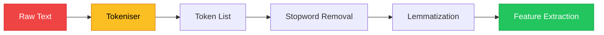
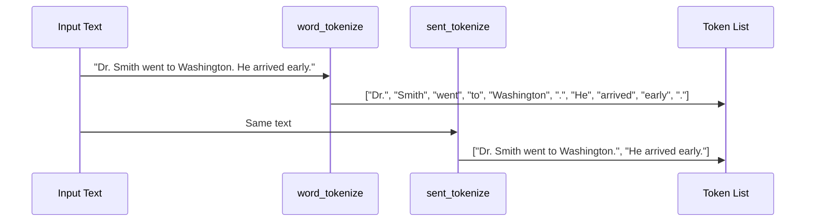

# Chapter 1 — Tokenization Strategies

> **Module 2 · Classical NLP** · Estimated Duration: 35 minutes

---

## 🎯 Learning Objectives

1. Define tokenization and explain its role as the first stage of any NLP pipeline.
2. Implement word-level, sentence-level, and sub-word tokenization in Python.
3. Compare NLTK, spaCy, and regex-based tokenisers for different use cases.
4. Handle edge cases: contractions, hyphenated words, punctuation attachment.

---

## 📚 Core Concepts

### 1.1 — Tokenization in the NLP Pipeline



```python
import re  # Import regex for custom tokenization patterns
from loguru import logger  # Import loguru for DEBUG execution tracing

logger.debug("Starting M02-C01 — Tokenization Strategies")  # Log chapter entry

# --- Simple whitespace tokenization ---
text: str = "The cat sat on the mat. It wasn't happy!"  # Sample sentence with contractions and punctuation
tokens_whitespace: list[str] = text.split()  # Split on whitespace — simplest tokeniser
logger.debug(f"Whitespace tokens: {tokens_whitespace}")  # Log result

# --- Regex-based word tokenization ---
tokens_regex: list[str] = re.findall(r"\b\w+(?:'\w+)?\b", text)  # Match words, preserving contractions
logger.debug(f"Regex tokens: {tokens_regex}")  # Log result — note "wasn't" stays intact
```

### 1.2 — NLTK Tokenisers



```python
import nltk  # Import NLTK for access to pre-built tokenisers
from nltk.tokenize import word_tokenize, sent_tokenize  # Import specific tokenization functions
from loguru import logger  # Import loguru for execution tracing

nltk.download("punkt_tab", quiet=True)  # Download the Punkt tokeniser model (required for word/sent tokenise)

text: str = "Dr. Smith went to Washington. He arrived early."  # Text with abbreviations and multiple sentences
logger.debug(f"Input text: '{text}'")  # Log the raw input

word_tokens: list[str] = word_tokenize(text)  # Apply the Punkt word tokeniser — handles abbreviations
logger.debug(f"Word tokens ({len(word_tokens)}): {word_tokens}")  # Log word tokens

sent_tokens: list[str] = sent_tokenize(text)  # Apply the Punkt sentence tokeniser
logger.debug(f"Sentence tokens ({len(sent_tokens)}): {sent_tokens}")  # Log sentence boundaries
```

---

## 🧪 Exercises

1. **Exercise 1.1** — Tokenise a paragraph using three different methods and compare the token counts.
2. **Exercise 1.2** — Write a tokeniser that splits on whitespace but preserves email addresses intact.
3. **Exercise 1.3** — Tokenise a multilingual text (English + Spanish) and log any unexpected splits.

---

## 🔑 Key Takeaways

- Tokenization is the **gateway operation** — every downstream step depends on token quality.
- **Whitespace splitting** is fast but fragile; **NLTK's Punkt** handles abbreviations and contractions.
- Choose your tokeniser based on the **domain** — legal, medical, and social media texts need different strategies.

---

[← Module Index](MODULE.md) · [Next Chapter →](M02-C02-L01-stopwords-noise-reduction.md)
