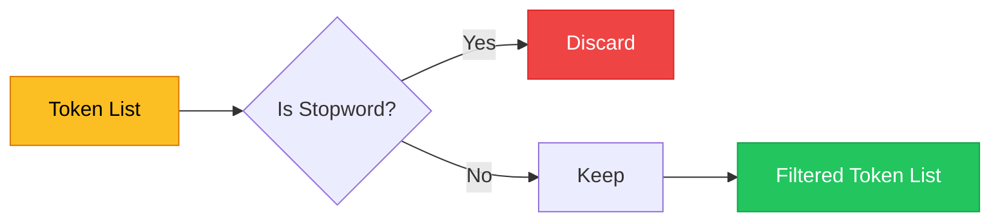
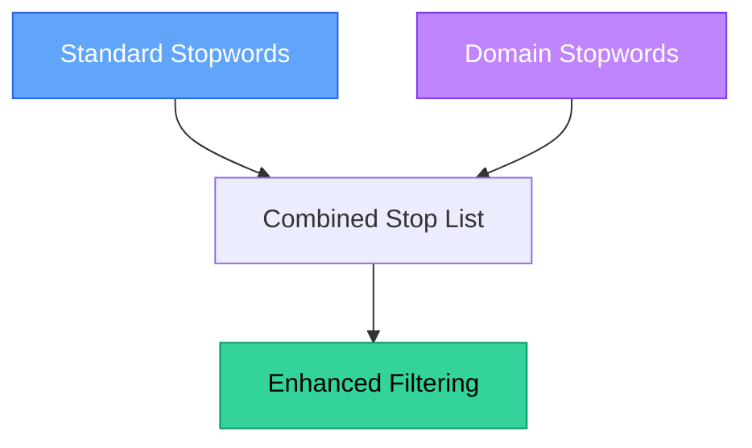

# Chapter 2 — Stopwords & Noise Reduction

> **Module 2 · Classical NLP** · Estimated Duration: 35 minutes

---

## 🎯 Learning Objectives

1. Define stopwords and explain why removing them improves signal-to-noise ratio.
2. Use NLTK's stopword corpus and build custom domain-specific stop lists.
3. Apply stopword removal as a pipeline step on tokenised text.
4. Evaluate the impact of stopword removal on downstream feature quality.

---

## 📚 Core Concepts

### 2.1 — The Stopword Filtering Pipeline



```python
import nltk  # Import NLTK for access to stopword corpora
from nltk.corpus import stopwords  # Import the stopwords corpus
from loguru import logger  # Import loguru for DEBUG tracing

nltk.download("stopwords", quiet=True)  # Download the stopword list if not already present

logger.debug("Starting M02-C02 — Stopwords & Noise Reduction")  # Log chapter entry

stop_words: set[str] = set(stopwords.words("english"))  # Load English stopwords into a set for O(1) lookup
logger.debug(f"Loaded {len(stop_words)} English stopwords")  # Log the size of the stop list

tokens: list[str] = ["the", "cat", "sat", "on", "the", "mat", "happily"]  # Sample token list
logger.debug(f"Before filtering: {tokens} ({len(tokens)} tokens)")  # Log original tokens

filtered: list[str] = [t for t in tokens if t.lower() not in stop_words]  # Filter out stopwords
logger.debug(f"After filtering: {filtered} ({len(filtered)} tokens)")  # Log the filtered result
```

### 2.2 — Custom Domain Stop Lists



```python
from loguru import logger  # Import loguru for execution tracing

# --- Building a domain-specific stop list ---
domain_stopwords: set[str] = {"document", "section", "page", "reference", "appendix"}  # Terms common in official docs
logger.debug(f"Domain stopwords: {domain_stopwords}")  # Log custom terms

combined_stops: set[str] = stop_words | domain_stopwords  # Merge standard + domain stopwords using set union
logger.debug(f"Combined stop list size: {len(combined_stops)}")  # Log merged size

# --- Apply combined filtering ---
doc_tokens: list[str] = ["the", "document", "section", "describes", "tokenization", "strategies"]
filtered_doc: list[str] = [t for t in doc_tokens if t.lower() not in combined_stops]  # Apply merged filter
logger.debug(f"Domain-filtered tokens: {filtered_doc}")  # Log the cleaned tokens
```

---

## 🧪 Exercises

1. **Exercise 2.1** — Compare the top 20 words before and after stopword removal on a real corpus.
2. **Exercise 2.2** — Build a stopword list for a medical NLP domain (hint: terms like "patient", "mg", "daily").
3. **Exercise 2.3** — Measure TF-IDF scores before and after stopword removal — does it change the top features?

---

## 🔑 Key Takeaways

- Stopwords carry **grammatical structure** but little **semantic signal** — removing them concentrates meaning.
- **Domain-specific stopwords** are as important as standard ones for specialised NLP applications.
- Use a `set` for stopword lookup — it provides O(1) membership testing.

---

[← Previous Chapter](M02-C01-L01-tokenisation-strategies.md) · [Module Index](MODULE.md) · [Next Chapter →](M02-C03-L01-lemmatisation-vs-stemming.md)
