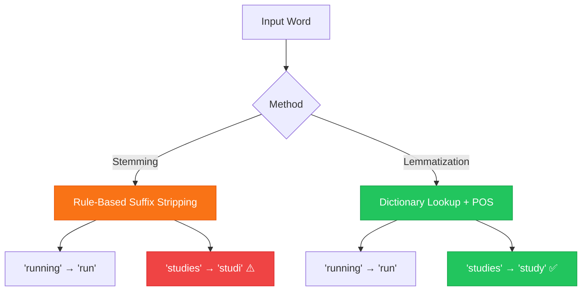
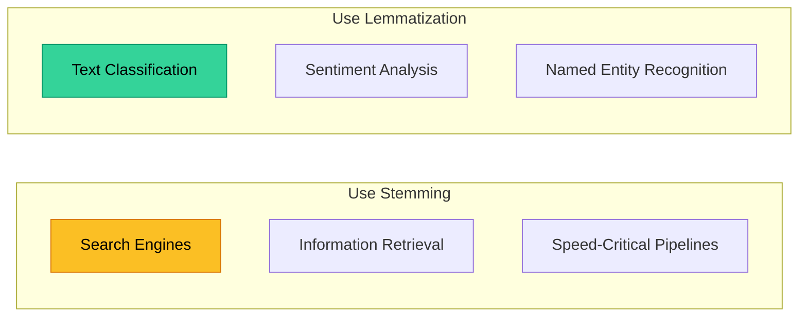

# Chapter 3 — Lemmatization vs. Stemming

> **Module 2 · Classical NLP** · Estimated Duration: 35 minutes

---

## 🎯 Learning Objectives

1. Distinguish between stemming (rule-based suffix stripping) and lemmatization (dictionary-based morphological analysis).
2. Implement Porter Stemmer and Snowball Stemmer from NLTK.
3. Implement WordNet Lemmatiser with POS-tag awareness.
4. Choose the right normalization strategy for different NLP tasks.

---

## 📚 Core Concepts

### 3.1 — Stemming vs. Lemmatization Comparison



```python
import nltk  # Import NLTK for stemming and lemmatization tools
from nltk.stem import PorterStemmer, SnowballStemmer  # Import stemmers
from nltk.stem import WordNetLemmatizer  # Import the WordNet-based lemmatiser
from loguru import logger  # Import loguru for DEBUG execution tracing

nltk.download("wordnet", quiet=True)  # Download WordNet data for the lemmatiser

logger.debug("Starting M02-C03 — Lemmatization vs. Stemming")  # Log chapter entry

words: list[str] = ["running", "studies", "better", "geese", "was", "are"]  # Test words with varied morphology

# --- Porter Stemmer ---
porter: PorterStemmer = PorterStemmer()  # Instantiate the classic Porter stemmer
stems_porter: list[str] = [porter.stem(w) for w in words]  # Apply stemming to each word
logger.debug(f"Porter stems: {list(zip(words, stems_porter))}")  # Log input-output pairs

# --- WordNet Lemmatiser ---
lemmatiser: WordNetLemmatizer = WordNetLemmatizer()  # Instantiate the WordNet lemmatiser
lemmas: list[str] = [lemmatiser.lemmatize(w, pos="v") for w in words]  # Lemmatise as verbs
logger.debug(f"WordNet lemmas (verb): {list(zip(words, lemmas))}")  # Log input-output pairs
```

### 3.2 — When to Use Each



---

## 🧪 Exercises

1. **Exercise 3.1** — Compare Porter and Snowball stemmers on 20 irregular English verbs.
2. **Exercise 3.2** — Implement a POS-aware lemmatiser that automatically detects the correct POS tag.
3. **Exercise 3.3** — Measure vocabulary size after stemming vs. lemmatization on a 10,000-document corpus.

---

## 🔑 Key Takeaways

- **Stemming** is fast but aggressive — it may produce non-words (e.g., "studi").
- **Lemmatization** produces valid dictionary forms but requires POS-tag information for accuracy.
- Choose based on your task: **stemming for IR/search**, **lemmatization for classification/NLU**.

---

[← Previous Chapter](M02-C02-L01-stopwords-noise-reduction.md) · [Module Index](MODULE.md) · [Next Chapter →](M02-C04-L01-n-grams-contextual-windows.md)
