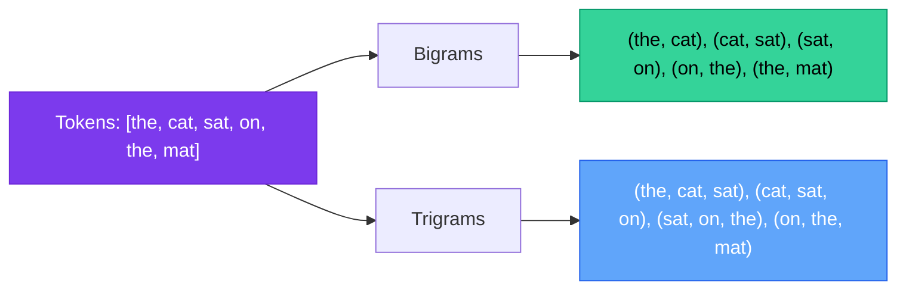
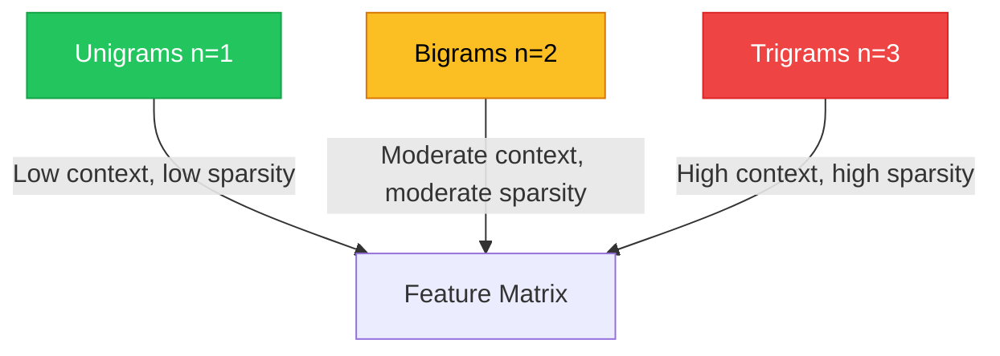

# Chapter 4 — N-Grams & Contextual Windows

> **Module 2 · Classical NLP** · Estimated Duration: 35 minutes

---

## 🎯 Learning Objectives

1. Define n-grams (unigrams, bigrams, trigrams) and explain their role in capturing local context.
2. Generate n-grams from tokenised text using Python and NLTK.
3. Analyse n-gram frequency distributions to discover collocations.
4. Understand the trade-off between n-gram order and feature sparsity.

---

## 📚 Core Concepts

### 4.1 — N-Gram Generation



```python
from nltk import ngrams  # Import NLTK's n-gram generator
from collections import Counter  # Import Counter for frequency analysis
from loguru import logger  # Import loguru for DEBUG tracing

logger.debug("Starting M02-C04 — N-Grams & Contextual Windows")  # Log chapter entry

tokens: list[str] = ["the", "cat", "sat", "on", "the", "mat"]  # Pre-tokenised input
logger.debug(f"Input tokens: {tokens}")  # Log the token list

# --- Bigrams ---
bigrams: list[tuple] = list(ngrams(tokens, 2))  # Generate all adjacent 2-grams
logger.debug(f"Bigrams ({len(bigrams)}): {bigrams}")  # Log bigrams

# --- Trigrams ---
trigrams: list[tuple] = list(ngrams(tokens, 3))  # Generate all adjacent 3-grams
logger.debug(f"Trigrams ({len(trigrams)}): {trigrams}")  # Log trigrams

# --- Frequency distribution ---
bigram_freq: Counter = Counter(bigrams)  # Count bigram occurrences
logger.debug(f"Most common bigrams: {bigram_freq.most_common(3)}")  # Log top 3 bigrams
```

### 4.2 — Sparsity vs. Context Trade-Off



---

## 🧪 Exercises

1. **Exercise 4.1** — Generate character-level n-grams (n=3) and analyse the most common patterns.
2. **Exercise 4.2** — Find the top 10 bigrams in a corpus after stopword removal.
3. **Exercise 4.3** — Plot n-gram vocabulary size as a function of n (1 through 5).

---

## 🔑 Key Takeaways

- **N-grams capture local sequential context** that individual tokens miss.
- Higher-order n-grams capture more context but introduce **exponential sparsity**.
- **Bigrams** are the sweet spot for most classification tasks — trigrams add marginal value.

---

[← Previous Chapter](M02-C03-L01-lemmatisation-vs-stemming.md) · [Module Index](MODULE.md) · [Next Chapter →](M02-C05-L01-bag-of-words-encoding.md)
