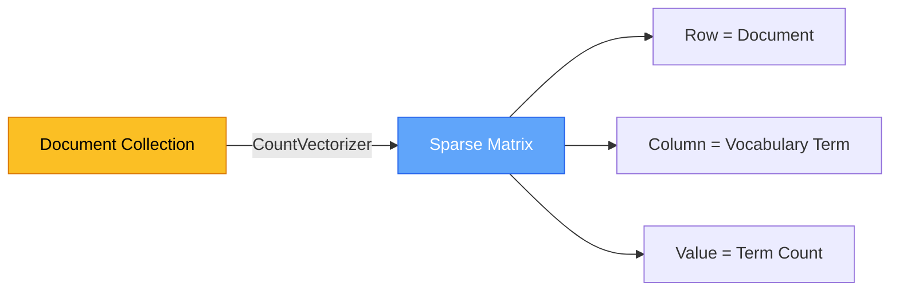

# Chapter 5 — Bag-of-Words Encoding

> **Module 2 · Classical NLP** · Estimated Duration: 35 minutes

---

## 🎯 Learning Objectives

1. Explain the Bag-of-Words (BoW) representation and its assumptions.
2. Use scikit-learn's `CountVectorizer` to transform text into sparse feature matrices.
3. Inspect the vocabulary and feature names generated by the vectoriser.
4. Understand the limitations of BoW (loss of word order, high dimensionality).

---

## 📚 Core Concepts

### 5.1 — The BoW Transformation



```python
from sklearn.feature_extraction.text import CountVectorizer  # Import BoW vectoriser from scikit-learn
from loguru import logger  # Import loguru for DEBUG tracing

logger.debug("Starting M02-C05 — Bag-of-Words Encoding")  # Log chapter entry

corpus: list[str] = [
    "The cat sat on the mat",
    "The dog sat on the log",
    "The cat chased the dog",
]  # Small corpus for demonstration
logger.debug(f"Corpus size: {len(corpus)} documents")  # Log corpus size

vectoriser: CountVectorizer = CountVectorizer()  # Instantiate with default settings (unigrams, no stop removal)
X = vectoriser.fit_transform(corpus)  # Fit vocabulary and transform corpus into a sparse matrix
logger.debug(f"Feature matrix shape: {X.shape}")  # Log (n_docs, n_features)
logger.debug(f"Vocabulary: {vectoriser.get_feature_names_out().tolist()}")  # Log all vocabulary terms
logger.debug(f"Dense matrix:\n{X.toarray()}")  # Log the count matrix (small corpus only)
```

### 5.2 — Sparse Matrix Efficiency


```python
from loguru import logger  # Import loguru for execution tracing

logger.debug(f"Matrix type: {type(X)}")  # Log the matrix type (should be scipy.sparse.csr_matrix)
logger.debug(f"Non-zero entries: {X.nnz}")  # Log the count of non-zero elements
logger.debug(f"Sparsity: {1 - X.nnz / (X.shape[0] * X.shape[1]):.2%}")  # Log sparsity percentage
```

---

## 🧪 Exercises

1. **Exercise 5.1** — Vectorise a real corpus and identify the 20 most frequent terms.
2. **Exercise 5.2** — Configure `CountVectorizer` with `ngram_range=(1,2)` and compare the vocabulary size.
3. **Exercise 5.3** — Set `max_features=100` and measure the impact on classification accuracy.

---

## 🔑 Key Takeaways

- **BoW discards word order** — "dog bites man" and "man bites dog" produce identical representations.
- **Sparse matrices** are essential — dense BoW matrices are prohibitively large for real corpora.
- `CountVectorizer` handles tokenization, vocabulary building, and encoding in a single API call.

---

[← Previous Chapter](M02-C04-L01-n-grams-contextual-windows.md) · [Module Index](MODULE.md) · [Next Chapter →](M02-C06-L01-tf-idf-weighting-mechanics.md)
