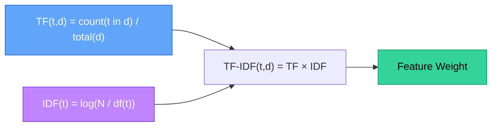
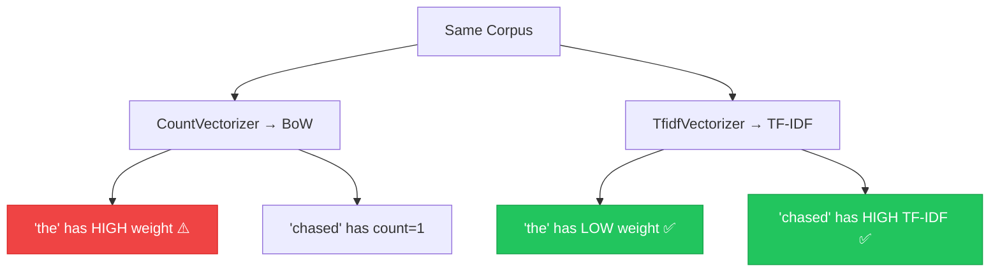

# Chapter 6 — TF-IDF Weighting Mechanics

> **Module 2 · Classical NLP** · Estimated Duration: 40 minutes

---

## 🎯 Learning Objectives

1. Define Term Frequency (TF) and Inverse Document Frequency (IDF) mathematically.
2. Explain why TF-IDF down-weights common terms and up-weights discriminative ones.
3. Use scikit-learn's `TfidfVectorizer` for one-step text-to-matrix transformation.
4. Compare BoW vs. TF-IDF feature quality for classification tasks.

---

## 📚 Core Concepts

### 6.1 — TF-IDF Formula



```python
from sklearn.feature_extraction.text import TfidfVectorizer  # Import TF-IDF vectoriser
from loguru import logger  # Import loguru for DEBUG tracing

logger.debug("Starting M02-C06 — TF-IDF Weighting Mechanics")  # Log chapter entry

corpus: list[str] = [
    "The cat sat on the mat",
    "The dog sat on the log",
    "The cat chased the dog happily",
]  # Small corpus

tfidf: TfidfVectorizer = TfidfVectorizer()  # Instantiate with default L2 normalization
X = tfidf.fit_transform(corpus)  # Fit and transform in one step
logger.debug(f"TF-IDF matrix shape: {X.shape}")  # Log dimensions
logger.debug(f"Feature names: {tfidf.get_feature_names_out().tolist()}")  # Log vocabulary
logger.debug(f"IDF values: {dict(zip(tfidf.get_feature_names_out(), tfidf.idf_))}")  # Log IDF per term
```

### 6.2 — BoW vs. TF-IDF Comparison



---

## 🧪 Exercises

1. **Exercise 6.1** — Compute TF-IDF manually for a 3-document corpus and verify against `TfidfVectorizer`.
2. **Exercise 6.2** — Train a classifier on both BoW and TF-IDF features and compare accuracy.
3. **Exercise 6.3** — Experiment with `max_df` and `min_df` parameters to control vocabulary size.

---

## 🔑 Key Takeaways

- **TF-IDF** penalises terms that appear in many documents — "the" gets near-zero weight.
- It amplifies **discriminative terms** that distinguish one document from the rest.
- `TfidfVectorizer` is the standard text-to-feature bridge in classical NLP.

---

[← Previous Chapter](M02-C05-L01-bag-of-words-encoding.md) · [Module Index](MODULE.md) · [Next Chapter →](M02-C07-L01-naive-bayes-classification.md)
