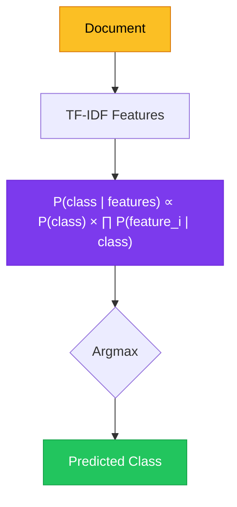
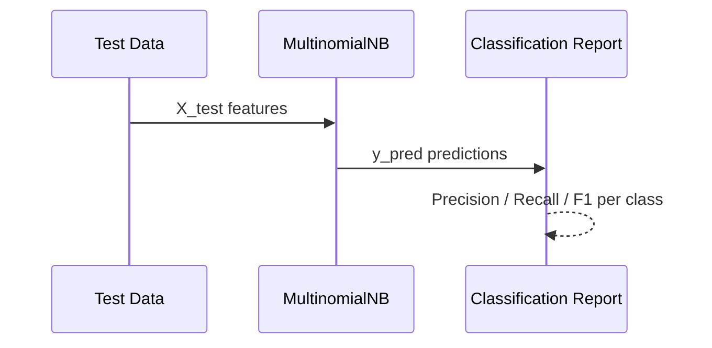

# Chapter 7 — Naïve Bayes Classification

> **Module 2 · Classical NLP** · Estimated Duration: 40 minutes

---

## 🎯 Learning Objectives

1. Explain the Naïve Bayes assumption and why it works well for text despite being "naïve".
2. Train a `MultinomialNB` classifier on TF-IDF features using scikit-learn.
3. Interpret class prior probabilities and feature log-probabilities.
4. Evaluate the model with accuracy, precision, and recall.

---

## 📚 Core Concepts

### 7.1 — Naïve Bayes for Text



```python
from sklearn.feature_extraction.text import TfidfVectorizer  # Transform text to TF-IDF features
from sklearn.naive_bayes import MultinomialNB  # Import the Multinomial Naïve Bayes classifier
from sklearn.model_selection import train_test_split  # Import train/test splitting utility
from sklearn.metrics import classification_report  # Import evaluation metrics formatter
from loguru import logger  # Import loguru for DEBUG tracing

logger.debug("Starting M02-C07 — Naïve Bayes Classification")  # Log chapter entry

texts: list[str] = ["great product", "terrible quality", "love it", "waste of money", "highly recommend", "awful"]
labels: list[int] = [1, 0, 1, 0, 1, 0]  # 1=positive, 0=negative
logger.debug(f"Corpus size: {len(texts)}, Labels: {labels}")  # Log dataset info

X = TfidfVectorizer().fit_transform(texts)  # Vectorise
clf = MultinomialNB()  # Instantiate the classifier
clf.fit(X, labels)  # Train
logger.debug(f"Class priors: {clf.class_log_prior_.tolist()}")  # Log learned priors
logger.debug(f"Training accuracy: {clf.score(X, labels):.2%}")  # Log training accuracy
```

### 7.2 — Model Evaluation



---

## 🧪 Exercises

1. **Exercise 7.1** — Train Naïve Bayes on a sentiment dataset and print the classification report.
2. **Exercise 7.2** — Experiment with Laplace smoothing (`alpha` parameter) and observe its effect.
3. **Exercise 7.3** — Identify the top 10 most informative features per class.

---

## 🔑 Key Takeaways

- **MultinomialNB** is fast, interpretable, and surprisingly effective for text classification.
- It assumes feature independence — "naïve" — yet performs well because TF-IDF features are weakly correlated.
- Always inspect **class priors** and **feature probabilities** to understand model decisions.

---

[← Previous Chapter](M02-C06-L01-tf-idf-weighting-mechanics.md) · [Module Index](MODULE.md) · [Next Chapter →](M02-C08-L01-logistic-regression-nlp.md)
