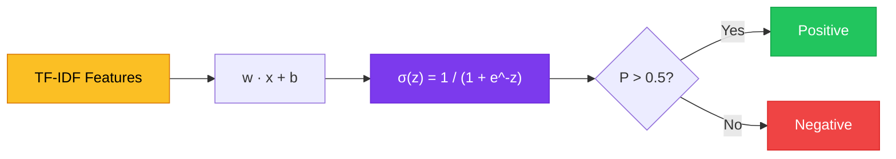
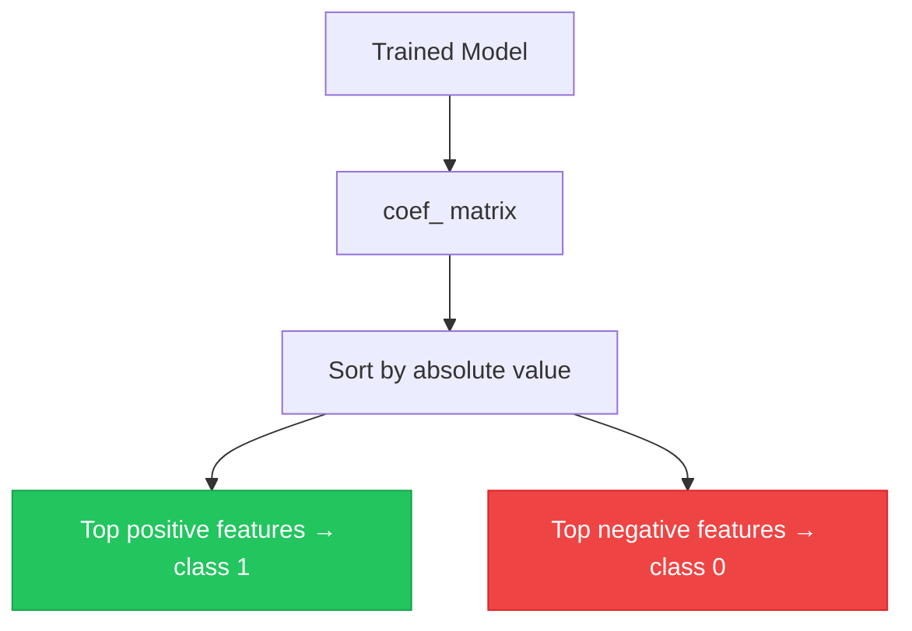

# Chapter 8 — Logistic Regression for NLP

> **Module 2 · Classical NLP** · Estimated Duration: 35 minutes

---

## 🎯 Learning Objectives

1. Explain logistic regression as a linear classifier with a sigmoid decision boundary.
2. Train `LogisticRegression` on TF-IDF features for binary and multi-class text classification.
3. Inspect feature importance via model coefficients.
4. Apply regularization (L1/L2) to control overfitting on high-dimensional text features.

---

## 📚 Core Concepts

### 8.1 — Logistic Regression Pipeline



```python
from sklearn.linear_model import LogisticRegression  # Import logistic regression classifier
from sklearn.feature_extraction.text import TfidfVectorizer  # Import TF-IDF vectoriser
from loguru import logger  # Import loguru for DEBUG execution tracing

logger.debug("Starting M02-C08 — Logistic Regression for NLP")  # Log chapter entry

texts: list[str] = ["great product", "terrible quality", "love it", "waste of money", "highly recommend", "awful"]
labels: list[int] = [1, 0, 1, 0, 1, 0]

vectoriser = TfidfVectorizer()
X = vectoriser.fit_transform(texts)  # Vectorise corpus
logger.debug(f"Feature matrix shape: {X.shape}")  # Log dimensions

clf = LogisticRegression(C=1.0, penalty="l2", max_iter=1000)  # L2 regularization, C=inverse regularization strength
clf.fit(X, labels)  # Train the model
logger.debug(f"Training accuracy: {clf.score(X, labels):.2%}")  # Log accuracy
logger.debug(f"Coefficient shape: {clf.coef_.shape}")  # Log weight matrix dimensions
```

### 8.2 — Feature Importance



```python
import numpy as np  # Import numpy for array operations
from loguru import logger  # Import loguru

feature_names = vectoriser.get_feature_names_out()  # Get vocabulary
coefs = clf.coef_[0]  # Get coefficient vector for binary classification

top_positive_idx = np.argsort(coefs)[-5:]  # Indices of top 5 positive coefficients
top_negative_idx = np.argsort(coefs)[:5]  # Indices of top 5 negative coefficients

logger.debug(f"Top positive features: {[(feature_names[i], coefs[i]) for i in top_positive_idx]}")
logger.debug(f"Top negative features: {[(feature_names[i], coefs[i]) for i in top_negative_idx]}")
```

---

## 🧪 Exercises

1. **Exercise 8.1** — Compare L1 vs. L2 regularization on a text classification task.
2. **Exercise 8.2** — Plot the decision boundary (2D PCA projection) for a binary classifier.
3. **Exercise 8.3** — Tune the `C` parameter using cross-validation and plot accuracy vs. C.

---

## 🔑 Key Takeaways

- Logistic regression is a **strong baseline** for text classification — often competitive with complex models.
- Model coefficients directly indicate **which words drive each class prediction**.
- **Regularization** is critical for text data due to the extremely high dimensionality of TF-IDF features.

---

[← Previous Chapter](M02-C07-L01-naive-bayes-classification.md) · [Module Index](MODULE.md) · [Next Chapter →](M02-C09-L01-evaluation-metrics-precision-recall.md)
