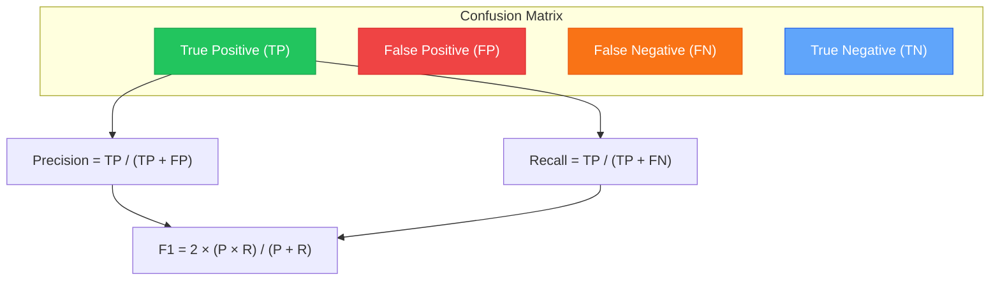
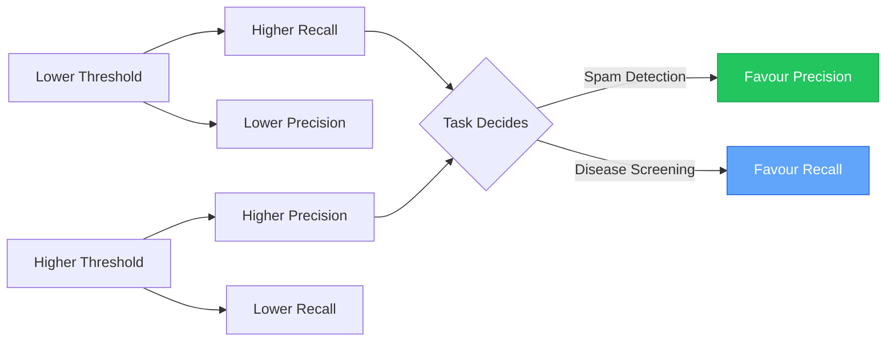

# Chapter 9 — Evaluation Metrics: Precision & Recall

> **Module 2 · Classical NLP** · Estimated Duration: 35 minutes

---

## 🎯 Learning Objectives

1. Define precision, recall, F1-score, and accuracy mathematically.
2. Explain the precision-recall trade-off and its implications for NLP tasks.
3. Generate and interpret a `classification_report` from scikit-learn.
4. Use ROC-AUC for threshold-independent evaluation.

---

## 📚 Core Concepts

### 9.1 — The Confusion Matrix



```python
from sklearn.metrics import classification_report, confusion_matrix  # Import evaluation tools
from loguru import logger  # Import loguru

logger.debug("Starting M02-C09 — Evaluation Metrics: Precision & Recall")  # Log chapter entry

y_true: list[int] = [1, 1, 0, 1, 0, 0, 1, 0]  # Ground truth labels
y_pred: list[int] = [1, 0, 0, 1, 0, 1, 1, 0]  # Model predictions

cm = confusion_matrix(y_true, y_pred)  # Compute confusion matrix
logger.debug(f"Confusion Matrix:\n{cm}")  # Log the matrix

report: str = classification_report(y_true, y_pred, target_names=["negative", "positive"])
logger.debug(f"Classification Report:\n{report}")  # Log the full metric report
```

### 9.2 — Precision-Recall Trade-Off



---

## 🧪 Exercises

1. **Exercise 9.1** — Compute precision, recall, and F1 manually from a confusion matrix.
2. **Exercise 9.2** — Plot a precision-recall curve for a trained classifier.
3. **Exercise 9.3** — Compare macro-average vs. weighted-average F1 on an imbalanced dataset.

---

## 🔑 Key Takeaways

- **Accuracy is misleading** on imbalanced datasets — always report precision, recall, and F1.
- The **precision-recall trade-off** must be driven by business requirements (cost of FP vs. FN).
- `classification_report` provides a one-stop summary of all key metrics.

---

[← Previous Chapter](M02-C08-L01-logistic-regression-nlp.md) · [Module Index](MODULE.md) · [Next Chapter →](M02-C10-L01-error-analysis-confusion-matrices.md)
