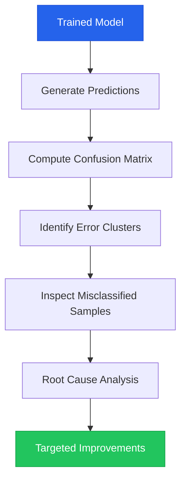
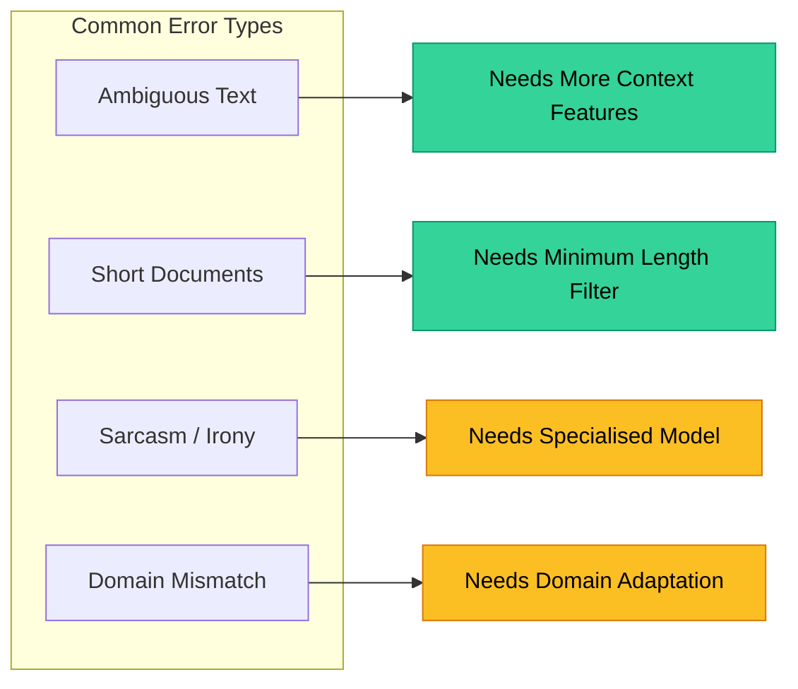

# Chapter 10 — Error Analysis & Confusion Matrices

> **Module 2 · Classical NLP** · Estimated Duration: 35 minutes

---

## 🎯 Learning Objectives

1. Conduct systematic error analysis on misclassified documents.
2. Inspect confusion matrices to identify error patterns between classes.
3. Perform per-class error breakdowns to guide model improvement.
4. Document error analysis findings as actionable engineering feedback.

---

## 📚 Core Concepts

### 10.1 — Error Analysis Workflow



```python
import numpy as np  # Import numpy for array operations
from sklearn.metrics import confusion_matrix, ConfusionMatrixDisplay  # Import CM tools
from loguru import logger  # Import loguru

logger.debug("Starting M02-C10 — Error Analysis & Confusion Matrices")  # Log chapter entry

y_true = [0, 0, 1, 1, 2, 2, 0, 1, 2, 0]  # Multi-class ground truth
y_pred = [0, 1, 1, 1, 2, 0, 0, 2, 2, 0]  # Model predictions

cm = confusion_matrix(y_true, y_pred)  # Compute the confusion matrix
logger.debug(f"Confusion Matrix:\n{cm}")  # Log the matrix

# --- Error analysis: find misclassified indices ---
misclassified = [(i, y_true[i], y_pred[i]) for i in range(len(y_true)) if y_true[i] != y_pred[i]]
logger.debug(f"Misclassified samples: {misclassified}")  # Log (index, true, predicted) tuples
logger.debug(f"Error rate: {len(misclassified) / len(y_true):.2%}")  # Log overall error rate
```

### 10.2 — Error Pattern Taxonomy



---

## 🧪 Exercises

1. **Exercise 10.1** — Build a per-class error report showing which classes are most confused.
2. **Exercise 10.2** — Extract the 5 most confidently wrong predictions (highest probability on wrong class).
3. **Exercise 10.3** — Propose three model improvements based on your error analysis findings.

---

## 🔑 Key Takeaways

- **Error analysis is more valuable than hyperparameter tuning** — it tells you *why* the model fails.
- Confusion matrices reveal **systematic confusion patterns** between classes.
- Always inspect **actual misclassified samples** — aggregate metrics hide qualitative insight.

---

## 🏁 Module 2 Complete

Congratulations! You have completed **Module 2 — Classical NLP**. You can now build, evaluate, and debug classical text classifiers.

**Next:** [Module 3 — Transformers & Summarization →](../Module-03_Transformers-Summarisation/MODULE.md)

---

[← Previous Chapter](M02-C09-L01-evaluation-metrics-precision-recall.md) · [Module Index](MODULE.md) · [Course Index](../README.md)
