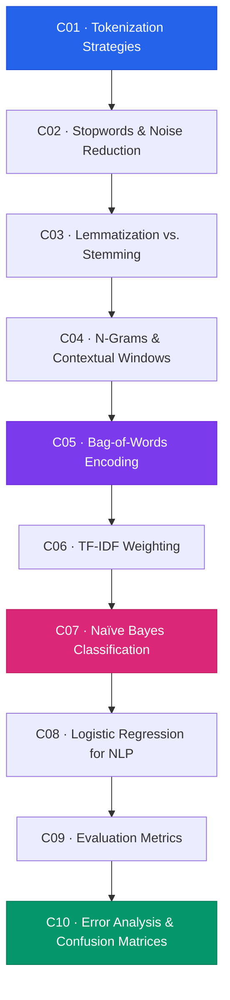

# Module 2 — Classical NLP

> **Duration:** 6 Hours · **Chapters:** 10 · **Level:** Intermediate

---

## 🎯 Module Objective

Build a complete classical NLP pipeline — from raw-text tokenization through feature engineering to supervised classification — and learn to evaluate every model with statistical rigour.

---

## 📖 Synopsis

This module progresses through the canonical NLP workflow:

- **Text pre-processing** — tokenization, stopword removal, lemmatization, and stemming.
- **Feature engineering** — n-grams, Bag-of-Words, and TF-IDF vectorization.
- **Supervised models** — Naïve Bayes and Logistic Regression for text classification.
- **Evaluation & debugging** — precision, recall, F1, ROC-AUC, confusion matrices, and systematic error analysis.

---

## 🗺️ Chapter Roadmap

---

## 📂 Chapter Index

| # | Title | File | Focus |
|---|-------|------|-------|
| 1 | Tokenization Strategies | [M02-C01](M02-C01-L01-tokenisation-strategies.md) | Word, sentence, sub-word tokenisers |
| 2 | Stopwords & Noise Reduction | [M02-C02](M02-C02-L01-stopwords-noise-reduction.md) | Corpus-specific stop lists, filtering |
| 3 | Lemmatization vs. Stemming | [M02-C03](M02-C03-L01-lemmatisation-vs-stemming.md) | Porter, Snowball, WordNet lemmatiser |
| 4 | N-Grams & Contextual Windows | [M02-C04](M02-C04-L01-n-grams-contextual-windows.md) | Bigrams, trigrams, windowed features |
| 5 | Bag-of-Words Encoding | [M02-C05](M02-C05-L01-bag-of-words-encoding.md) | CountVectorizer, sparse matrices |
| 6 | TF-IDF Weighting Mechanics | [M02-C06](M02-C06-L01-tf-idf-weighting-mechanics.md) | Term frequency, inverse document frequency |
| 7 | Naïve Bayes Classification | [M02-C07](M02-C07-L01-naive-bayes-classification.md) | MultinomialNB, smoothing, priors |
| 8 | Logistic Regression for NLP | [M02-C08](M02-C08-L01-logistic-regression-nlp.md) | Regularization, feature importance |
| 9 | Evaluation Metrics | [M02-C09](M02-C09-L01-evaluation-metrics-precision-recall.md) | Precision, recall, F1, ROC-AUC |
| 10 | Error Analysis & Confusion Matrices | [M02-C10](M02-C10-L01-error-analysis-confusion-matrices.md) | Systematic debugging of model failures |

---

## ✅ Module Completion Checklist

- [ ] Completed all 10 chapters
- [ ] Built at least one end-to-end text classifier
- [ ] Compared Naïve Bayes vs. Logistic Regression performance
- [ ] Reviewed confusion matrix output for each model
- [ ] Ready for **Module 3 — Transformers & Summarization**

---

[← Back to Course Index](../README.md) · [Previous Module ←](../Module-01_Python-for-NLP/MODULE.md) · [Next Module →](../Module-03_Transformers-Summarisation/MODULE.md)
