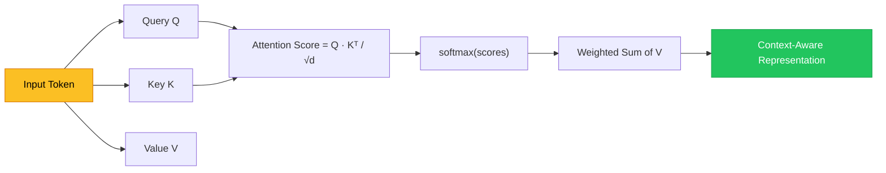
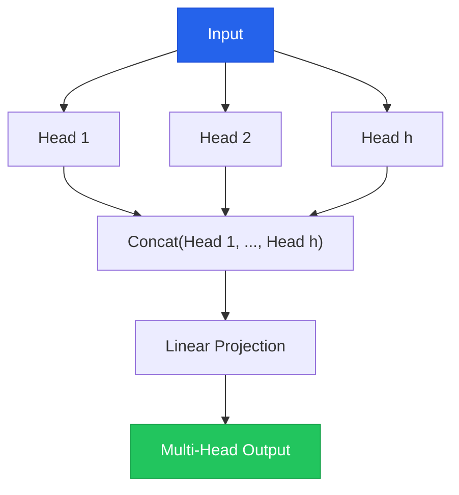

# Chapter 1 — Attention Mechanism Intuition

> **Module 3 · Transformers & Summarization** · Estimated Duration: 50 minutes

---

## 🎯 Learning Objectives

1. Explain the intuition behind the attention mechanism: queries, keys, and values.
2. Visualise how self-attention computes context-aware token representations.
3. Implement a simplified scaled dot-product attention in NumPy.
4. Connect attention to the broader transformer architecture.

---

## 📚 Core Concepts

### 1.1 — Query, Key, Value Intuition



```python
import numpy as np  # Import numpy for matrix operations — simulating attention computation
from loguru import logger  # Import loguru for DEBUG tracing

logger.debug("Starting M03-C01 — Attention Mechanism Intuition")  # Log chapter entry

# --- Simplified self-attention ---
np.random.seed(42)  # Fix seed for reproducibility
seq_len: int = 4  # Number of tokens in the sequence
d_model: int = 8  # Embedding dimension

X: np.ndarray = np.random.randn(seq_len, d_model)  # Random input embeddings (4 tokens × 8 dims)
logger.debug(f"Input shape: {X.shape}")  # Log the input dimensions

W_Q: np.ndarray = np.random.randn(d_model, d_model)  # Query projection matrix
W_K: np.ndarray = np.random.randn(d_model, d_model)  # Key projection matrix
W_V: np.ndarray = np.random.randn(d_model, d_model)  # Value projection matrix

Q: np.ndarray = X @ W_Q  # Project inputs to queries
K: np.ndarray = X @ W_K  # Project inputs to keys
V: np.ndarray = X @ W_V  # Project inputs to values
logger.debug(f"Q, K, V shapes: {Q.shape}, {K.shape}, {V.shape}")  # Log projection shapes

scores: np.ndarray = Q @ K.T / np.sqrt(d_model)  # Scaled dot-product attention scores
logger.debug(f"Attention scores shape: {scores.shape}")  # Log score matrix shape

# --- Softmax ---
exp_scores: np.ndarray = np.exp(scores - scores.max(axis=-1, keepdims=True))  # Numerical stability trick
weights: np.ndarray = exp_scores / exp_scores.sum(axis=-1, keepdims=True)  # Normalise to probabilities
logger.debug(f"Attention weights (row 0): {weights[0].round(4)}")  # Log first token's attention distribution

output: np.ndarray = weights @ V  # Weighted sum of values
logger.debug(f"Output shape: {output.shape}")  # Log the context-aware output dimensions
```

### 1.2 — Multi-Head Attention



---

## 🧪 Exercises

1. **Exercise 1.1** — Visualise the attention weight matrix as a heatmap for a 5-token sentence.
2. **Exercise 1.2** — Implement multi-head attention by splitting Q, K, V into multiple heads.
3. **Exercise 1.3** — Compare attention distributions before and after training on a toy dataset.

---

## 🔑 Key Takeaways

- Attention lets each token **look at every other token** to build context-aware representations.
- The **scaled dot-product** prevents attention scores from growing too large with high dimensions.
- **Multi-head attention** captures different relationship types simultaneously.

---

[← Module Index](MODULE.md) · [Next Chapter →](M03-C02-L01-token-embeddings-vector-space.md)
