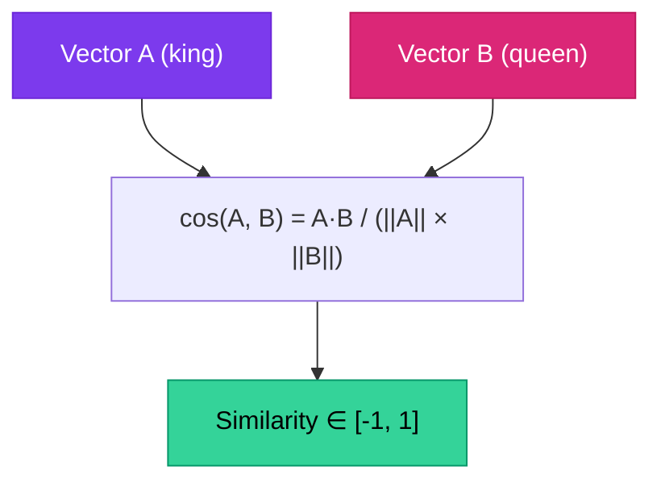

# Chapter 2 — Token Embeddings & Vector Space

> **Module 3 · Transformers & Summarization** · Estimated Duration: 45 minutes

---

## 🎯 Learning Objectives

1. Explain how tokens are mapped to dense vectors (embeddings).
2. Distinguish between static embeddings (Word2Vec, GloVe) and contextual embeddings (BERT, GPT).
3. Measure semantic similarity using cosine distance.
4. Visualise embedding spaces conceptually.

---

## 📚 Core Concepts

### 2.1 — Embedding Lookup


```python
import numpy as np  # Import numpy for vector operations
from loguru import logger  # Import loguru for DEBUG tracing

logger.debug("Starting M03-C02 — Token Embeddings & Vector Space")

vocab_size: int = 1000  # Size of the vocabulary
embed_dim: int = 64  # Embedding dimensionality

embedding_matrix: np.ndarray = np.random.randn(vocab_size, embed_dim) * 0.01  # Initialise small random embeddings
logger.debug(f"Embedding matrix shape: {embedding_matrix.shape}")  # Log dimensions

token_id: int = 42  # Example token ID
embedding: np.ndarray = embedding_matrix[token_id]  # Look up the embedding vector by index
logger.debug(f"Token {token_id} embedding (first 8 dims): {embedding[:8].round(4)}")
```

### 2.2 — Cosine Similarity



```python
import numpy as np
from loguru import logger

def cosine_similarity(a: np.ndarray, b: np.ndarray) -> float:
    """Compute cosine similarity between two vectors."""
    dot_product: float = np.dot(a, b)  # Numerator: dot product
    norm_product: float = np.linalg.norm(a) * np.linalg.norm(b)  # Denominator: product of norms
    similarity: float = dot_product / max(norm_product, 1e-10)  # Divide with epsilon guard
    logger.debug(f"Cosine similarity: {similarity:.4f}")
    return similarity

vec_a = embedding_matrix[10]  # Embedding for token 10
vec_b = embedding_matrix[11]  # Embedding for token 11
sim = cosine_similarity(vec_a, vec_b)  # Compute similarity
logger.debug(f"Similarity between tokens 10 and 11: {sim:.4f}")
```

---

## 🧪 Exercises

1. **Exercise 2.1** — Load pre-trained GloVe embeddings and find the 5 nearest neighbours of "computer".
2. **Exercise 2.2** — Demonstrate the "king - man + woman ≈ queen" analogy with pre-trained vectors.
3. **Exercise 2.3** — Compare static vs. contextual embeddings for polysemous words (e.g., "bank").

---

## 🔑 Key Takeaways

- Embeddings encode **semantic meaning** as dense vectors — similar words have similar vectors.
- **Contextual embeddings** (from transformers) produce different vectors for the same word in different contexts.
- **Cosine similarity** is the standard metric for measuring semantic relatedness.

---

[← Previous Chapter](M03-C01-L01-attention-mechanism-intuition.md) · [Module Index](MODULE.md) · [Next Chapter →](M03-C03-L01-context-window-architecture.md)
