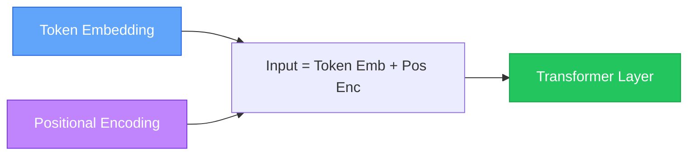
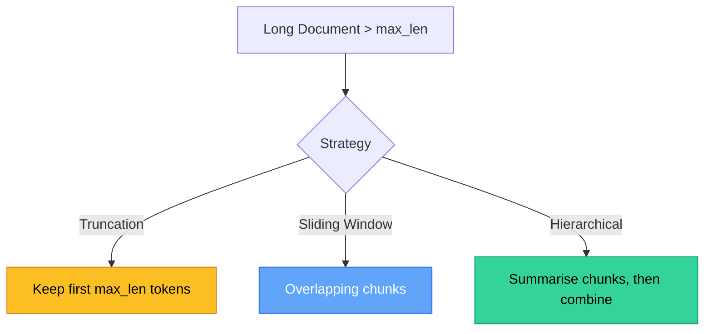

# Chapter 3 — Context Window Architecture

> **Module 3 · Transformers & Summarization** · Estimated Duration: 45 minutes

---

## 🎯 Learning Objectives

1. Define the context window (maximum sequence length) and its impact on transformer behaviour.
2. Explain positional encoding and why transformers need it.
3. Handle inputs that exceed the context window: truncation, sliding window, and chunking strategies.
4. Compare context window sizes across popular models (BERT: 512, GPT-2: 1024, GPT-4: 128K).

---

## 📚 Core Concepts

### 3.1 — Positional Encoding



```python
import numpy as np  # Import numpy for positional encoding computation
from loguru import logger  # Import loguru for DEBUG tracing

logger.debug("Starting M03-C03 — Context Window Architecture")

def sinusoidal_positional_encoding(seq_len: int, d_model: int) -> np.ndarray:
    """Generate sinusoidal positional encodings."""
    pos = np.arange(seq_len)[:, np.newaxis]  # Position indices (seq_len, 1)
    dim = np.arange(d_model)[np.newaxis, :]  # Dimension indices (1, d_model)
    angles = pos / np.power(10000, (2 * (dim // 2)) / d_model)  # Angle computation
    pe = np.zeros((seq_len, d_model))  # Initialise encoding matrix
    pe[:, 0::2] = np.sin(angles[:, 0::2])  # Even dimensions: sine
    pe[:, 1::2] = np.cos(angles[:, 1::2])  # Odd dimensions: cosine
    logger.debug(f"Positional encoding shape: {pe.shape}")
    return pe

pe = sinusoidal_positional_encoding(seq_len=128, d_model=64)
logger.debug(f"PE[0][:8] = {pe[0][:8].round(4)}")  # Log first position's encoding
logger.debug(f"PE[127][:8] = {pe[127][:8].round(4)}")  # Log last position's encoding
```

### 3.2 — Handling Long Documents



---

## 🧪 Exercises

1. **Exercise 3.1** — Implement a sliding window chunker that splits long text with 50-token overlap.
2. **Exercise 3.2** — Compare BERT tokeniser output length vs. whitespace word count for 20 documents.
3. **Exercise 3.3** — Visualise positional encodings as a heatmap for positions 0–127.

---

## 🔑 Key Takeaways

- The **context window** is a hard limit — tokens beyond it are invisible to the model.
- **Positional encoding** injects sequence order into the permutation-invariant attention mechanism.
- Choose a **long-document strategy** (truncation, chunking, hierarchical) based on your task requirements.

---

[← Previous Chapter](M03-C02-L01-token-embeddings-vector-space.md) · [Module Index](MODULE.md) · [Next Chapter →](M03-C04-L01-pretrained-models-huggingface.md)
