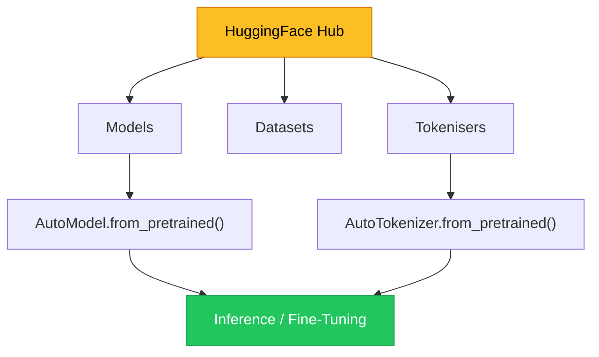
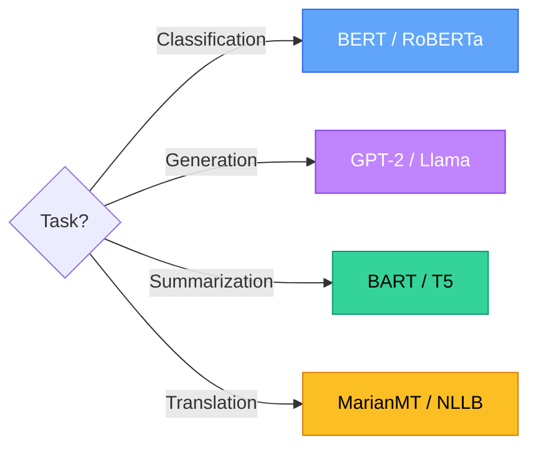

# Chapter 4 — Pre-trained Models & HuggingFace

> **Module 3 · Transformers & Summarization** · Estimated Duration: 50 minutes

---

## 🎯 Learning Objectives

1. Navigate the HuggingFace Model Hub and select models for specific NLP tasks.
2. Load pre-trained models and tokenisers using `AutoModel` and `AutoTokenizer`.
3. Perform inference with a loaded model (tokenise → encode → decode).
4. Understand model cards, licensing, and ethical considerations.

---

## 📚 Core Concepts

### 4.1 — The HuggingFace Ecosystem



```python
from transformers import AutoTokenizer, AutoModel  # Import HuggingFace auto classes
from loguru import logger  # Import loguru for DEBUG tracing

logger.debug("Starting M03-C04 — Pre-trained Models & HuggingFace")

model_name: str = "bert-base-uncased"  # Specify the pre-trained model identifier
logger.debug(f"Loading model: {model_name}")

tokeniser = AutoTokenizer.from_pretrained(model_name)  # Load the associated tokeniser
model = AutoModel.from_pretrained(model_name)  # Load the pre-trained model weights
logger.debug(f"Tokeniser vocab size: {tokeniser.vocab_size}")
logger.debug(f"Model parameters: {sum(p.numel() for p in model.parameters()):,}")

text: str = "Natural language processing is fascinating."
inputs = tokeniser(text, return_tensors="pt")  # Tokenise and convert to PyTorch tensors
logger.debug(f"Input IDs: {inputs['input_ids'].tolist()}")
logger.debug(f"Attention mask: {inputs['attention_mask'].tolist()}")
```

### 4.2 — Model Selection Guide



---

## 🧪 Exercises

1. **Exercise 4.1** — Load `distilbert-base-uncased` and compare its parameter count to `bert-base-uncased`.
2. **Exercise 4.2** — Tokenise 10 sentences and log the token-to-word ratio for each.
3. **Exercise 4.3** — Read a model card on Hub and summarise its training data and limitations.

---

## 🔑 Key Takeaways

- `AutoModel` and `AutoTokenizer` detect the correct architecture automatically from the model name.
- Always check the **model card** for training data, intended use, and known limitations.
- DistilBERT offers **40% fewer parameters** with ~97% of BERT's performance — ideal for prototyping.

---

[← Previous Chapter](M03-C03-L01-context-window-architecture.md) · [Module Index](MODULE.md) · [Next Chapter →](M03-C05-L01-text-classification-transformers.md)
