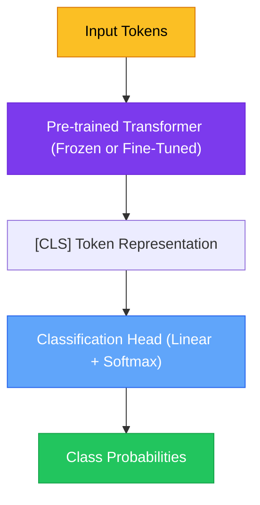
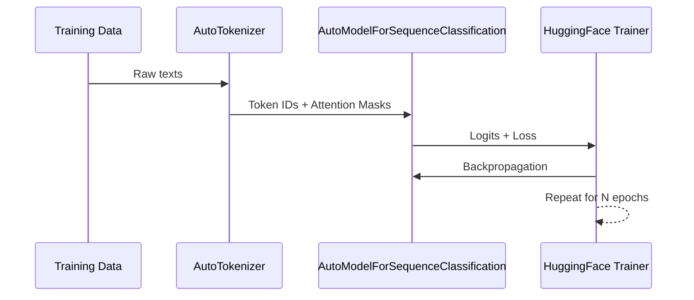

# Chapter 5 — Text Classification with Transformers

> **Module 3 · Transformers & Summarization** · Estimated Duration: 50 minutes

---

## 🎯 Learning Objectives

1. Attach a classification head to a pre-trained transformer model.
2. Use `AutoModelForSequenceClassification` for binary and multi-class tasks.
3. Fine-tune on a labelled dataset with the HuggingFace `pipeline()` API.
4. Compare transformer classification performance against classical baselines.

---

## 📚 Core Concepts

### 5.1 — Sequence Classification Architecture



```python
from transformers import pipeline  # Import the high-level pipeline API
from loguru import logger  # Import loguru for DEBUG tracing

logger.debug("Starting M03-C05 — Text Classification with Transformers")

# --- Zero-shot classification using pipeline ---
classifier = pipeline("sentiment-analysis")  # Load default sentiment model
logger.debug("Sentiment classifier loaded")

texts: list[str] = [
    "This NLP course is absolutely brilliant!",
    "I found the explanation confusing and unhelpful.",
    "The code examples are well documented and clear.",
]
for text in texts:
    result = classifier(text)[0]  # Run inference
    logger.debug(f"Text: '{text[:50]}…' → Label: {result['label']}, Score: {result['score']:.4f}")
```

### 5.2 — Fine-Tuning with AutoModelForSequenceClassification



```python
from transformers import AutoModelForSequenceClassification, AutoTokenizer  # Import model and tokeniser classes
from loguru import logger

model_name: str = "distilbert-base-uncased"
tokeniser = AutoTokenizer.from_pretrained(model_name)
model = AutoModelForSequenceClassification.from_pretrained(model_name, num_labels=2)
logger.debug(f"Classification model loaded with {model.config.num_labels} labels")
logger.debug(f"Total parameters: {sum(p.numel() for p in model.parameters()):,}")
```

---

## 🧪 Exercises

1. **Exercise 5.1** — Run sentiment analysis on 20 product reviews and log the results.
2. **Exercise 5.2** — Fine-tune DistilBERT on a small sentiment dataset (e.g., SST-2).
3. **Exercise 5.3** — Compare performance: TF-IDF + LogReg vs. DistilBERT on the same dataset.

---

## 🔑 Key Takeaways

- The `pipeline()` API provides **zero-code inference** for common NLP tasks.
- `AutoModelForSequenceClassification` adds a classification head on top of any transformer.
- Even with limited data, fine-tuned transformers typically **outperform classical baselines**.

---

[← Previous Chapter](M03-C04-L01-pretrained-models-huggingface.md) · [Module Index](MODULE.md) · [Next Chapter →](M03-C06-L01-huggingface-trainer-api-setup.md)
