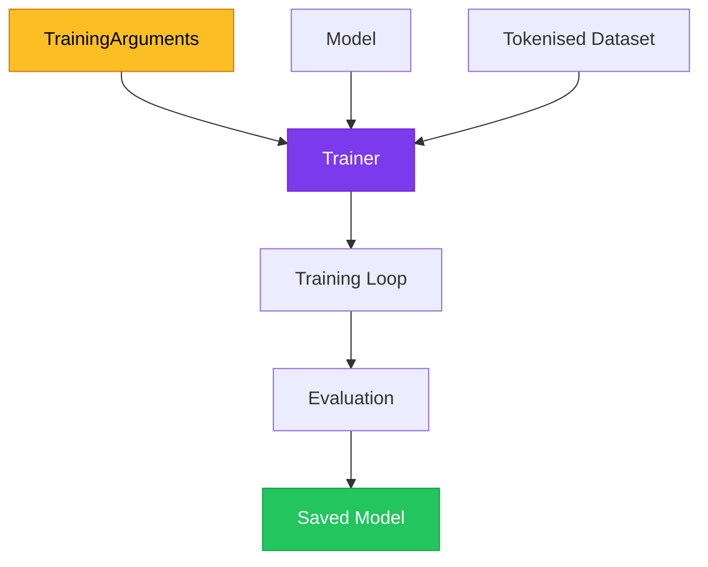

# Chapter 6 — HuggingFace Trainer API Setup

> **Module 3 · Transformers & Summarization** · Estimated Duration: 50 minutes

---

## 🎯 Learning Objectives

1. Configure `TrainingArguments` for learning rate, batch size, epochs, and evaluation strategy.
2. Prepare datasets using the HuggingFace `datasets` library.
3. Set up a `Trainer` instance with model, data, and metrics.
4. Run training with integrated logging to the console.

---

## 📚 Core Concepts

### 6.1 — Trainer Architecture



```python
from transformers import TrainingArguments  # Import training configuration class
from loguru import logger

logger.debug("Starting M03-C06 — HuggingFace Trainer API Setup")

training_args = TrainingArguments(
    output_dir="./results",  # Directory for checkpoints and logs
    num_train_epochs=3,  # Number of training passes over the dataset
    per_device_train_batch_size=16,  # Batch size per GPU/CPU
    per_device_eval_batch_size=16,  # Evaluation batch size
    learning_rate=2e-5,  # Initial learning rate for AdamW optimiser
    weight_decay=0.01,  # L2 regularization weight
    evaluation_strategy="epoch",  # Evaluate at the end of each epoch
    save_strategy="epoch",  # Save checkpoint per epoch
    logging_steps=10,  # Log metrics every 10 steps
    load_best_model_at_end=True,  # Restore best model after training
)
logger.debug(f"Training args: epochs={training_args.num_train_epochs}, lr={training_args.learning_rate}")
```

### 6.2 — Dataset Preparation


```python
from datasets import load_dataset  # Import HuggingFace datasets library
from transformers import AutoTokenizer
from loguru import logger

tokeniser = AutoTokenizer.from_pretrained("distilbert-base-uncased")

def tokenise_function(examples: dict) -> dict:
    """Tokenise a batch of examples."""
    result = tokeniser(examples["text"], padding="max_length", truncation=True, max_length=128)
    logger.debug(f"Tokenised batch of {len(examples['text'])} examples")
    return result

dataset = load_dataset("imdb", split="train[:100]")  # Load a small subset for demonstration
logger.debug(f"Dataset size: {len(dataset)}")

tokenised = dataset.map(tokenise_function, batched=True)  # Apply tokenization in batch mode
logger.debug(f"Tokenised dataset columns: {tokenised.column_names}")
```

---

## 🧪 Exercises

1. **Exercise 6.1** — Configure `TrainingArguments` for a 5-epoch run with cosine learning rate schedule.
2. **Exercise 6.2** — Load the SST-2 dataset, tokenise it, and inspect the first 3 rows.
3. **Exercise 6.3** — Set up a complete `Trainer` and run one training epoch, logging all metrics.

---

## 🔑 Key Takeaways

- `TrainingArguments` centralises **all hyperparameters** in a single, reproducible configuration object.
- The `datasets.map()` function efficiently applies tokenization in **batched mode**.
- `load_best_model_at_end=True` ensures you always get the **checkpoint with lowest validation loss**.

---

[← Previous Chapter](M03-C05-L01-text-classification-transformers.md) · [Module Index](MODULE.md) · [Next Chapter →](M03-C07-L01-light-fine-tuning-techniques.md)
