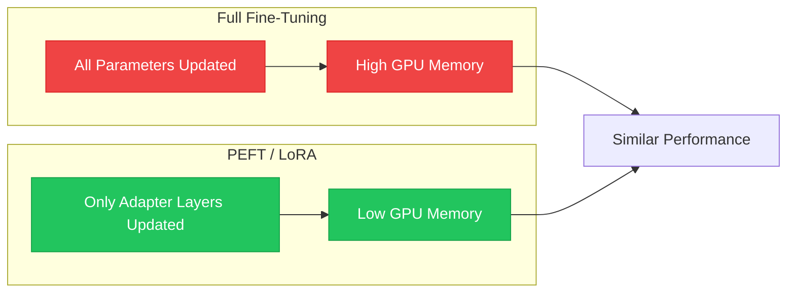
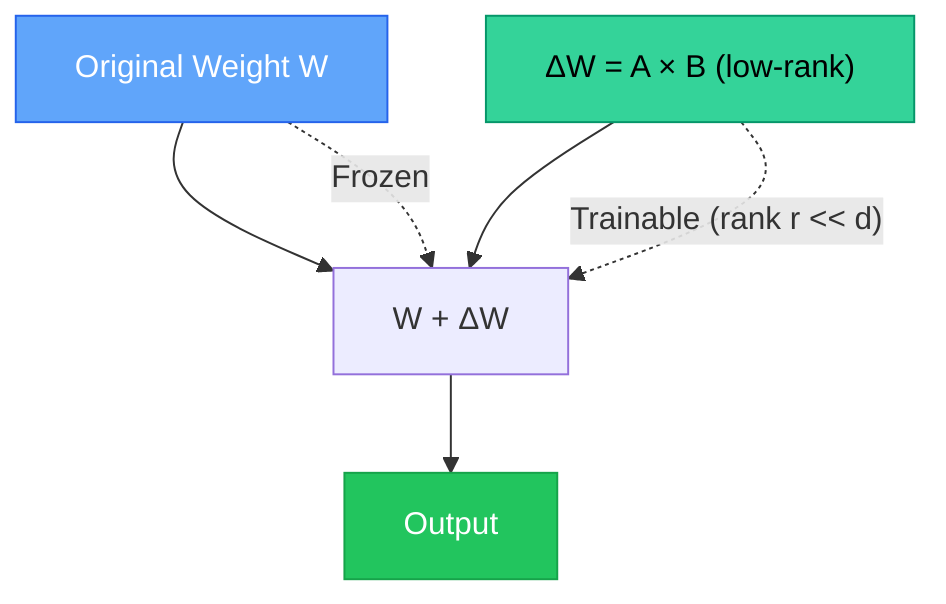

# Chapter 7 — Light Fine-Tuning Techniques

> **Module 3 · Transformers & Summarization** · Estimated Duration: 50 minutes

---

## 🎯 Learning Objectives

1. Explain parameter-efficient fine-tuning (PEFT) and why it matters for large models.
2. Implement LoRA (Low-Rank Adaptation) conceptually and with the `peft` library.
3. Freeze backbone layers and only train the classification head.
4. Compare full fine-tuning vs. PEFT in terms of memory, speed, and performance.

---

## 📚 Core Concepts

### 7.1 — PEFT vs. Full Fine-Tuning



```python
from transformers import AutoModelForSequenceClassification
from loguru import logger

logger.debug("Starting M03-C07 — Light Fine-Tuning Techniques")

model = AutoModelForSequenceClassification.from_pretrained("distilbert-base-uncased", num_labels=2)

# --- Freeze all backbone parameters ---
for name, param in model.named_parameters():
    if "classifier" not in name:  # Keep only the classification head trainable
        param.requires_grad = False  # Freeze this parameter — no gradient computation
        
trainable = sum(p.numel() for p in model.parameters() if p.requires_grad)
total = sum(p.numel() for p in model.parameters())
logger.debug(f"Trainable: {trainable:,} / {total:,} ({trainable/total:.2%})")
```

### 7.2 — LoRA Conceptual Architecture



---

## 🧪 Exercises

1. **Exercise 7.1** — Fine-tune with frozen backbone and compare accuracy to full fine-tuning.
2. **Exercise 7.2** — Measure GPU memory usage for full vs. PEFT fine-tuning.
3. **Exercise 7.3** — Experiment with different LoRA ranks (r=4, 8, 16) and compare results.

---

## 🔑 Key Takeaways

- **PEFT** methods train <1% of parameters while retaining >95% of performance.
- **Freezing the backbone** is the simplest form of light fine-tuning — zero extra libraries needed.
- **LoRA** injects trainable low-rank matrices, enabling efficient adaptation of massive models.

---

[← Previous Chapter](M03-C06-L01-huggingface-trainer-api-setup.md) · [Module Index](MODULE.md) · [Next Chapter →](M03-C08-L01-generative-models-summarisation.md)
