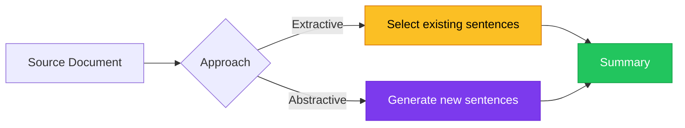
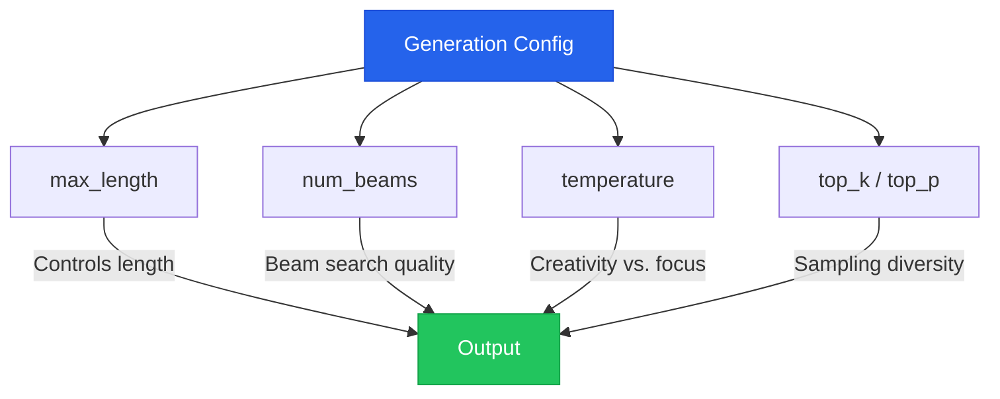

# Chapter 8 — Generative Models & Summarization

> **Module 3 · Transformers & Summarization** · Estimated Duration: 50 minutes

---

## 🎯 Learning Objectives

1. Explain the difference between extractive and abstractive summarization.
2. Use BART and T5 for abstractive text summarization via the `pipeline()` API.
3. Control generation with parameters: `max_length`, `min_length`, `num_beams`, `temperature`.
4. Evaluate summary quality using ROUGE metrics.

---

## 📚 Core Concepts

### 8.1 — Extractive vs. Abstractive Summarization



```python
from transformers import pipeline  # Import the high-level pipeline API
from loguru import logger

logger.debug("Starting M03-C08 — Generative Models & Summarization")

summariser = pipeline("summarization", model="facebook/bart-large-cnn")  # Load BART for summarization
logger.debug("BART summarization pipeline loaded")

article: str = (
    "Natural language processing (NLP) is a subfield of linguistics, computer science, "
    "and artificial intelligence concerned with the interactions between computers and human "
    "language. It involves programming computers to process and analyse large amounts of "
    "natural language data. The goal is a computer capable of understanding the contents of "
    "documents, including the contextual nuances of the language within them."
)
logger.debug(f"Article length: {len(article.split())} words")

summary = summariser(article, max_length=50, min_length=15, do_sample=False)
logger.debug(f"Summary: '{summary[0]['summary_text']}'")
```

### 8.2 — Generation Parameters



---

## 🧪 Exercises

1. **Exercise 8.1** — Summarise 5 articles and compare BART vs. T5 outputs.
2. **Exercise 8.2** — Experiment with `temperature` values (0.3, 0.7, 1.0) and observe quality differences.
3. **Exercise 8.3** — Compute ROUGE-1, ROUGE-2, and ROUGE-L scores against reference summaries.

---

## 🔑 Key Takeaways

- **Abstractive summarization** generates novel text — it can rephrase, compress, and paraphrase.
- **Beam search** (`num_beams > 1`) produces higher-quality but less diverse outputs.
- **ROUGE metrics** are the standard for summary evaluation but have known limitations.

---

[← Previous Chapter](M03-C07-L01-light-fine-tuning-techniques.md) · [Module Index](MODULE.md) · [Next Chapter →](M03-C09-L01-pipeline-abstraction-layers.md)
