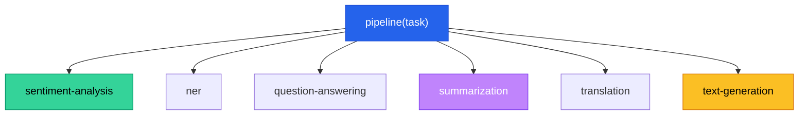

# Chapter 9 — Pipeline Abstraction Layers

> **Module 3 · Transformers & Summarization** · Estimated Duration: 45 minutes

---

## 🎯 Learning Objectives

1. Master the HuggingFace `pipeline()` API for rapid NLP prototyping.
2. Build custom pipeline wrappers that chain pre-processing, inference, and post-processing.
3. Configure pipelines for different tasks: classification, NER, QA, summarization, translation.
4. Handle batch inference efficiently through pipeline batching.

---

## 📚 Core Concepts

### 9.1 — Pipeline Task Catalogue



```python
from transformers import pipeline  # Import the universal pipeline API
from loguru import logger

logger.debug("Starting M03-C09 — Pipeline Abstraction Layers")

# --- Multiple task pipelines ---
tasks: dict = {
    "sentiment": pipeline("sentiment-analysis"),
    "ner": pipeline("ner", grouped_entities=True),
}
logger.debug(f"Loaded {len(tasks)} pipelines")

text: str = "Dr. Alan Turing developed the concept of the Turing machine in Cambridge."

for task_name, pipe in tasks.items():
    result = pipe(text)
    logger.debug(f"[{task_name}] {result}")
```

### 9.2 — Custom Pipeline Wrapper


```python
from transformers import pipeline
from loguru import logger

class NLPPipeline:
    """Custom wrapper around HuggingFace pipelines with logging."""

    def __init__(self, task: str, model: str | None = None):
        self.pipe = pipeline(task, model=model)  # Initialise the underlying HF pipeline
        logger.debug(f"NLPPipeline initialised for task='{task}'")

    def run(self, text: str) -> dict:
        """Run the pipeline with pre/post processing."""
        logger.debug(f"[pre] Input length: {len(text)} chars")
        cleaned: str = text.strip()  # Basic pre-processing
        result = self.pipe(cleaned)  # Model inference
        logger.debug(f"[post] Result: {result}")
        return {"input": cleaned, "output": result}

nlp = NLPPipeline("sentiment-analysis")
output = nlp.run("  This abstraction layer is incredibly useful!  ")
logger.debug(f"Final output: {output}")
```

---

## 🧪 Exercises

1. **Exercise 9.1** — Create a pipeline that chains sentiment analysis → named entity recognition.
2. **Exercise 9.2** — Implement batch inference for 100 texts and measure throughput.
3. **Exercise 9.3** — Build a pipeline wrapper that retries on failure with exponential backoff.

---

## 🔑 Key Takeaways

- The `pipeline()` API is the fastest way to go **from zero to inference** with any HuggingFace model.
- **Custom wrappers** add pre-processing, post-processing, logging, and error handling.
- Batch inference can be **10×+ faster** than single-document processing.

---

[← Previous Chapter](M03-C08-L01-generative-models-summarisation.md) · [Module Index](MODULE.md) · [Next Chapter →](M03-C10-L01-hallucination-mitigation-strategies.md)
