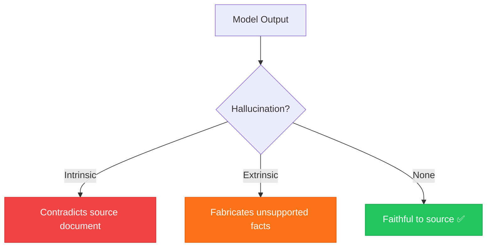
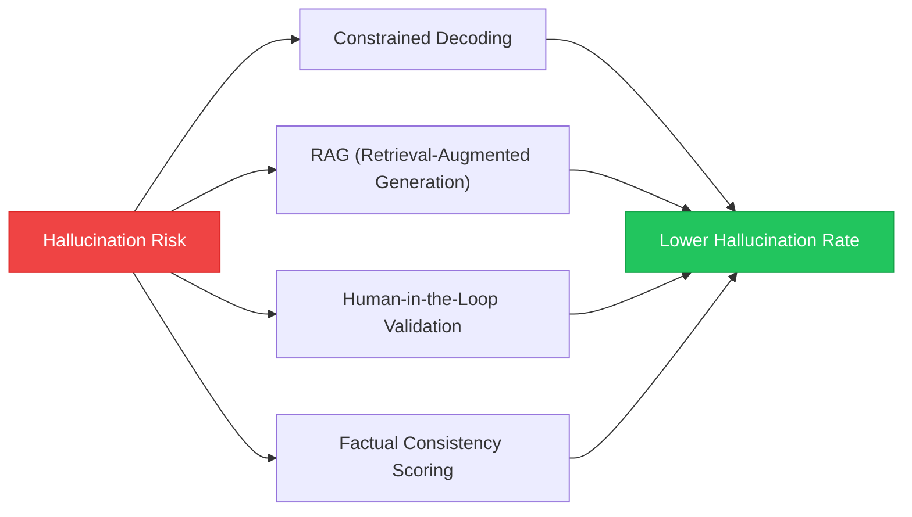

# Chapter 10 — Hallucination Mitigation Strategies

> **Module 3 · Transformers & Summarization** · Estimated Duration: 50 minutes

---

## 🎯 Learning Objectives

1. Define hallucination in the context of generative NLP models.
2. Classify hallucination types: intrinsic (contradicts source) and extrinsic (fabricated facts).
3. Implement detection heuristics: factual consistency checks, entity overlap scoring.
4. Apply mitigation strategies: constrained decoding, retrieval-augmented generation (RAG), human-in-the-loop.

---

## 📚 Core Concepts

### 10.1 — Hallucination Taxonomy



```python
from loguru import logger

logger.debug("Starting M03-C10 — Hallucination Mitigation Strategies")

source: str = "The Eiffel Tower was completed in 1889 and stands 330 metres tall."
summary: str = "The Eiffel Tower, completed in 1901, is 330 metres tall."  # Contains hallucinated date

# --- Simple entity overlap check ---
source_years: set = set(w for w in source.split() if w.isdigit() and len(w) == 4)
summary_years: set = set(w for w in summary.split() if w.isdigit() and len(w) == 4)

logger.debug(f"Source years: {source_years}")
logger.debug(f"Summary years: {summary_years}")

fabricated: set = summary_years - source_years  # Years in summary but not in source
if fabricated:
    logger.warning(f"⚠️ Potential hallucination — fabricated years: {fabricated}")
else:
    logger.debug("No year-based hallucination detected")
```

### 10.2 — Mitigation Strategies



---

## 🧪 Exercises

1. **Exercise 10.1** — Build an entity overlap scorer that compares NER output of source vs. summary.
2. **Exercise 10.2** — Implement a simple RAG pipeline: retrieve relevant chunks → generate grounded summary.
3. **Exercise 10.3** — Create a human review interface that flags low-confidence summaries.

---

## 🔑 Key Takeaways

- **Hallucinations are the #1 reliability problem** in generative NLP — always validate outputs.
- **Entity overlap scoring** is a cheap, effective first-pass hallucination detector.
- **RAG** grounds generation in retrieved evidence — it is the most scalable mitigation strategy.

---

## 🏁 Module 3 Complete

Congratulations! You have completed **Module 3 — Transformers & Summarization**. You now understand attention, fine-tuning, and generation reliability.

**Next:** [Module 4 — Model Packaging & CLI Tool →](../Module-04_Model-Packaging-CLI/MODULE.md)

---

[← Previous Chapter](M03-C09-L01-pipeline-abstraction-layers.md) · [Module Index](MODULE.md) · [Course Index](../README.md)
