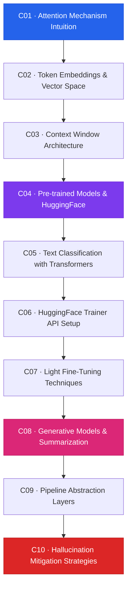

# Module 3 — Transformers & Summarization

> **Duration:** 8 Hours · **Chapters:** 10 · **Level:** Advanced

---

## 🎯 Module Objective

Develop deep intuition for attention-based architectures, leverage pre-trained transformer models from HuggingFace, and build production-grade summarization pipelines — including strategies for detecting and mitigating hallucinations.

---

## 📖 Synopsis

This module bridges the gap between classical NLP and modern deep learning:

- **Attention & embeddings** — understanding self-attention, positional encoding, and vector-space semantics.
- **Context windows** — how transformers handle sequence length and truncation.
- **HuggingFace ecosystem** — loading pre-trained models, tokenisers, and the Trainer API.
- **Fine-tuning & generation** — light fine-tuning techniques, generative summarization, and pipeline abstractions.
- **Reliability** — hallucination detection, mitigation heuristics, and human-in-the-loop validation.

---

## 🗺️ Chapter Roadmap

---

## 📂 Chapter Index

| # | Title | File | Focus |
|---|-------|------|-------|
| 1 | Attention Mechanism Intuition | [M03-C01](M03-C01-L01-attention-mechanism-intuition.md) | Self-attention, Q/K/V matrices |
| 2 | Token Embeddings & Vector Space | [M03-C02](M03-C02-L01-token-embeddings-vector-space.md) | Word2Vec, contextual embeddings |
| 3 | Context Window Architecture | [M03-C03](M03-C03-L01-context-window-architecture.md) | Positional encoding, max sequence length |
| 4 | Pre-trained Models & HuggingFace | [M03-C04](M03-C04-L01-pretrained-models-huggingface.md) | Model hub, AutoModel, AutoTokenizer |
| 5 | Text Classification with Transformers | [M03-C05](M03-C05-L01-text-classification-transformers.md) | Sequence classification, fine-tuning heads |
| 6 | HuggingFace Trainer API Setup | [M03-C06](M03-C06-L01-huggingface-trainer-api-setup.md) | TrainingArguments, data collators |
| 7 | Light Fine-Tuning Techniques | [M03-C07](M03-C07-L01-light-fine-tuning-techniques.md) | LoRA, adapter layers, frozen backbones |
| 8 | Generative Models & Summarization | [M03-C08](M03-C08-L01-generative-models-summarisation.md) | Seq2Seq, BART, T5, beam search |
| 9 | Pipeline Abstraction Layers | [M03-C09](M03-C09-L01-pipeline-abstraction-layers.md) | HuggingFace `pipeline()`, custom wrappers |
| 10 | Hallucination Mitigation Strategies | [M03-C10](M03-C10-L01-hallucination-mitigation-strategies.md) | Detection heuristics, factual grounding |

---

## ✅ Module Completion Checklist

- [ ] Completed all 10 chapters
- [ ] Loaded and used at least two pre-trained HuggingFace models
- [ ] Fine-tuned a model using the Trainer API
- [ ] Generated summaries and evaluated quality
- [ ] Implemented at least one hallucination mitigation strategy
- [ ] Ready for **Module 4 — Model Packaging & CLI Tool**

---

[← Back to Course Index](../README.md) · [Previous Module ←](../Module-02_Classical-NLP/MODULE.md) · [Next Module →](../Module-04_Model-Packaging-CLI/MODULE.md)
