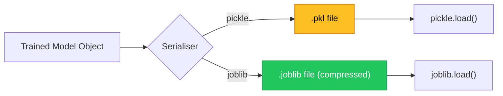
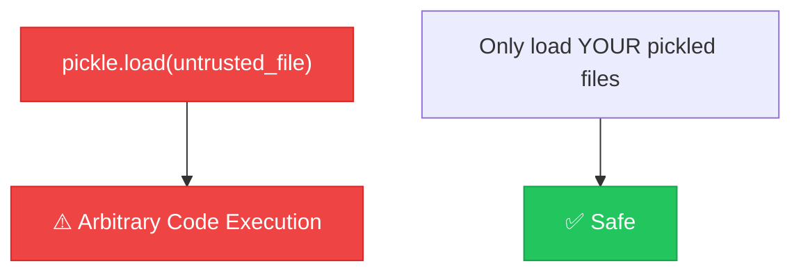

# Chapter 1 — Serialization: Pickle & Joblib

> **Module 4 · Model Packaging & CLI Tool** · Estimated Duration: 25 minutes

---

## 🎯 Learning Objectives

1. Serialise and deserialise Python objects using `pickle` and `joblib`.
2. Understand the security implications of unpickling untrusted data.
3. Use `joblib` for efficient serialization of large numpy arrays and scikit-learn models.
4. Implement versioned model saving with metadata.

---

## 📚 Core Concepts

### 1.1 — Pickle vs. Joblib



```python
import pickle  # Import pickle for object serialization
import joblib  # Import joblib — optimised for numpy-heavy objects
from pathlib import Path  # Import pathlib for file path handling
from loguru import logger  # Import loguru for DEBUG tracing

logger.debug("Starting M04-C01 — Serialization: Pickle & Joblib")

model: dict = {"type": "NaiveBayes", "accuracy": 0.87, "weights": [0.1, 0.9]}  # Simulated model

# --- Pickle ---
pkl_path: Path = Path("models/model_v1.pkl")
pkl_path.parent.mkdir(parents=True, exist_ok=True)  # Ensure directory exists
with open(pkl_path, "wb") as f:
    pickle.dump(model, f)  # Serialise to binary file
logger.debug(f"Saved with pickle: {pkl_path} ({pkl_path.stat().st_size} bytes)")

# --- Joblib ---
jbl_path: Path = Path("models/model_v1.joblib")
joblib.dump(model, jbl_path, compress=3)  # Serialise with zlib compression level 3
logger.debug(f"Saved with joblib: {jbl_path} ({jbl_path.stat().st_size} bytes)")
```

### 1.2 — Security Warning



---

## 🧪 Exercises

1. **Exercise 1.1** — Serialise a scikit-learn pipeline (vectoriser + classifier) and reload it.
2. **Exercise 1.2** — Compare file sizes of pickle vs. joblib with different compression levels.
3. **Exercise 1.3** — Add a metadata JSON sidecar file alongside each serialised model.

---

## 🔑 Key Takeaways

- **Joblib** is preferred for scikit-learn models — it handles numpy arrays more efficiently.
- **Never unpickle untrusted data** — pickle can execute arbitrary code on load.
- Always save **metadata** (version, training date, metrics) alongside the model file.

---

[← Module Index](MODULE.md) · [Next Chapter →](M04-C02-L01-saving-transformer-weights.md)
