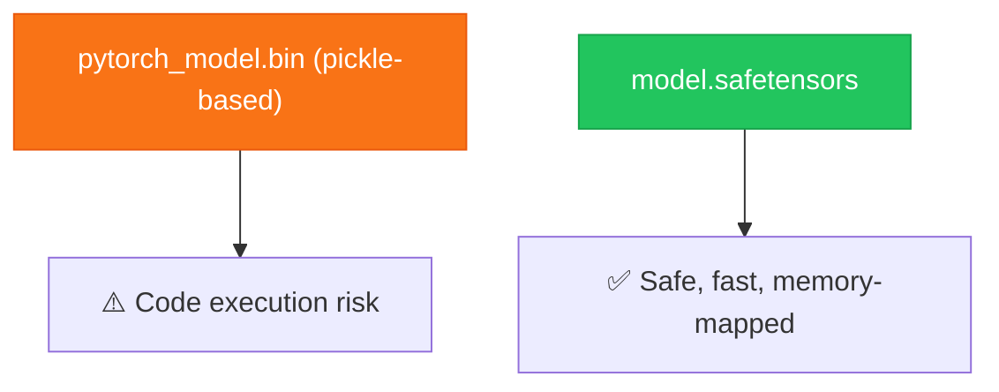

# Chapter 2 — Saving Transformer Weights

> **Module 4 · Model Packaging & CLI Tool** · Estimated Duration: 25 minutes

---

## 🎯 Learning Objectives

1. Use `save_pretrained()` and `from_pretrained()` for HuggingFace models.
2. Understand the artefacts saved: `config.json`, `pytorch_model.bin`, `tokenizer.json`.
3. Explore the safetensors format for secure weight storage.
4. Version transformer checkpoints with semantic naming.

---

## 📚 Core Concepts

### 2.1 — Save & Load Workflow


```python
from transformers import AutoModelForSequenceClassification, AutoTokenizer
from pathlib import Path
from loguru import logger

logger.debug("Starting M04-C02 — Saving Transformer Weights")

model_name: str = "distilbert-base-uncased"
save_dir: Path = Path("models/distilbert-sentiment-v1")

model = AutoModelForSequenceClassification.from_pretrained(model_name, num_labels=2)
tokeniser = AutoTokenizer.from_pretrained(model_name)

model.save_pretrained(save_dir)  # Save model weights and config
tokeniser.save_pretrained(save_dir)  # Save tokeniser vocabulary and config
logger.debug(f"Model and tokeniser saved to: {save_dir}")

# --- List saved artefacts ---
for f in sorted(save_dir.iterdir()):
    logger.debug(f"  {f.name} ({f.stat().st_size:,} bytes)")
```

### 2.2 — Safetensors Format



---

## 🧪 Exercises

1. **Exercise 2.1** — Save a fine-tuned model and reload it in a separate script.
2. **Exercise 2.2** — Compare load times between `.bin` and `.safetensors` formats.
3. **Exercise 2.3** — Create a versioning scheme: `models/v1.0.0/`, `models/v1.1.0/`, etc.

---

## 🔑 Key Takeaways

- `save_pretrained()` produces a self-contained directory with all files needed for restoration.
- **Safetensors** is the recommended format — it is safe (no code execution) and faster to load.
- Always **version your model directories** to enable rollback and A/B comparison.

---

[← Previous Chapter](M04-C01-L01-serialization-pickle-joblib.md) · [Module Index](MODULE.md) · [Next Chapter →](M04-C03-L01-enterprise-folder-structures.md)
