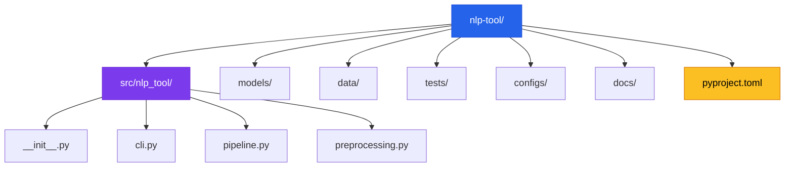
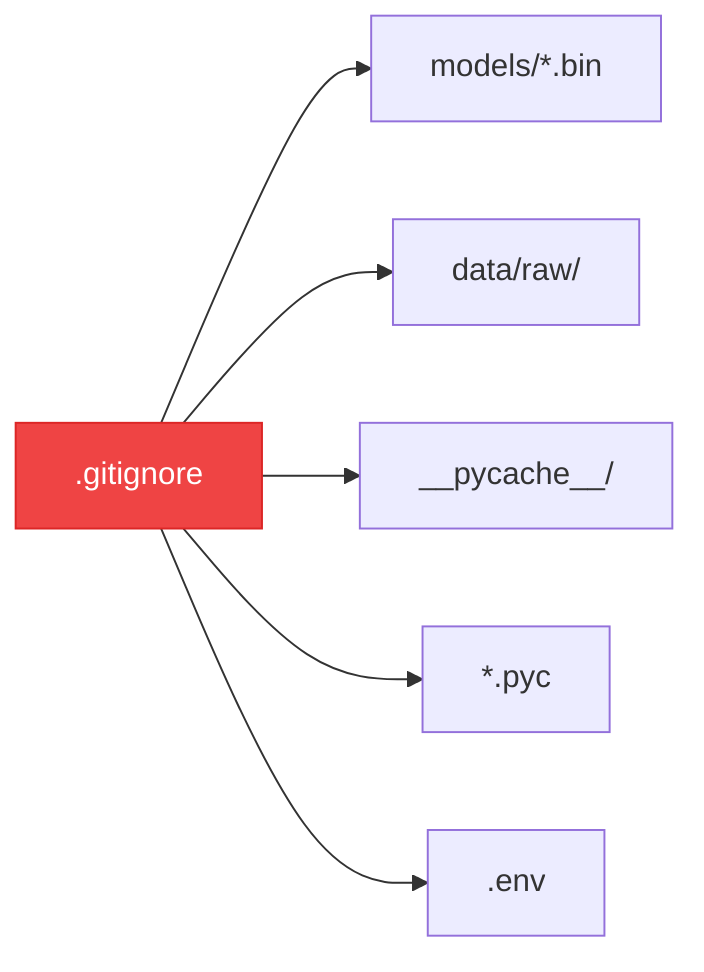

# Chapter 3 — Enterprise Folder Structures

> **Module 4 · Model Packaging & CLI Tool** · Estimated Duration: 20 minutes

---

## 🎯 Learning Objectives

1. Design a production-grade project layout for NLP applications.
2. Separate concerns: source code, models, data, tests, configuration, and documentation.
3. Implement `__init__.py` files for proper Python package structure.
4. Use `.gitignore` to exclude large binary files from version control.

---

## 📚 Core Concepts

### 3.1 — Recommended Layout



```python
from pathlib import Path
from loguru import logger

logger.debug("Starting M04-C03 — Enterprise Folder Structures")

project_root: Path = Path("nlp-tool")
dirs: list[str] = [
    "src/nlp_tool", "models", "data/raw", "data/processed",
    "tests", "configs", "docs"
]
for d in dirs:
    path: Path = project_root / d
    path.mkdir(parents=True, exist_ok=True)
    logger.debug(f"Created: {path}")

# --- Create __init__.py ---
init_file: Path = project_root / "src" / "nlp_tool" / "__init__.py"
init_file.write_text('"""NLP Tool — Main package."""\n__version__ = "0.1.0"\n')
logger.debug(f"Created: {init_file}")
```

### 3.2 — .gitignore for NLP Projects



---

## 🧪 Exercises

1. **Exercise 3.1** — Create the full project layout from scratch using the recommended structure.
2. **Exercise 3.2** — Write a `.gitignore` file that excludes model binaries and raw data.
3. **Exercise 3.3** — Add a `pyproject.toml` with project metadata and dependencies.

---

## 🔑 Key Takeaways

- **Separation of concerns** (code, data, models, tests) is non-negotiable for maintainable projects.
- Large binary files (models, datasets) should be in `.gitignore` and tracked with Git LFS if needed.
- `pyproject.toml` is the modern standard for Python project configuration (replacing `setup.py`).

---

[← Previous Chapter](M04-C02-L01-saving-transformer-weights.md) · [Module Index](MODULE.md) · [Next Chapter →](M04-C04-L01-model-versioning-lineage.md)
