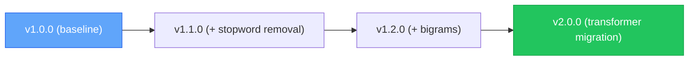
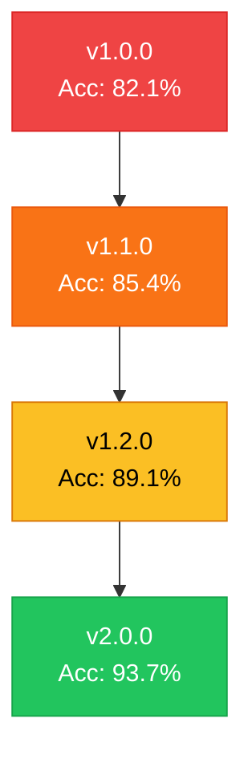

# Chapter 4 — Model Versioning & Lineage

> **Module 4 · Model Packaging & CLI Tool** · Estimated Duration: 25 minutes

---

## 🎯 Learning Objectives

1. Apply semantic versioning (SemVer) to NLP model releases.
2. Track model lineage: training data, hyperparameters, metrics, and parent model.
3. Implement a JSON metadata schema for model provenance.
4. Compare model versions side-by-side using logged metrics.

---

## 📚 Core Concepts

### 4.1 — Model Versioning Scheme



```python
import json
from pathlib import Path
from datetime import datetime
from loguru import logger

logger.debug("Starting M04-C04 — Model Versioning & Lineage")

metadata: dict = {
    "model_name": "sentiment-classifier",
    "version": "1.2.0",
    "created": datetime.now().isoformat(),
    "parent_version": "1.1.0",
    "training_data": "imdb-train-25k",
    "hyperparameters": {"C": 1.0, "max_features": 10000, "ngram_range": [1, 2]},
    "metrics": {"accuracy": 0.891, "f1_macro": 0.887, "precision": 0.893, "recall": 0.885},
}
logger.debug(f"Model metadata: {json.dumps(metadata, indent=2)}")

meta_path: Path = Path("models/v1.2.0/metadata.json")
meta_path.parent.mkdir(parents=True, exist_ok=True)
meta_path.write_text(json.dumps(metadata, indent=2, ensure_ascii=False))
logger.debug(f"Metadata saved to: {meta_path}")
```

### 4.2 — Lineage Graph



---

## 🧪 Exercises

1. **Exercise 4.1** — Build a version comparison table from multiple `metadata.json` files.
2. **Exercise 4.2** — Implement a `promote_model()` function that copies the best version to a `production/` folder.
3. **Exercise 4.3** — Add training duration and hardware info to the metadata schema.

---

## 🔑 Key Takeaways

- **SemVer** communicates change magnitude: MAJOR (breaking), MINOR (additive), PATCH (fix).
- **Lineage tracking** answers "how did we get here?" — essential for debugging regressions.
- A **metadata sidecar** (`metadata.json`) makes every model self-documenting.

---

[← Previous Chapter](M04-C03-L01-enterprise-folder-structures.md) · [Module Index](MODULE.md) · [Next Chapter →](M04-C05-L01-cli-argparse-fundamentals.md)
