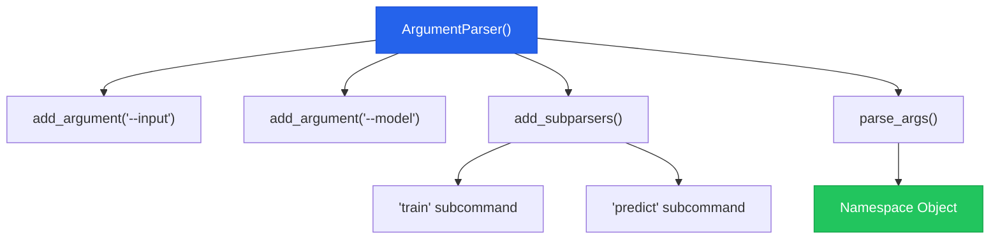
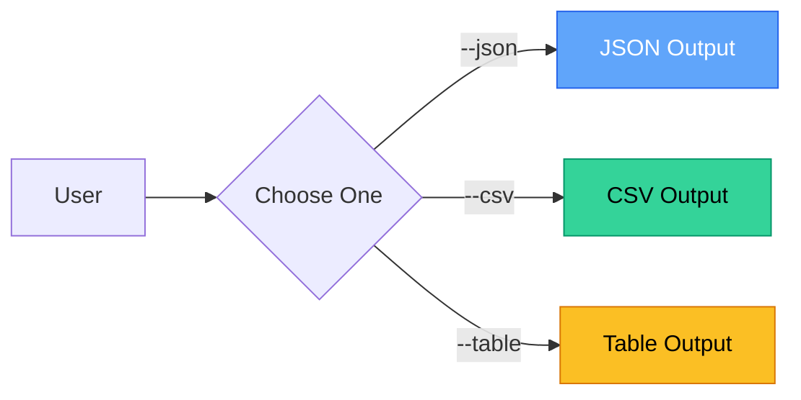

# Chapter 5 — CLI Argparse Fundamentals

> **Module 4 · Model Packaging & CLI Tool** · Estimated Duration: 25 minutes

---

## 🎯 Learning Objectives

1. Build command-line interfaces using Python's `argparse` module.
2. Define positional arguments, optional flags, and subcommands.
3. Implement mutually exclusive argument groups.
4. Add help text and usage examples for Windows PowerShell users.

---

## 📚 Core Concepts

### 5.1 — Argparse Architecture



```python
import argparse  # Import argparse for CLI argument parsing
from loguru import logger  # Import loguru for DEBUG tracing

logger.debug("Starting M04-C05 — CLI Argparse Fundamentals")

parser = argparse.ArgumentParser(
    prog="nlp-tool",
    description="A terminal-based NLP analysis tool.",
)  # Create the root argument parser

parser.add_argument("--input", "-i", type=str, required=True, help="Path to input text file")
parser.add_argument("--model", "-m", type=str, default="models/v1.0.0", help="Path to model directory")
parser.add_argument("--verbose", "-v", action="store_true", help="Enable verbose output")

# --- Subcommands ---
subparsers = parser.add_subparsers(dest="command", help="Available commands")

train_parser = subparsers.add_parser("train", help="Train a new model")
train_parser.add_argument("--epochs", type=int, default=10, help="Number of training epochs")

predict_parser = subparsers.add_parser("predict", help="Run predictions")
predict_parser.add_argument("--batch-size", type=int, default=32, help="Inference batch size")

# --- Parsing (demo with test args) ---
args = parser.parse_args(["--input", "data/test.txt", "predict", "--batch-size", "64"])
logger.debug(f"Parsed args: {args}")
logger.debug(f"Command: {args.command}, Input: {args.input}, Batch size: {args.batch_size}")
```

### 5.2 — Mutually Exclusive Groups



---

## 🧪 Exercises

1. **Exercise 5.1** — Build a CLI with `train`, `predict`, and `evaluate` subcommands.
2. **Exercise 5.2** — Add a mutually exclusive output format group: `--json`, `--csv`, `--table`.
3. **Exercise 5.3** — Implement `--version` flag that prints the tool version and exits.

---

## 🔑 Key Takeaways

- `argparse` is the standard library for CLI tools — no external dependencies needed.
- **Subcommands** organise complex tools into logical operations (`train`, `predict`, `evaluate`).
- Always provide `--help` text — it is the primary documentation for CLI users.

---

[← Previous Chapter](M04-C04-L01-model-versioning-lineage.md) · [Module Index](MODULE.md) · [Next Chapter →](M04-C06-L01-designing-main-entry-points.md)
