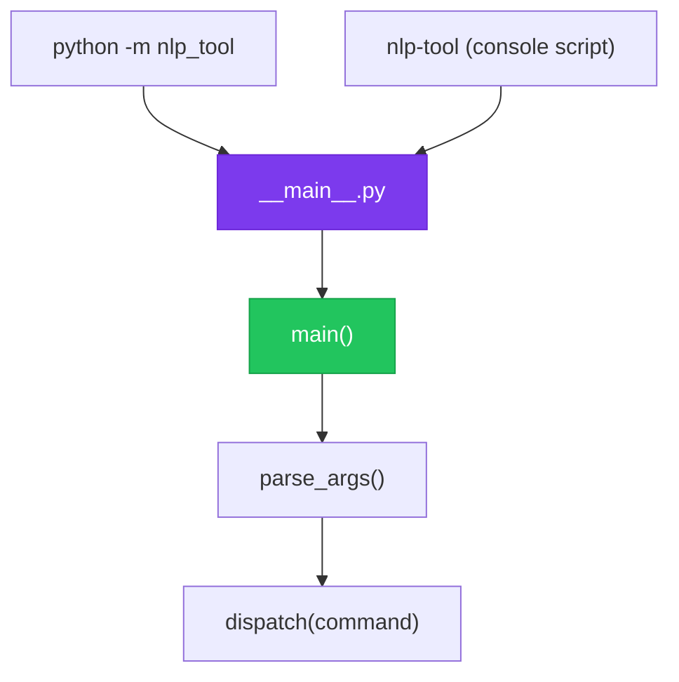

# Chapter 6 — Designing Main Entry Points

> **Module 4 · Model Packaging & CLI Tool** · Estimated Duration: 20 minutes

---

## 🎯 Learning Objectives

1. Implement `__main__.py` for `python -m package` execution.
2. Design clean main functions with argument parsing, logging setup, and error handling.
3. Create console entry-point scripts for `pip install`-able tools.
4. Follow the guard-clause pattern with `if __name__ == "__main__"`.

---

## 📚 Core Concepts

### 6.1 — Entry Point Architecture



```python
"""src/nlp_tool/__main__.py — Package entry point."""
import sys
from loguru import logger

def main() -> int:
    """Main entry point for the NLP tool."""
    logger.debug("NLP Tool starting")
    logger.debug(f"Python version: {sys.version}")
    logger.debug(f"Arguments: {sys.argv[1:]}")
    
    # Argument parsing and dispatch would go here
    logger.debug("NLP Tool completed successfully")
    return 0  # Exit code 0 = success

if __name__ == "__main__":
    raise SystemExit(main())
```

### 6.2 — pyproject.toml Console Scripts


---

## 🧪 Exercises

1. **Exercise 6.1** — Create a `__main__.py` that dispatches to `train` or `predict` functions.
2. **Exercise 6.2** — Configure a console script entry point in `pyproject.toml`.
3. **Exercise 6.3** — Add proper exit codes: 0 (success), 1 (user error), 2 (system error).

---

## 🔑 Key Takeaways

- `__main__.py` enables `python -m package` execution — the standard for Python CLI tools.
- Console script entry points make your tool available as a system command after `pip install`.
- Return **integer exit codes** — shell scripts and CI pipelines depend on them.

---

[← Previous Chapter](M04-C05-L01-cli-argparse-fundamentals.md) · [Module Index](MODULE.md) · [Next Chapter →](M04-C07-L01-terminal-interface-ux.md)
