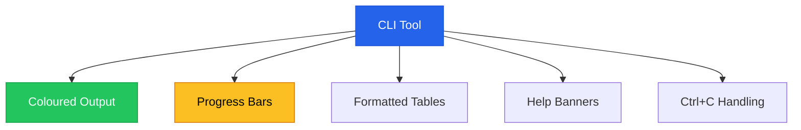
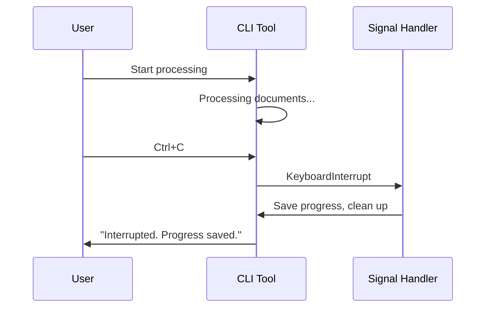

# Chapter 7 — Terminal Interface & UX

> **Module 4 · Model Packaging & CLI Tool** · Estimated Duration: 25 minutes

---

## 🎯 Learning Objectives

1. Add colour output to CLI tools using `colorama` or ANSI escape codes.
2. Implement progress bars for long-running operations with `tqdm`.
3. Design informative help text and usage banners.
4. Handle user interrupts (`Ctrl+C`) gracefully.

---

## 📚 Core Concepts

### 7.1 — Terminal UX Components



```python
from tqdm import tqdm  # Import tqdm for progress bar display
import time  # Import time for simulating work
from loguru import logger  # Import loguru for DEBUG tracing

logger.debug("Starting M04-C07 — Terminal Interface & UX")

# --- Progress bar for batch processing ---
documents: list[str] = [f"doc_{i}" for i in range(100)]  # Simulated document list
logger.debug(f"Processing {len(documents)} documents")

for doc in tqdm(documents, desc="Processing", unit="doc"):
    time.sleep(0.01)  # Simulate work
    
logger.debug("All documents processed")
```

### 7.2 — Graceful Interrupt Handling



```python
import signal
import sys
from loguru import logger

def handle_interrupt(signum, frame):
    """Handle Ctrl+C gracefully."""
    logger.warning("Interrupted by user. Saving progress...")
    sys.exit(130)  # Standard exit code for SIGINT

signal.signal(signal.SIGINT, handle_interrupt)
logger.debug("Interrupt handler registered")
```

---

## 🧪 Exercises

1. **Exercise 7.1** — Add a coloured status banner that displays tool name, version, and mode.
2. **Exercise 7.2** — Implement a nested progress bar (outer: files, inner: lines per file).
3. **Exercise 7.3** — Create a results table using the `tabulate` library.

---

## 🔑 Key Takeaways

- **Progress bars** transform user-hostile silence into informative feedback.
- **Graceful interrupt handling** prevents data loss and corrupted output files.
- Good **CLI UX** is as important as good GUI UX — users spend hours in terminals.

---

[← Previous Chapter](M04-C06-L01-designing-main-entry-points.md) · [Module Index](MODULE.md) · [Next Chapter →](M04-C08-L01-integrated-nlp-tool-logic.md)
