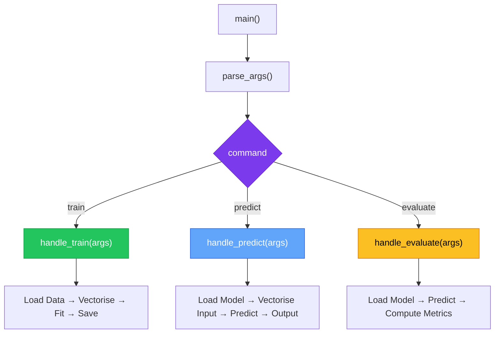
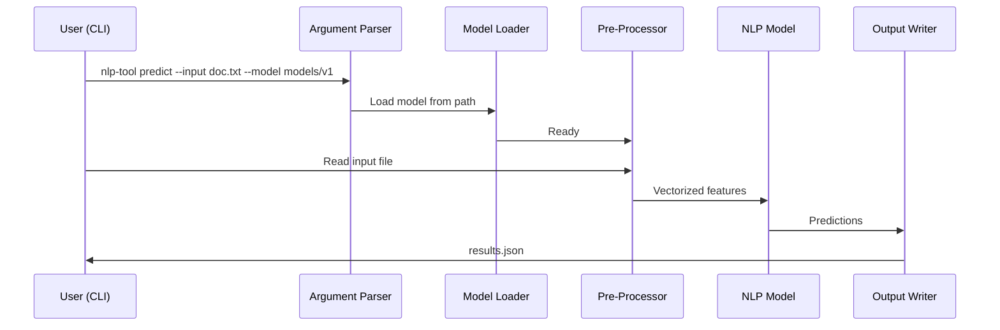

# Chapter 8 — Integrated NLP Tool Logic

> **Module 4 · Model Packaging & CLI Tool** · Estimated Duration: 30 minutes

---

## 🎯 Learning Objectives

1. Wire trained NLP models into CLI subcommands.
2. Implement `train`, `predict`, and `evaluate` command handlers.
3. Load models, process input files, and write structured output.
4. Coordinate the pre-processing pipeline with the model inference pipeline.

---

## 📚 Core Concepts

### 8.1 — Command Dispatch Architecture



```python
import json
from pathlib import Path
from loguru import logger

logger.debug("Starting M04-C08 — Integrated NLP Tool Logic")

def handle_predict(input_path: Path, model_dir: Path, output_path: Path) -> None:
    """Load model, run predictions, write results."""
    logger.debug(f"Loading model from: {model_dir}")
    # model = joblib.load(model_dir / "model.joblib")
    
    logger.debug(f"Reading input from: {input_path}")
    # texts = input_path.read_text(encoding="utf-8").splitlines()
    
    logger.debug("Running predictions...")
    # predictions = model.predict(vectoriser.transform(texts))
    
    results: list[dict] = [
        {"text": "sample text", "prediction": "positive", "confidence": 0.92}
    ]  # Simulated results
    
    output_path.write_text(json.dumps(results, indent=2, ensure_ascii=False))
    logger.debug(f"Results written to: {output_path}")

handle_predict(Path("data/input.txt"), Path("models/v1.2.0"), Path("output/results.json"))
```

### 8.2 — End-to-End Prediction Flow



---

## 🧪 Exercises

1. **Exercise 8.1** — Implement `handle_train()` that loads CSV data, trains a classifier, and saves the model.
2. **Exercise 8.2** — Add a `--format` flag to `predict` supporting JSON, CSV, and plain text output.
3. **Exercise 8.3** — Implement `handle_evaluate()` that prints a classification report from test data.

---

## 🔑 Key Takeaways

- **Command dispatch** separates CLI parsing from business logic — each handler is independently testable.
- Always **log every major step** (load, process, predict, write) for debugging in production.
- Structured output (JSON) enables downstream consumption by other tools and dashboards.

---

[← Previous Chapter](M04-C07-L01-terminal-interface-ux.md) · [Module Index](MODULE.md) · [Next Chapter →](M04-C09-L01-debugging-windows-environments.md)
