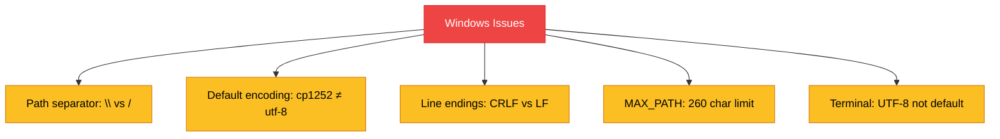
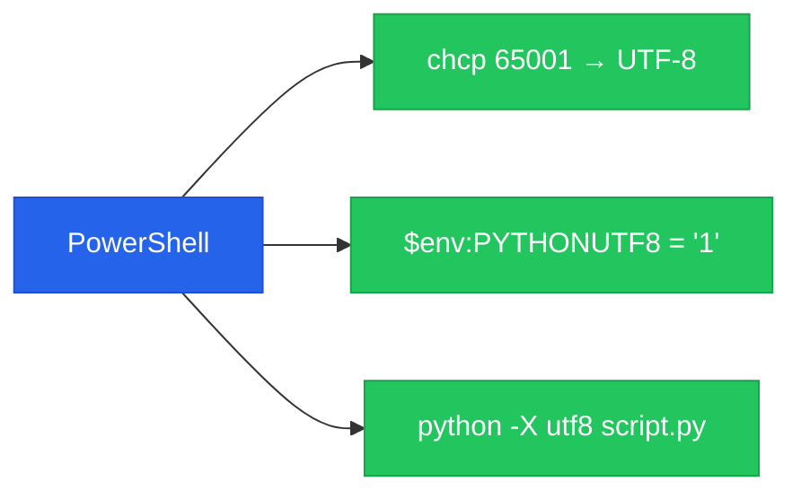

# Chapter 9 — Debugging in Windows Environments

> **Module 4 · Model Packaging & CLI Tool** · Estimated Duration: 25 minutes

---

## 🎯 Learning Objectives

1. Troubleshoot common Windows-specific Python issues: paths, encoding, line endings.
2. Use PowerShell effectively for NLP tool development and testing.
3. Handle long file paths (>260 characters) on Windows.
4. Debug Unicode and encoding issues in Windows terminals.

---

## 📚 Core Concepts

### 9.1 — Windows Gotchas for Python NLP



```python
import sys
import locale
from pathlib import Path
from loguru import logger

logger.debug("Starting M04-C09 — Debugging in Windows Environments")

# --- Check encoding defaults ---
logger.debug(f"sys.getdefaultencoding(): {sys.getdefaultencoding()}")
logger.debug(f"locale.getpreferredencoding(): {locale.getpreferredencoding()}")
logger.debug(f"sys.stdout.encoding: {sys.stdout.encoding}")

# --- Always use pathlib for cross-platform paths ---
data_path: Path = Path("C:/Users/Engineer/data/corpus.txt")  # Forward slashes work on Windows
logger.debug(f"Path: {data_path}")
logger.debug(f"Exists: {data_path.exists()}")

# --- Force UTF-8 in Windows terminal ---
if sys.platform == "win32":
    import os
    os.environ["PYTHONUTF8"] = "1"  # Enable Python UTF-8 mode
    logger.debug("PYTHONUTF8 mode enabled for Windows")
```

### 9.2 — PowerShell Tips



---

## 🧪 Exercises

1. **Exercise 9.1** — Write a test that reads a UTF-8 file with accented characters on Windows.
2. **Exercise 9.2** — Create a script that detects and normalises CRLF/LF line endings.
3. **Exercise 9.3** — Handle a path longer than 260 characters using the `\\?\` prefix.

---

## 🔑 Key Takeaways

- Always use `pathlib.Path` — it handles path separators automatically across platforms.
- Set `PYTHONUTF8=1` or use `python -X utf8` to avoid encoding surprises on Windows.
- Test on Windows early — encoding and path issues compound when discovered late.

---

[← Previous Chapter](M04-C08-L01-integrated-nlp-tool-logic.md) · [Module Index](MODULE.md) · [Next Chapter →](M04-C10-L01-final-project-deployment.md)
