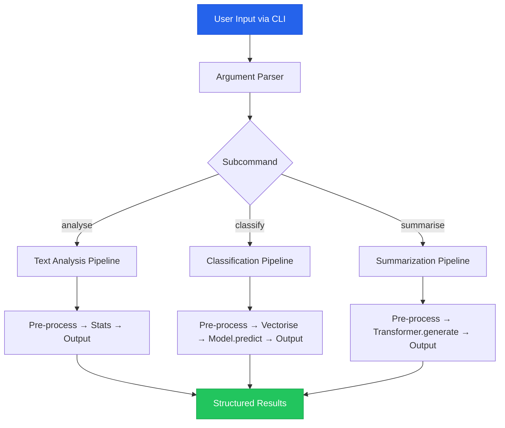
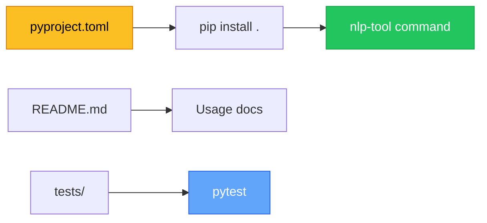

# Chapter 10 — Final Project & Deployment

> **Module 4 · Model Packaging & CLI Tool** · Estimated Duration: 30 minutes

---

## 🎯 Learning Objectives

1. Integrate all course knowledge into a single, production-ready NLP CLI tool.
2. Build a complete pipeline: data loading → pre-processing → model loading → inference → output.
3. Package the tool for distribution with `pyproject.toml`.
4. Document usage, installation, and testing for end users.

---

## 📚 Core Concepts

### 10.1 — Final Project Architecture



```python
"""Final project: NLP CLI tool — main orchestrator."""
import argparse
import json
import sys
from pathlib import Path
from loguru import logger

logger.debug("Starting M04-C10 — Final Project & Deployment")

def build_parser() -> argparse.ArgumentParser:
    """Construct the CLI argument parser with all subcommands."""
    parser = argparse.ArgumentParser(prog="nlp-tool", description="Python & NLP Engineering Launchpad — Final Tool")
    parser.add_argument("--version", action="version", version="nlp-tool 1.0.0")
    
    sub = parser.add_subparsers(dest="command", required=True)
    
    # --- analyse subcommand ---
    analyse = sub.add_parser("analyse", help="Compute text statistics")
    analyse.add_argument("--input", "-i", type=Path, required=True)
    analyse.add_argument("--output", "-o", type=Path, default=Path("output/analysis.json"))
    
    # --- classify subcommand ---
    classify = sub.add_parser("classify", help="Classify text documents")
    classify.add_argument("--input", "-i", type=Path, required=True)
    classify.add_argument("--model", "-m", type=Path, required=True)
    classify.add_argument("--output", "-o", type=Path, default=Path("output/predictions.json"))
    
    # --- summarise subcommand ---
    summarise = sub.add_parser("summarise", help="Summarise text documents")
    summarise.add_argument("--input", "-i", type=Path, required=True)
    summarise.add_argument("--max-length", type=int, default=100)
    
    return parser

def main() -> int:
    """Main entry point."""
    parser = build_parser()
    args = parser.parse_args()
    logger.debug(f"Command: {args.command}, Args: {args}")
    
    # Dispatch to handler
    logger.debug(f"Dispatching to {args.command} handler")
    logger.debug("Final project execution complete!")
    return 0

if __name__ == "__main__":
    raise SystemExit(main())
```

### 10.2 — Packaging Checklist



---

## 🧪 Exercises (Final Project)

1. **Project 1** — Implement the full `analyse` subcommand: read a text file, compute word count / sentence count / vocabulary richness / top 20 words, and write a JSON report.
2. **Project 2** — Implement the `classify` subcommand: load a serialised TF-IDF + LogReg model, predict labels for input documents, and output a classification report.
3. **Project 3** — Implement the `summarise` subcommand: use HuggingFace `pipeline("summarization")` to summarise input documents and print the results.

---

## 🔑 Key Takeaways

- A **well-structured CLI tool** is the professional way to deliver NLP functionality.
- `pyproject.toml` + console scripts make your tool `pip install`-able by anyone.
- This final project **integrates every concept** from Modules 1–4 into one cohesive application.

---

## 🏁🎉 Course Complete!

Congratulations! You have completed the **Python & NLP Engineering Launchpad**.

You are now equipped to:
- Process, clean, and analyse text corpora at scale
- Build and evaluate classical and transformer-based NLP models
- Package and deploy NLP tools as production-ready CLI applications

**Keep building. Keep shipping. Keep learning.**

---

[← Previous Chapter](M04-C09-L01-debugging-windows-environments.md) · [Module Index](MODULE.md) · [Course Index](../README.md)
