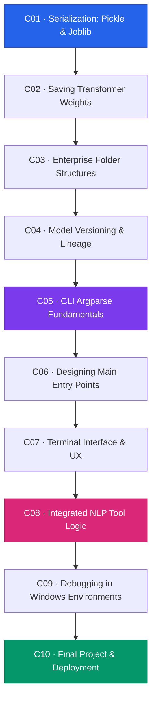

# Module 4 — Model Packaging & CLI Tool

> **Duration:** 4 Hours · **Chapters:** 10 · **Level:** Production

---

## 🎯 Module Objective

Transform trained NLP models into versioned, serialised artefacts and ship them as a polished Windows command-line tool — from `pickle` files to a fully interactive terminal application.

---

## 📖 Synopsis

This capstone module covers the last mile of the NLP engineering lifecycle:

- **Serialization** — persisting scikit-learn and transformer models with Pickle, Joblib, and HuggingFace's `save_pretrained`.
- **Project structure** — enterprise-grade folder layouts, model versioning, and lineage tracking.
- **CLI design** — building professional `argparse`-based tools for Windows with thoughtful UX.
- **Final project** — integrating the entire course into one terminal-based NLP tool and deploying it.

---

## 🗺️ Chapter Roadmap

---

## 📂 Chapter Index

| # | Title | File | Focus |
|---|-------|------|-------|
| 1 | Serialization: Pickle & Joblib | [M04-C01](M04-C01-L01-serialization-pickle-joblib.md) | Object persistence, compression |
| 2 | Saving Transformer Weights | [M04-C02](M04-C02-L01-saving-transformer-weights.md) | `save_pretrained`, safetensors |
| 3 | Enterprise Folder Structures | [M04-C03](M04-C03-L01-enterprise-folder-structures.md) | `src/`, `models/`, `data/`, `tests/` |
| 4 | Model Versioning & Lineage | [M04-C04](M04-C04-L01-model-versioning-lineage.md) | Semantic versioning, metadata tracking |
| 5 | CLI Argparse Fundamentals | [M04-C05](M04-C05-L01-cli-argparse-fundamentals.md) | Subcommands, mutually exclusive groups |
| 6 | Designing Main Entry Points | [M04-C06](M04-C06-L01-designing-main-entry-points.md) | `__main__.py`, entry-point scripts |
| 7 | Terminal Interface & UX | [M04-C07](M04-C07-L01-terminal-interface-ux.md) | Colour output, progress bars, help text |
| 8 | Integrated NLP Tool Logic | [M04-C08](M04-C08-L01-integrated-nlp-tool-logic.md) | Wiring models into CLI commands |
| 9 | Debugging in Windows Environments | [M04-C09](M04-C09-L01-debugging-windows-environments.md) | Path issues, encoding, PowerShell tips |
| 10 | Final Project & Deployment | [M04-C10](M04-C10-L01-final-project-deployment.md) | End-to-end NLP CLI tool |

---

## ✅ Module Completion Checklist

- [ ] Completed all 10 chapters
- [ ] Serialised at least one scikit-learn and one transformer model
- [ ] Structured a project with enterprise-grade folder layout
- [ ] Built a working CLI tool with subcommands
- [ ] Completed the Final Project
- [ ] 🎉 **Course Complete!**

---

[← Back to Course Index](../README.md) · [Previous Module ←](../Module-03_Transformers-Summarisation/MODULE.md)
