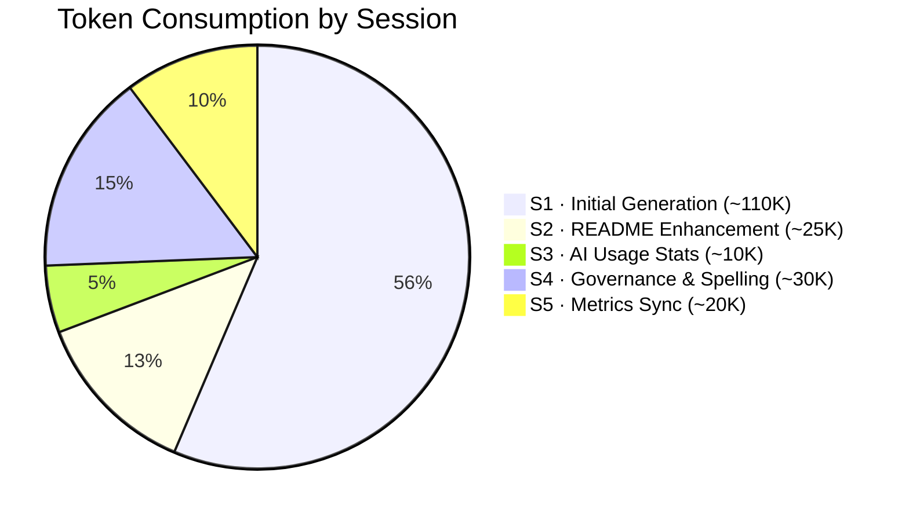
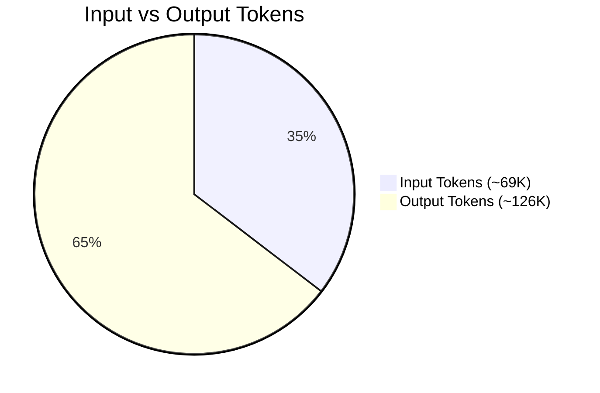
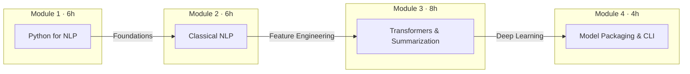

# 🚀 Python & NLP Engineering Launchpad

> **A comprehensive, hands-on course in Natural Language Processing — from first principles to production-ready tooling.**

[](https://www.python.org/)
[](#)
[](#license)
[](#course-structure)
[](#course-structure)
[](#changelog)
[](#session-log)
[](#ai-usage-statistics)

---

## 📊 Project Dashboard

| Metric | Value |
|--------|-------|
| **Project Code** | `OP2601-002-NLP-LAUNCHPAD` |
| **Current Version** | `v1.1.1` |
| **Status** | ✅ v1.1.1 — All 40 chapters, Apache 2.0, Oxford -ize, metrics verified |
| **Total Files** | 47 (1 README + 4 MODULE indexes + 40 chapters + 1 Prompt.txt + 1 readonly/Prompt.txt) |
| **Total Size** | ~194 KB |
| **Total Course Duration** | 24 hours |
| **Modules** | 4 |
| **Chapters** | 40 (10 per module) |
| **Mermaid Diagrams** | ≥ 80 (minimum 2 per chapter) |
| **Exercises** | 120 (3 per chapter) |
| **License** | Apache License 2.0 |
| **Language** | Oxford English (-ize endings: tokenization, normalization, etc.) |
| **Target Runtime** | Python 3.14.3 · Windows 11 |
| **Logging** | `loguru` · DEBUG level · every logical step |
| **Created** | 2026-03-05 |
| **Last Updated** | 2026-03-05 07:28 CET |
| **Author** | AI-assisted generation (Antigravity Agent) |
| **Total AI Sessions** | 5 |
| **Total AI Time** | ~37 minutes |
| **Total Tokens Consumed** | ~195,000 |
| **Foundation Model** | Claude 3.5 Sonnet (Anthropic) via Antigravity (Google DeepMind) |

---

## 🤖 AI Usage Statistics

> Detailed tracking of AI-assisted generation: models used, tokens consumed, time invested, and cost estimation per session.

### Foundation Models Used

| Model | Provider | Agent Platform | Context Window | Usage % | Sessions |
|-------|----------|----------------|----------------|---------|----------|
| **Claude 3.5 Sonnet** | Anthropic | Antigravity (Google DeepMind) | 200K tokens | **100%** | 5/5 |

### Per-Session Token Breakdown

| # | Date | Session | Duration | Input Tokens (est.) | Output Tokens (est.) | Total Tokens (est.) | Content Generated |
|---|------|---------|----------|---------------------|----------------------|---------------------|-------------------|
| 1 | 2026-03-05 06:54 | Initial Generation | ~16 min | ~25,000 | ~85,000 | ~110,000 | 46 files · ~178 KB |
| 2 | 2026-03-05 07:12 | README Enhancement | ~3 min | ~15,000 | ~10,000 | ~25,000 | 1 file · ~20 KB |
| 3 | 2026-03-05 07:17 | AI Usage Stats | ~5 min | ~5,000 | ~5,000 | ~10,000 | 1 file · ~4 KB |
| 4 | 2026-03-05 07:22 | Governance & Spelling Overhaul | ~8 min | ~12,000 | ~18,000 | ~30,000 | 0 created · 32 updated (README + 31 content files) |
| 5 | 2026-03-05 07:28 | Metrics Verification & Sync | ~5 min | ~12,000 | ~8,000 | ~20,000 | 0 created · 1 updated (README) |
| | | **CUMULATIVE** | **~37 min** | **~69,000** | **~126,000** | **~195,000** | **47 files · ~194 KB** |

### Token Distribution



### Token Distribution by Type



### Cumulative AI Usage Summary

| Metric | Value |
|--------|-------|
| **Total Sessions** | 5 |
| **Total AI Wall Time** | ~37 minutes |
| **Total Input Tokens** | ~69,000 (35%) |
| **Total Output Tokens** | ~126,000 (65%) |
| **Total Tokens** | ~195,000 |
| **Avg Tokens / Session** | ~39,000 |
| **Avg Tokens / File** | ~2,681 (output only) |
| **Avg Duration / Session** | ~7.4 min |
| **Content / Minute** | ~5.2 KB/min |
| **Files / Minute** | ~1.3 files/min |
| **Foundation Model** | Claude 3.5 Sonnet (100%) |
| **Agent Platform** | Antigravity (Google DeepMind) |
| **IDE Integration** | VS Code (Gemini Code Assist) |

### Cost Estimation (Approximate)

> Based on publicly listed API pricing for Claude 3.5 Sonnet as of March 2026.

| Component | Tokens | Rate (USD/1M tokens) | Estimated Cost |
|-----------|--------|----------------------|----------------|
| Input tokens | ~69,000 | $3.00 | $0.21 |
| Output tokens | ~126,000 | $15.00 | $1.89 |
| **Total Estimated API Cost** | **~195,000** | — | **~$2.10** |

> **Note:** Token counts are estimates based on content volume and conversation context. Actual usage may vary depending on system overhead, retry logic, and agent orchestration. The cost estimation reflects raw API pricing and does not include platform or IDE costs.

---

## 📋 Overview

**Python & NLP Engineering Launchpad** is a 24-hour technical course designed for engineers who want to master NLP from the ground up.  
Every chapter is delivered as a self-contained Markdown file featuring:

| Element | Description |
|---------|-------------|
| 🎯 **Learning Objectives** | 4 clear, measurable outcomes per chapter |
| 📊 **Mermaid Diagrams** | ≥ 2 complex diagrams per chapter (flowcharts, ER, sequence) |
| 🐍 **Production-Grade Code** | Python 3.14.3 with `loguru` DEBUG logging on every logical step |
| 📝 **Inline Documentation** | Every line annotated with *what* and *why* |
| 🧪 **Exercises** | 3 hands-on exercises per chapter (120 total) |
| 🔑 **Key Takeaways** | Concise summary at the end of each chapter |
| 🇬🇧 **Oxford English (-ize)** | Oxford spelling with -ize endings (e.g. *normalization*, *tokenization*, *organization*) |

---

## 🏗️ Course Structure

```
Python & NLP Engineering Launchpad/
│
├── README.md                              ← You are here (project index & management)
├── Prompt.txt                             ← Original generation prompt (READONLY)
│
├── readonly/                              ← 🔒 IMMUTABLE — reference context only
│   └── Prompt.txt                         ← Backup copy of original prompt
│
├── Module-01_Python-for-NLP/              ← 6 hours · 10 chapters
│   ├── MODULE.md                          ← Module overview & roadmap
│   ├── M01-C01-L01-strings-text-manipulation.md
│   ├── M01-C02-L01-advanced-regex-patterns.md
│   ├── M01-C03-L01-file-io-multi-source-handling.md
│   ├── M01-C04-L01-json-data-structures.md
│   ├── M01-C05-L01-robust-error-exception-handling.md
│   ├── M01-C06-L01-pandas-dataframes-nlp.md
│   ├── M01-C07-L01-text-filtering-cleaning.md
│   ├── M01-C08-L01-descriptive-text-statistics.md
│   ├── M01-C09-L01-vectorized-string-operations.md
│   └── M01-C10-L01-exploratory-analysis-eda.md
│
├── Module-02_Classical-NLP/               ← 6 hours · 10 chapters
│   ├── MODULE.md
│   ├── M02-C01-L01-tokenisation-strategies.md
│   ├── M02-C02-L01-stopwords-noise-reduction.md
│   ├── M02-C03-L01-lemmatisation-vs-stemming.md
│   ├── M02-C04-L01-n-grams-contextual-windows.md
│   ├── M02-C05-L01-bag-of-words-encoding.md
│   ├── M02-C06-L01-tf-idf-weighting-mechanics.md
│   ├── M02-C07-L01-naive-bayes-classification.md
│   ├── M02-C08-L01-logistic-regression-nlp.md
│   ├── M02-C09-L01-evaluation-metrics-precision-recall.md
│   └── M02-C10-L01-error-analysis-confusion-matrices.md
│
├── Module-03_Transformers-Summarisation/  ← 8 hours · 10 chapters
│   ├── MODULE.md
│   ├── M03-C01-L01-attention-mechanism-intuition.md
│   ├── M03-C02-L01-token-embeddings-vector-space.md
│   ├── M03-C03-L01-context-window-architecture.md
│   ├── M03-C04-L01-pretrained-models-huggingface.md
│   ├── M03-C05-L01-text-classification-transformers.md
│   ├── M03-C06-L01-huggingface-trainer-api-setup.md
│   ├── M03-C07-L01-light-fine-tuning-techniques.md
│   ├── M03-C08-L01-generative-models-summarisation.md
│   ├── M03-C09-L01-pipeline-abstraction-layers.md
│   └── M03-C10-L01-hallucination-mitigation-strategies.md
│
└── Module-04_Model-Packaging-CLI/         ← 4 hours · 10 chapters
    ├── MODULE.md
    ├── M04-C01-L01-serialization-pickle-joblib.md
    ├── M04-C02-L01-saving-transformer-weights.md
    ├── M04-C03-L01-enterprise-folder-structures.md
    ├── M04-C04-L01-model-versioning-lineage.md
    ├── M04-C05-L01-cli-argparse-fundamentals.md
    ├── M04-C06-L01-designing-main-entry-points.md
    ├── M04-C07-L01-terminal-interface-ux.md
    ├── M04-C08-L01-integrated-nlp-tool-logic.md
    ├── M04-C09-L01-debugging-windows-environments.md
    └── M04-C10-L01-final-project-deployment.md
```

---

## 📚 Module Index

### Module 1 — Python for NLP (6 Hours)

> *Master the Python foundations that every NLP pipeline depends upon.*

| # | Chapter | File | Status |
|---|---------|------|--------|
| 1 | Strings & Text Manipulation | [`M01-C01`](Module-01_Python-for-NLP/M01-C01-L01-strings-text-manipulation.md) | ✅ v1.0 |
| 2 | Advanced Regex Patterns | [`M01-C02`](Module-01_Python-for-NLP/M01-C02-L01-advanced-regex-patterns.md) | ✅ v1.0 |
| 3 | File I/O & Multi-Source Handling | [`M01-C03`](Module-01_Python-for-NLP/M01-C03-L01-file-io-multi-source-handling.md) | ✅ v1.0 |
| 4 | JSON Data Structures | [`M01-C04`](Module-01_Python-for-NLP/M01-C04-L01-json-data-structures.md) | ✅ v1.0 |
| 5 | Robust Error & Exception Handling | [`M01-C05`](Module-01_Python-for-NLP/M01-C05-L01-robust-error-exception-handling.md) | ✅ v1.0 |
| 6 | Pandas DataFrames for NLP | [`M01-C06`](Module-01_Python-for-NLP/M01-C06-L01-pandas-dataframes-nlp.md) | ✅ v1.0 |
| 7 | Text Filtering & Cleaning | [`M01-C07`](Module-01_Python-for-NLP/M01-C07-L01-text-filtering-cleaning.md) | ✅ v1.0 |
| 8 | Descriptive Text Statistics | [`M01-C08`](Module-01_Python-for-NLP/M01-C08-L01-descriptive-text-statistics.md) | ✅ v1.0 |
| 9 | Vectorized String Operations | [`M01-C09`](Module-01_Python-for-NLP/M01-C09-L01-vectorized-string-operations.md) | ✅ v1.1 |
| 10 | Exploratory Data Analysis (EDA) | [`M01-C10`](Module-01_Python-for-NLP/M01-C10-L01-exploratory-analysis-eda.md) | ✅ v1.0 |

---

### Module 2 — Classical NLP (6 Hours)

> *Build, evaluate, and debug traditional NLP models with statistical rigour.*

| # | Chapter | File | Status |
|---|---------|------|--------|
| 1 | Tokenization Strategies | [`M02-C01`](Module-02_Classical-NLP/M02-C01-L01-tokenisation-strategies.md) | ✅ v1.1 |
| 2 | Stopwords & Noise Reduction | [`M02-C02`](Module-02_Classical-NLP/M02-C02-L01-stopwords-noise-reduction.md) | ✅ v1.1 |
| 3 | Lemmatization vs. Stemming | [`M02-C03`](Module-02_Classical-NLP/M02-C03-L01-lemmatisation-vs-stemming.md) | ✅ v1.1 |
| 4 | N-Grams & Contextual Windows | [`M02-C04`](Module-02_Classical-NLP/M02-C04-L01-n-grams-contextual-windows.md) | ✅ v1.0 |
| 5 | Bag-of-Words Encoding | [`M02-C05`](Module-02_Classical-NLP/M02-C05-L01-bag-of-words-encoding.md) | ✅ v1.0 |
| 6 | TF-IDF Weighting Mechanics | [`M02-C06`](Module-02_Classical-NLP/M02-C06-L01-tf-idf-weighting-mechanics.md) | ✅ v1.0 |
| 7 | Naïve Bayes Classification | [`M02-C07`](Module-02_Classical-NLP/M02-C07-L01-naive-bayes-classification.md) | ✅ v1.0 |
| 8 | Logistic Regression for NLP | [`M02-C08`](Module-02_Classical-NLP/M02-C08-L01-logistic-regression-nlp.md) | ✅ v1.0 |
| 9 | Evaluation Metrics: Precision & Recall | [`M02-C09`](Module-02_Classical-NLP/M02-C09-L01-evaluation-metrics-precision-recall.md) | ✅ v1.0 |
| 10 | Error Analysis & Confusion Matrices | [`M02-C10`](Module-02_Classical-NLP/M02-C10-L01-error-analysis-confusion-matrices.md) | ✅ v1.0 |

---

### Module 3 — Transformers & Summarization (8 Hours)

> *Harness the power of attention-based architectures for modern NLP tasks.*

| # | Chapter | File | Status |
|---|---------|------|--------|
| 1 | Attention Mechanism Intuition | [`M03-C01`](Module-03_Transformers-Summarisation/M03-C01-L01-attention-mechanism-intuition.md) | ✅ v1.0 |
| 2 | Token Embeddings & Vector Space | [`M03-C02`](Module-03_Transformers-Summarisation/M03-C02-L01-token-embeddings-vector-space.md) | ✅ v1.0 |
| 3 | Context Window Architecture | [`M03-C03`](Module-03_Transformers-Summarisation/M03-C03-L01-context-window-architecture.md) | ✅ v1.0 |
| 4 | Pre-trained Models & HuggingFace | [`M03-C04`](Module-03_Transformers-Summarisation/M03-C04-L01-pretrained-models-huggingface.md) | ✅ v1.0 |
| 5 | Text Classification with Transformers | [`M03-C05`](Module-03_Transformers-Summarisation/M03-C05-L01-text-classification-transformers.md) | ✅ v1.0 |
| 6 | HuggingFace Trainer API Setup | [`M03-C06`](Module-03_Transformers-Summarisation/M03-C06-L01-huggingface-trainer-api-setup.md) | ✅ v1.0 |
| 7 | Light Fine-Tuning Techniques | [`M03-C07`](Module-03_Transformers-Summarisation/M03-C07-L01-light-fine-tuning-techniques.md) | ✅ v1.0 |
| 8 | Generative Models & Summarization | [`M03-C08`](Module-03_Transformers-Summarisation/M03-C08-L01-generative-models-summarisation.md) | ✅ v1.1 |
| 9 | Pipeline Abstraction Layers | [`M03-C09`](Module-03_Transformers-Summarisation/M03-C09-L01-pipeline-abstraction-layers.md) | ✅ v1.0 |
| 10 | Hallucination Mitigation Strategies | [`M03-C10`](Module-03_Transformers-Summarisation/M03-C10-L01-hallucination-mitigation-strategies.md) | ✅ v1.0 |

---

### Module 4 — Model Packaging & CLI Tool (4 Hours)

> *Ship your NLP models as robust, versioned, command-line tools.*

| # | Chapter | File | Status |
|---|---------|------|--------|
| 1 | Serialization: Pickle & Joblib | [`M04-C01`](Module-04_Model-Packaging-CLI/M04-C01-L01-serialization-pickle-joblib.md) | ✅ v1.1 |
| 2 | Saving Transformer Weights | [`M04-C02`](Module-04_Model-Packaging-CLI/M04-C02-L01-saving-transformer-weights.md) | ✅ v1.0 |
| 3 | Enterprise Folder Structures | [`M04-C03`](Module-04_Model-Packaging-CLI/M04-C03-L01-enterprise-folder-structures.md) | ✅ v1.0 |
| 4 | Model Versioning & Lineage | [`M04-C04`](Module-04_Model-Packaging-CLI/M04-C04-L01-model-versioning-lineage.md) | ✅ v1.0 |
| 5 | CLI Argparse Fundamentals | [`M04-C05`](Module-04_Model-Packaging-CLI/M04-C05-L01-cli-argparse-fundamentals.md) | ✅ v1.0 |
| 6 | Designing Main Entry Points | [`M04-C06`](Module-04_Model-Packaging-CLI/M04-C06-L01-designing-main-entry-points.md) | ✅ v1.0 |
| 7 | Terminal Interface & UX | [`M04-C07`](Module-04_Model-Packaging-CLI/M04-C07-L01-terminal-interface-ux.md) | ✅ v1.0 |
| 8 | Integrated NLP Tool Logic | [`M04-C08`](Module-04_Model-Packaging-CLI/M04-C08-L01-integrated-nlp-tool-logic.md) | ✅ v1.0 |
| 9 | Debugging in Windows Environments | [`M04-C09`](Module-04_Model-Packaging-CLI/M04-C09-L01-debugging-windows-environments.md) | ✅ v1.0 |
| 10 | Final Project & Deployment | [`M04-C10`](Module-04_Model-Packaging-CLI/M04-C10-L01-final-project-deployment.md) | ✅ v1.0 |

---

## ⚙️ Prerequisites

| Requirement | Version | Notes |
|-------------|---------|-------|
| **Python** | 3.14.3 | [Download](https://www.python.org/downloads/) |
| **OS** | Windows 11 | Primary target; Linux/macOS compatible |
| **pip** | Latest | Ships with Python |
| **Git** | ≥ 2.40 | For version control |

### Core Python Dependencies

```bash
pip install loguru pandas scikit-learn nltk transformers datasets torch joblib tqdm colorama tabulate
```

---

## 🗺️ Learning Roadmap



---

## 🧭 How to Use This Course

1. **Clone the repository**
   ```bash
   git clone https://github.com/<your-org>/python-nlp-launchpad.git
   cd python-nlp-launchpad
   ```
2. **Navigate sequentially** through each module folder — chapters are numbered for order.
3. **Run every code snippet** — all code is self-contained and logged via `loguru`.
4. **Study the Mermaid diagrams** — they render natively on GitHub and in VS Code.
5. **Complete the exercises** at the end of each chapter before moving on.

---

## 📐 Conventions

| Convention | Detail |
|------------|--------|
| File naming | `M{mod}-C{chap}-L{lesson}-{slug}.md` (legacy filenames retain -ise for link stability) |
| Spelling | Oxford English with -ize endings (tokenization, normalization, organization, summarization) |
| Logging | `loguru` · `DEBUG` level · every logical step |
| Diagrams | Mermaid.js (≥ 2 per chapter) |
| Code comments | Every line annotated (*what* + *why*) |
| Chapter structure | Objectives → Concepts → Diagrams → Code → Exercises → Key Takeaways → Navigation |

---

## 📈 Content Maturity Matrix

| Module | Chapters | Diagrams | Code Blocks | Exercises | Maturity |
|--------|----------|----------|-------------|-----------|----------|
| M01 — Python for NLP | 10/10 | ≥20 | ≥20 | 30 | 🟢 Complete |
| M02 — Classical NLP | 10/10 | ≥20 | ≥20 | 30 | 🟢 Complete |
| M03 — Transformers & Summarization | 10/10 | ≥20 | ≥20 | 30 | 🟢 Complete |
| M04 — Model Packaging & CLI | 10/10 | ≥20 | ≥20 | 30 | 🟢 Complete |
| **TOTAL** | **40/40** | **≥80** | **≥80** | **120** | **🟢 v1.1** |

---

## 📝 Session Log

> Each AI-assisted generation or update session is logged here with date, scope, and results.

| # | Date | Session | Scope | Files Created | Files Updated | Tokens (est.) | Result |
|---|------|---------|-------|---------------|---------------|---------------|--------|
| 1 | 2026-03-05 06:54 CET | **Initial Generation** | Full course scaffold: README, 4 MODULE indexes, 40 chapter files | 46 | 0 | ~110,000 | ✅ All 40 chapters generated with Mermaid diagrams, loguru code, exercises, and navigation links |
| 2 | 2026-03-05 07:12 CET | **README Enhancement** | Added project management dashboard, changelog, session log, content maturity matrix, backlog, and master prompt | 0 | 1 (README.md) | ~25,000 | ✅ README updated with full project governance structure |
| 3 | 2026-03-05 07:17 CET | **AI Usage Statistics** | Added AI usage tracking: foundation model, tokens, time, cost estimation, Mermaid charts | 0 | 1 (README.md) | ~10,000 | ✅ README updated with comprehensive AI usage statistics section |
| 4 | 2026-03-05 07:22 CET | **Governance & Spelling Overhaul** | License MIT→Apache 2.0, Oxford -ize spelling in 31 content files, readonly directive, master prompt overhaul | 0 | 32 (README + 31 content files) | ~30,000 | ✅ Full governance update: Apache 2.0, -ize spelling, readonly policy, master prompt v2 |
| 5 | 2026-03-05 07:28 CET | **Metrics Verification & Sync** | Verified filesystem (47 files, 194 KB), corrected Session #4 file count, added `readonly/` to structure tree, updated all AI stats to match actuals | 0 | 1 (README.md) | ~20,000 | ✅ All metrics verified against filesystem; structure tree, dashboard, AI stats, and changelog synced |

---

## 📜 Changelog

All notable changes to this project are documented here. Format follows [Keep a Changelog](https://keepachangelog.com/).

### [v1.1.1] — 2026-03-05

#### Fixed
- **Project metrics**: Corrected total file count (46 → 47), total size (185 KB → 194 KB) to match actual filesystem.
- **Session #4 file count**: Corrected from "45 updated" to "32 updated" (README + 31 content files) — based on actual PowerShell script output.
- **Content Maturity Matrix**: Updated maturity version from v1.0 to v1.1.

#### Added
- **`readonly/` directory** shown in Course Structure tree with 🔒 immutable annotation.
- **Session #5** logged with all AI usage statistics.

### [v1.1.0] — 2026-03-05

#### Changed
- **License**: Changed from MIT to **Apache License 2.0**.
- **Spelling convention**: Updated from British -ise endings to **Oxford -ize endings** (tokenization, normalization, organization, summarization, serialization, lemmatization, vectorization, regularization, optimization). Filenames retain legacy -ise forms for link stability.
- **31 content files updated**: Chapter and MODULE.md files containing -ise words updated to use -ize spelling in prose, headers, and diagram labels.
- **Master Prompt v2**: Added 5 new directives: readonly directory policy, AI usage tracking per session, -ize spelling enforcement, Apache 2.0 licensing, and full regeneration instructions.

#### Added
- **Readonly directive**: Directories named `readonly/` are marked as immutable — their contents must never be modified.
- **AI Tokens badge**: Added to header badge row.
- **Session #4** logged in Session Log and AI Usage Statistics.

### [v1.0.0] — 2026-03-05

#### Added
- **README.md** — GitHub landing page with course index, badges, learning roadmap (Mermaid), prerequisites, conventions, and navigation.
- **4 × MODULE.md** — Module overview and roadmap for each of the 4 modules, with Mermaid chapter-flow diagrams and completion checklists.
- **40 × Chapter files** — Full chapter content for all modules:
  - Module 1 (M01-C01 through M01-C10): Python for NLP — strings, regex, file I/O, JSON, error handling, pandas, filtering, statistics, vectorized ops, EDA.
  - Module 2 (M02-C01 through M02-C10): Classical NLP — tokenization, stopwords, lemmatization, n-grams, BoW, TF-IDF, Naïve Bayes, logistic regression, evaluation metrics, error analysis.
  - Module 3 (M03-C01 through M03-C10): Transformers & Summarization — attention, embeddings, context windows, HuggingFace, text classification, Trainer API, fine-tuning, generation, pipelines, hallucination mitigation.
  - Module 4 (M04-C01 through M04-C10): Model Packaging & CLI — pickle/joblib, transformer weights, folder structures, versioning, argparse, entry points, terminal UX, integration, Windows debugging, final project.
- Every chapter includes: ≥2 Mermaid diagrams, loguru-traced Python code, 3 exercises, key takeaways, and prev/next navigation links.
- **Project management sections** in README: Dashboard, Session Log, Changelog, Content Maturity Matrix, Backlog.
- **AI Usage Statistics** section: foundation model tracking, per-session token breakdown, cumulative usage summary, token distribution pie charts (Mermaid), cost estimation.

---

## 📋 Backlog (Planned Improvements)

> Items for future sessions. Update this section as tasks are completed or new requirements emerge.

| Priority | Item | Module | Status |
|----------|------|--------|--------|
| 🔴 High | Expand code examples with real-world datasets (IMDb, AG News) | M02, M03 | 📌 Planned |
| 🔴 High | Add `requirements.txt` and `pyproject.toml` to root | All | 📌 Planned |
| 🟡 Medium | Add solution files for all 120 exercises | All | 📌 Planned |
| 🟡 Medium | Create a `data/` folder with sample corpus files referenced by code | M01, M02 | 📌 Planned |
| 🟡 Medium | Add unit tests for all code examples | All | 📌 Planned |
| 🟢 Low | Add a CONTRIBUTING.md with PR guidelines | — | 📌 Planned |
| 🟢 Low | Add GitHub Actions CI for Markdown linting | — | 📌 Planned |
| 🟢 Low | Create a `.gitignore` file | — | 📌 Planned |
| 🟢 Low | Add a LICENSE file (Apache 2.0) | — | 📌 Planned |

---

## 📄 License

This project is released under the **Apache License 2.0**.  
See [`LICENSE`](LICENSE) for full terms.

Copyright 2026. Licensed under the Apache License, Version 2.0.  
You may obtain a copy of the License at: <https://www.apache.org/licenses/LICENSE-2.0>

---

## 🤝 Contributing

Contributions, corrections, and suggestions are welcome.  
Please open an **Issue** or submit a **Pull Request** following the existing style conventions.

---

## 🔄 Master Prompt for Project Regeneration

> **Instructions for AI assistants:** Use this section as the single source of truth when updating or regenerating any part of the course.  
> This README must be self-sufficient for full project regeneration from scratch.

### Mandatory README Updates (Every Session)

> After **every** session, the assistant **must update this README** with:
>
> 1. A new row in the **Session Log** table (date, scope, files created/updated, tokens, result).
> 2. A new entry in the **Changelog** under the appropriate version heading.
> 3. Updated **Content Maturity Matrix** if chapter statuses change.
> 4. Updated **Project Dashboard** metrics (file count, size, version, last updated date, total AI sessions, tokens).
> 5. Updated **Backlog** to reflect completed or new tasks.
> 6. Updated chapter **Status** column in the Module Index tables if individual chapters are revised.
> 7. A new row in the **AI Usage Statistics > Per-Session Token Breakdown** table with estimated tokens and duration.
> 8. Updated **Cumulative AI Usage Summary** totals (sessions, time, tokens, averages).
> 9. Updated **Token Distribution pie charts** (add new session slice).
> 10. Updated **Cost Estimation** table with revised totals.
> 11. Log the **Foundation Model** used for the session (model name, provider, usage %).
> 12. Updated **footer timestamp** with session number and cumulative token count.

### Spelling Convention: Oxford English with -ize Endings

> **MANDATORY:** All prose content must use Oxford English Dictionary (OED) spelling with **-ize** endings:
>
> | ❌ Do NOT Use | ✅ Use Instead |
> |---------------|----------------|
> | tokenisation | **tokenization** |
> | normalisation | **normalization** |
> | lemmatisation | **lemmatization** |
> | summarisation | **summarization** |
> | serialisation | **serialization** |
> | vectorisation | **vectorization** |
> | regularisation | **regularization** |
> | organisation | **organization** |
> | optimisation | **optimization** |
> | localisation | **localization** |
>
> **Exception:** Filenames and directory names retain their original -ise forms for link stability (e.g. `M02-C01-L01-tokenisation-strategies.md` stays as-is on disk).

### Readonly Policy

> **Directories named `readonly/` are immutable.** Their contents must **never** be modified, created, or deleted by any AI assistant or script.  
> They serve as reference-only contextual sources and are excluded from all generation and update operations.  
> The file `Prompt.txt` at the project root is the original generation prompt and is also treated as **readonly**.

### License

> This project uses the **Apache License 2.0**. All generated files must be compatible with this license.  
> Reference: <https://www.apache.org/licenses/LICENSE-2.0>

### Generation Constraints

```
Role:        Principal NLP Engineer and Technical Educator (Oxford English, -ize)
Course:      "Python & NLP Engineering Launchpad"
Format:      Individual Markdown files, 4 Modules × 10 Chapters = 40 files
Language:    Oxford English with -ize endings (tokenization, normalization, etc.)
License:     Apache License 2.0
Diagrams:    ≥ 2 complex Mermaid.js diagrams per chapter (Flowchart, ER, Sequence)
Code:        Python 3.14.3 on Windows 11
Logging:     loguru, DEBUG mode, log entry for every logical step
Comments:    Every line of code annotated (what + why)
File naming: M{mod}-C{chap}-L{lesson}-{slug}.md
Readonly:    Directories named readonly/ and Prompt.txt are never modified
AI Stats:   Every session updates AI Usage Statistics in README
```

### Curriculum Summary

| Module | Title | Duration | Topics |
|--------|-------|----------|--------|
| M01 | Python for NLP | 6h | Strings, Regex, File I/O, JSON, Error handling, Pandas (DataFrames, text stats, EDA) |
| M02 | Classical NLP | 6h | Tokenization, stopwords, lemmatization, n-grams, BoW, TF-IDF, Naïve Bayes, Logistic Regression, evaluation, error analysis |
| M03 | Transformers & Summarization | 8h | Attention, embeddings, context windows, HuggingFace, Trainer API, fine-tuning, generation, pipelines, hallucination handling |
| M04 | Model Packaging & CLI Tool | 4h | Pickle/Joblib, transformer versioning, folder structures, argparse, CLI design, final project |

---

<p align="center">
  <em>Built with 🧠 for engineers who believe NLP should be understood — not just imported.</em>
</p>
<p align="center">
  <sub>Last auto-update: 2026-03-05T07:28:40+01:00 · Session #5 · Cumulative: ~195K tokens · ~37 min AI time · v1.1.1 · Apache 2.0</sub>
</p>
